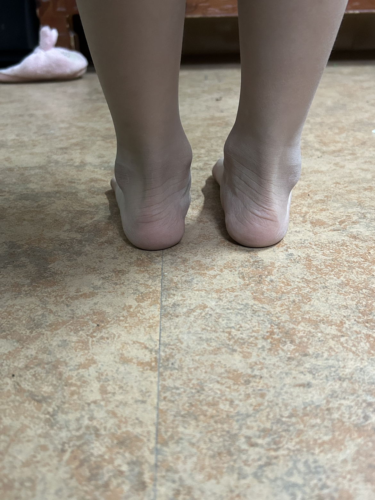
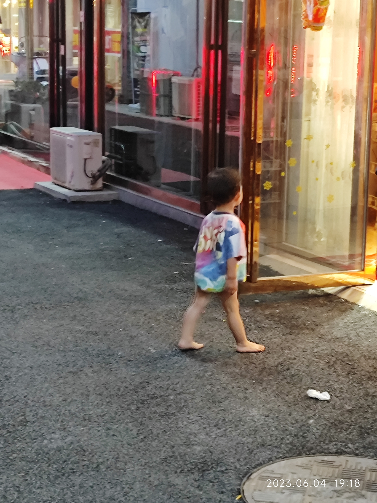
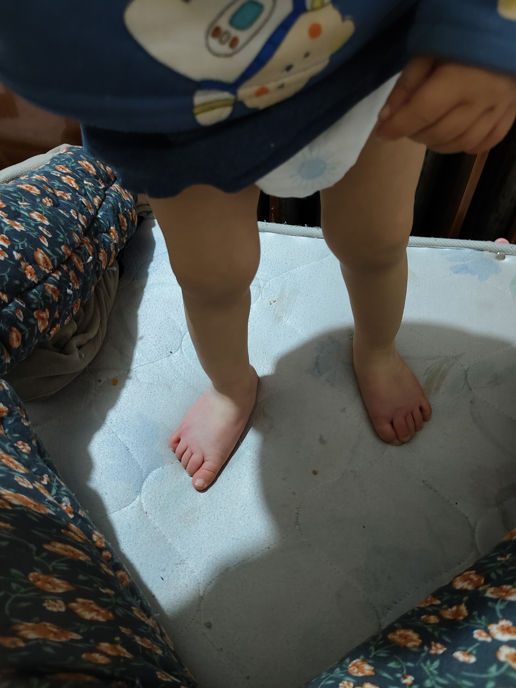

[toc]

# 正文

3岁小孩就有#扁平足 ？#足弓发育 家长可以怎么做？#足弓 #足弓塌陷 #医学科普

作者: [南方医院骨科朱立军](https://www.douyin.com/user/MS4wLjABAAAAy6pAspwbZRMmjhGIIhmZHJIbewb9kvFtH63-PCH-8VWT9y2R0lsf_JczxMf97sPF)

发布时间：2021-8-26 17:0:0

收集时间：2025-12-24 20:6:40

统计信息：点赞数（8607），评论数（1308），收藏数（711），分享数（7772） 

原文地址：[3岁小孩就有扁平足 ？足弓发育 家长可以怎么做？足弓 足弓塌陷 医学科普](https://www.douyin.com/video/7000222455822437639) 

# 评论

1. <a href="https://www.douyin.com/user/MS4wLjABAAAAssQG6B2ocvXk12GjkxCehseC74xe6zSt7O-QlUVD1Ik">夜空下的繁星</a> (<small title="">2021-8-26 23:17:23</small>): 我差点以为我家的天天不穿鞋，会导致扁平足［泪奔］［泪奔］［泪奔］好在看到这条视频。
   - **南方医院骨科朱立军** (<small title="">2021-8-26 23:34:42</small>): 好［赞］
   - <a href="https://www.douyin.com/user/MS4wLjABAAAAq5oWrn1BX_BXDPwBY14jg_nVLW0vQ0k21VBMz4tv5pI">郑朵朵。</a> (<small title="">2021-9-3 10:39:48</small>): 我们家从小到大在家光脚丫［泪奔］现在十岁半了，怎么越来越平，都跟地板粘住的平了［泪奔］
   - <a href="https://www.douyin.com/user/MS4wLjABAAAAgwDzel3-Kte1NYxp0aTdU2sk5bTUFtme4s_1PaymFmA">小杠精上线叭……</a> (<small title="">2021-8-27 3:5:14</small>): 左脚 脚脖子往里面了些 这个不用矫正么 鞋子应该有一边会凹下去点［看］
   - <a href="https://www.douyin.com/user/MS4wLjABAAAABC6lfFvgaS1kAdQzkVtawR422twZ45q0HlNnwWnFeik">-无糖-</a> (<small title="">2021-9-9 10:43:58</small>): 本来就不应该光脚在家跑 地板都是平的 足弓发育不好的
   - <a href="https://www.douyin.com/user/MS4wLjABAAAABC6lfFvgaS1kAdQzkVtawR422twZ45q0HlNnwWnFeik">-无糖-</a> (<small title="">2022-6-20 0:23:14</small>): 小时候也不是全都铺地板砖 泥巴地当然可以多光脚
   - <a href="https://www.douyin.com/user/MS4wLjABAAAAFz9c5pLklqn1K2J7-QuBzDLz2hB9I_mOJY18yofcJUc">仙人掌🌵</a> (<small title="">2022-5-7 12:15:6</small>): 带出去赤脚跳舞［捂脸］
   - <a href="https://www.douyin.com/user/MS4wLjABAAAAg73SjlAhu19879kKgM1nCphgYBE3JmvyqcfL8TeooJE">HHHHHHH!</a> (<small title="">2021-9-25 1:16:51</small>): 我也是这样以为，我家两个脱鞋大王［捂脸］［捂脸］穿不住鞋子
   - <a href="https://www.douyin.com/user/MS4wLjABAAAAOBqPnrlJ5KHbRobeIWgHaXVupUXSCwmeaBXDdeFzDvg">茉莉花茶🌸</a> (<small title="">2021-9-9 0:34:43</small>): 我也是这么想的诶，每天担心她赤脚会导致扁平足，我家的上一秒穿鞋放地上走，下一秒她自己就立马脱了，天天赤脚
   - <a href="https://www.douyin.com/user/MS4wLjABAAAA7iiOiHw0n2vctt2VOZG1Thk2O6VDOcjF_N-wPvKWZ20">小富婆🥰</a> (<small title="">2021-8-27 3:11:15</small>): 我也这么以为的，担心了很久，娃只要不出门都是光脚的［捂脸］
   - <a href="https://www.douyin.com/user/MS4wLjABAAAASH1wMT50ie6w0YqoRDtVmGSqicvhLs558QeT6mqfdvY">๑҉  🌸宝儿🌸🎃</a> (<small title="">2021-8-27 0:57:51</small>): 我家娃2岁多，超高超重，脚板比较大，我姐说是扁平足，我好焦虑，又说不穿鞋会扁平足又说脚外翻［泪奔］
   - <a href="https://www.douyin.com/user/MS4wLjABAAAAlz1Lzsnh7LZGlu58ZGxH2R53LY3i4PwT1C9dVoCr4M4g8OwtffomY2wM02A6zRUF">用户6225266234990</a> (<small title="">2023-10-8 7:11:58</small>): 我家孩子从小不穿鞋，现在3岁半了扁平足，愁死了
   - <a href="https://www.douyin.com/user/MS4wLjABAAAAK8C60wHkimzzS48tCqTIdYlX00pHERiTniAiHJt6vsk">蝶儿飞飞🦋🦋🦋</a> (<small title="">2023-8-25 19:51:22</small>): 我家也是整天撵着穿鞋，时间长我也不管了。［捂脸］
   - <a href="https://www.douyin.com/user/MS4wLjABAAAAXCZ5qe_stsCMOH5_ENoSHHcM-1QL_qoj8X5601nPLbQ">棒棒糖🍭</a> (<small title="">2023-5-14 16:25:2</small>): 我家的是站地上没有，不站地上是正常的，吓得我以为需要矫正［捂脸］［捂脸］
   - <a href="https://www.douyin.com/user/MS4wLjABAAAAbN0uUjh-mITmp6PfrPRN3uhBfsJ9Yi1DP3oqtYo-mDY">考拉</a> (<small title="">2023-4-14 13:57:16</small>): 我家宝一岁三个月，也害怕是偏平足，因为看她脚丫底下都是平的
   - <a href="https://www.douyin.com/user/MS4wLjABAAAAxrZ205P2pl65SGlm_X9QRPMFJEz5dB3NdBmdSDIjuC8">小糖</a> (<small title="">2022-11-28 17:26:13</small>): ^\_^d［呲牙］［比心］ap
   - <a href="https://www.douyin.com/user/MS4wLjABAAAAaKHFbBRRTqg9g_q5lJ-8Xx4hohf8uWrW3_bwiwj9SHhCTZmZpDo9HoINxDSHp_SA">ん成长路え</a> (<small title="">2022-11-4 15:7:14</small>): 我家也是天天不穿鞋， 好担心会成扁平足
   - <a href="https://www.douyin.com/user/MS4wLjABAAAARpR97-QSD4Q3xhkI-mOEtT_xaXMZ-TPVjse2zzpgrko">你的霞姐姐</a> (<small title="">2022-9-30 17:54:11</small>): 我儿子目前两岁十个月也是扁平足，天天光脚，一年四季，现在内八，我也怪不穿鞋的事
   - <a href="https://www.douyin.com/user/MS4wLjABAAAAY8dizfVb8bLE_ukPsYBHBH3I1ldHv3GjLDQjzkYDMcg">五季十三月</a> (<small title="">2022-8-20 0:0:4</small>): @11 我也被那些视频说的害怕
   - <a href="https://www.douyin.com/user/MS4wLjABAAAAcZQ4ToXvQYJ3E2QFEJuRsD_RBtkcq-WRP_uS7cU4yHK9P_bvm7tGRT8Rb5hNBiW6">扁平足之父</a> (<small title="">2022-8-10 0:31:56</small>): 美不美，看的是小腿，而影响腿型的是足弓！扁平足只需15天就能恢复足弓！
 
研究发现，如果父母其中一个是扁平足，儿女有50%是扁平足，父母双方都有扁平足，机率是90%；如果没有，别开心，建议你先查DNA
   - <a href="https://www.douyin.com/user/MS4wLjABAAAA-eBg3_Scu1h1VLJTJnSUB8AwW5CZaeu_5xk13KspOXw">呜啦啦</a> (<small title="">2022-8-9 10:35:2</small>): 我家孩子扁平足，去医院看医生就说不能光脚走路了
   - <a href="https://www.douyin.com/user/MS4wLjABAAAA5zckbWWvHbB1wrYBxdXS4-lpGRILZ0Yv0HGH2cPU3bHTax1UuR-M40J2wjZO-KSv">爪瓜</a> (<small title="">2022-8-7 17:41:32</small>): 我从来没有光脚走过 足弓特别高 我儿子就是功能性扁平足 经常摔跤 我觉得是他走路姿势有问题
2. <a href="https://www.douyin.com/user/MS4wLjABAAAAvyXqhMzG7Yj83cRNvpDEHybCepuHzBAIX2E5typzJco">旋</a> (<small title="">2024-2-18 0:22:1</small>): 这样是吗？ 
3. <a href="https://www.douyin.com/user/MS4wLjABAAAAd0E74TA4gYjoQ7nRYfLzv9mLvMZGrVg2oEQB27IugRQ">TT🐈‍⬛</a> (<small title="">2021-8-27 0:55:44</small>): 足外翻建议多大就医？和需要光脚丫吗？
   - <a href="https://www.douyin.com/user/MS4wLjABAAAAhZwnPgmOplihU1gQLiuXKu1fI7KJuWMvv-3uN5o1nLQ">用户1457960535417</a> (<small title="">2021-8-27 0:59:34</small>): 现在就去看
4. <a href="https://www.douyin.com/user/MS4wLjABAAAAoUa5LPAc_30ClpDQTt_4lqhxIMsGQw4NZIRrXs6pJ_o">☀️   大蓓蓓＠</a> (<small title="">2024-4-26 17:7:29</small>): 意思光脚是好的？
5. <a href="https://www.douyin.com/user/MS4wLjABAAAAcvwq7wG-VArh5tMXBnZ8iWbDSPG4mMQETgRSaeA8Wds">李小欣。</a> (<small title="">2024-8-2 14:12:30</small>): 我们今天刚体检完，医生不让光脚走［衰］［衰］
6. <a href="https://www.douyin.com/user/MS4wLjABAAAAwE8lgg4IP9FdIM76AV7C6xCosQ-VwxKo4VA9ERtNFxU">记录</a> (<small title="">2024-1-18 16:22:26</small>): 我们不喜欢穿鞋，扁平足［流泪］膝外翻，可喜欢跑来跑去和跳来跳去了，现在3岁了， 
   - <a href="https://www.douyin.com/user/MS4wLjABAAAAn6fjoIxnaSoM3i6stIoO69FJ80WVCGpX2wj7u1Wma9nBDs3BaLSFBYSYSem6twKT">🌈🌈小橙子吖</a> (<small title="">2024-1-24 15:17:47</small>): ［捂脸］我今天看我小娃也这样［捂脸］［捂脸］ 
   - <a href="https://www.douyin.com/user/MS4wLjABAAAAx-L3hcDocCSkKoTS6Q47MYdCk9nD9lvCsmKYhXI_BfM">🌛</a> (<small title="">2024-3-25 13:43:37</small>): 这个扁平足特征很明显 我老公也是这样 不踩地上的时候还好一踩足弓那里就趴在地上［流泪］我害怕我孩也是 当兵都验不上
   - <a href="https://www.douyin.com/user/MS4wLjABAAAAn6fjoIxnaSoM3i6stIoO69FJ80WVCGpX2wj7u1Wma9nBDs3BaLSFBYSYSem6twKT">🌈🌈小橙子吖</a> (<small title="">2024-3-25 13:46:14</small>): 我家还小。。那时候才一岁7个月
   - <a href="https://www.douyin.com/user/MS4wLjABAAAAx-L3hcDocCSkKoTS6Q47MYdCk9nD9lvCsmKYhXI_BfM">🌛</a> (<small title="">2024-3-25 13:46:48</small>): 现在好了嘛
   - <a href="https://www.douyin.com/user/MS4wLjABAAAAn6fjoIxnaSoM3i6stIoO69FJ80WVCGpX2wj7u1Wma9nBDs3BaLSFBYSYSem6twKT">🌈🌈小橙子吖</a> (<small title="">2024-3-25 13:54:11</small>): 好像扁平足2-3岁以后才能看出来。。小的时候都这样
7. <a href="https://www.douyin.com/user/MS4wLjABAAAADwrJMq-JKU6FtKQl-K8COfTf4pS6QwEZFSfGT5lZLmo">梁閃電⚡️</a> (<small title="">2024-7-13 12:52:56</small>): 我到小学三年级都不穿鞋在学校跑来跑去 现在35岁还是扁平足［微笑］
8. <a href="https://www.douyin.com/user/MS4wLjABAAAArae1PsCl59iYI6SD6FaYEZ9497oh5U3rPf7wD0TihB8">欧莹洁</a> (<small title="">2021-8-26 18:10:26</small>): 从小到大俩娃都是赤脚，无论春夏秋冬［捂脸］
   - **南方医院骨科朱立军** (<small title="">2021-8-26 19:59:10</small>): ［赞］
   - <a href="https://www.douyin.com/user/MS4wLjABAAAAX9E35HgBMxREgFGDxiInTeVB_3U8wA619lPr7HzQ47U">💋泳儿👸</a> (<small title="">2021-11-5 13:50:40</small>): 我女儿一样［捂脸］
   - <a href="https://www.douyin.com/user/MS4wLjABAAAAcDHwDIxZOOPlJBQcdtOCIgclSs2RXIcoDJWEYYices4">夕洛</a> (<small title="">2021-9-25 1:54:3</small>): 同款
   - <a href="https://www.douyin.com/user/MS4wLjABAAAA8_j7yKxh9X-KyfSv2084QPZGFOayN_naX04WKVCOhOY">小馨馨</a> (<small title="">2021-9-9 14:56:33</small>): 真不知道听哪个专家的，我家的春夏秋冬都赤脚结果足弓塌陷，医生说是不穿鞋导致的，现在五岁了，父母都有足弓
   - <a href="https://www.douyin.com/user/MS4wLjABAAAAKWsxSWWyVPyzpGKPK6drJ1noP1ze3PZnM3GS0BGZQRY">七秒鱼的记忆</a> (<small title="">2021-8-27 9:31:28</small>): 我儿子从小就喜欢光脚在家跑，有过敏性鼻炎爱咳凑，老公总说是我们光脚的原因，家里木地板，冬天也不冷，厨房和卫生间他就不进，现在才知道，因为地上是瓷砖，小孩子都是聪明的 他也知道热冷的
   - <a href="https://www.douyin.com/user/MS4wLjABAAAAp1G6ZC5LjjrYspC8mYqzu_dZJ2WJqhUYpu_inkjJyZM">今夜🌙几点睡💫</a> (<small title="">2021-8-26 22:17:8</small>): ［捂脸］叫穿鞋不到三分钟又脱了
   - <a href="https://www.douyin.com/user/MS4wLjABAAAAWHa5g3uGkfGFksYQnWXZCp1YLFeBbyJLUTlW4Eyyric">じve甜甜</a> (<small title="">2023-4-17 7:11:2</small>): 扁平足是遗传的，我爸就是的，我也是，我家俩孩子现在就是不爱穿鞋，天天光脚在地板上跑，我看差不多也是扁平足［流泪］
   - <a href="https://www.douyin.com/user/MS4wLjABAAAArae1PsCl59iYI6SD6FaYEZ9497oh5U3rPf7wD0TihB8">欧莹洁</a> (<small title="">2022-7-29 17:5:29</small>): 家里老人也是这样说，但是孩子不肯穿也是拿他没办法的［捂脸］
   - <a href="https://www.douyin.com/user/MS4wLjABAAAABv6EYo7YlKSNVM85951sEmO0dIwTmay63SjcZ-LFd1I">用户1930297205831</a> (<small title="">2022-7-28 22:22:59</small>): 可是那样寒气入体啊
   - <a href="https://www.douyin.com/user/MS4wLjABAAAAiP8c8M0bK3TRl5v4cNBlwX-FaMwCslz6UemxWH_-Dx4VJAviy_KlV1o3IK_8WCCZ">无尽蓝</a> (<small title="">2022-5-9 12:12:29</small>): 我孩子都三岁半还光脚，到外面都被人说，我都不好意思［捂脸］
   - <a href="https://www.douyin.com/user/MS4wLjABAAAAI7FVcSIpWKFKpNB0ut4r29xX34I4i8sSlmYEk8HxOEE">果……静</a> (<small title="">2022-4-26 12:38:36</small>): 赤脚还好吗，我家就是不愿意穿鞋，我都头痛死了，脚底也是平的［捂脸］
   - <a href="https://www.douyin.com/user/MS4wLjABAAAAVMS1OaSWB8GJqBdp9YaC-Kqjzcvb_FZsmoK5oWmslOI">李子</a> (<small title="">2021-12-3 15:18:24</small>): 我家小的也一样［捂脸］
   - <a href="https://www.douyin.com/user/MS4wLjABAAAArae1PsCl59iYI6SD6FaYEZ9497oh5U3rPf7wD0TihB8">欧莹洁</a> (<small title="">2021-9-9 10:18:47</small>): 看来同款娃儿真多［捂脸］倒是省了不少袜子和拖鞋钱［捂脸］
   - <a href="https://www.douyin.com/user/MS4wLjABAAAAJjBxIvy7B9Xxb00dt6sIjmkJw1tDya5PUog3RQaUenbD3hNREKDzKHOAjyHcXs2R">123啊</a> (<small title="">2021-9-9 8:52:56</small>): 我女儿也是，一进屋子里就脱鞋［捂脸］［捂脸］［捂脸］
   - <a href="https://www.douyin.com/user/MS4wLjABAAAAK3jPByNgCqYeFdWcA3Oauav3QHSnBuHgsWm0QCssft8">涵妮/景宝</a> (<small title="">2021-9-8 23:21:47</small>): 同款娃［捂脸］
   - <a href="https://www.douyin.com/user/MS4wLjABAAAA2Mt-nSIPYu3DUJ3E1mq85kSAo7-2oVmOK2pIPMvcjD0">哼唱小情歌</a> (<small title="">2021-9-8 23:15:56</small>): 我家也光脚，奶奶来了会说“光脚丫你冰不冰啊！”我儿子说不冰！确实，我家还是木地板，我试过不冰，而且不穿鞋在家走路的感觉挺好！
   - <a href="https://www.douyin.com/user/MS4wLjABAAAACvm-qWWu4D5WE_HWZFYLYpi-CD7uSMwMKkHbltkae_I">兔爷JC-T</a> (<small title="">2021-9-8 23:7:11</small>): 我儿子也是，冬天也不是地暖，给他穿袜子他立马撤掉，也不怕冷，也不爱感冒
   - <a href="https://www.douyin.com/user/MS4wLjABAAAArae1PsCl59iYI6SD6FaYEZ9497oh5U3rPf7wD0TihB8">欧莹洁</a> (<small title="">2021-8-28 19:28:28</small>): 那我家的出门了还是会穿鞋的，说是怕脏［捂脸］
   - <a href="https://www.douyin.com/user/MS4wLjABAAAAP3MEhhEZ3FpbuzIOuhw7zEyGpLRIjYQinIAoCbIsqZU">🌸美妍🌸</a> (<small title="">2021-8-28 15:46:16</small>): 我家的也是，夏天在外边都不穿鞋［捂脸］
   - <a href="https://www.douyin.com/user/MS4wLjABAAAArae1PsCl59iYI6SD6FaYEZ9497oh5U3rPf7wD0TihB8">欧莹洁</a> (<small title="">2021-8-27 13:36:33</small>): 我大儿子也是过敏性鼻炎，家婆也是这样怪我，可是给孩子穿上，转头就脱了［捂脸］反正身体各方面都是不错的，管他了，孩子开心就好［耶］
   - <a href="https://www.douyin.com/user/MS4wLjABAAAAprrE4XjDRgvo8X0JoVcpLExGon0mSLDq4jvLBJX6tLY">一个小馒头.</a> (<small title="">2021-8-27 1:36:40</small>): 我家也是，也不生病，从来都不穿袜子［泪奔］
9. <a href="https://www.douyin.com/user/MS4wLjABAAAA_X7yC_sctIg3JABvMB_7NDRcbE_1dPMtlB0VH4c-zxk">向日葵的微笑😊</a> (<small title="">2023-8-19 9:40:9</small>): 我家也是3岁，今天看看也是扁平足，天天光脚跑来跑去［捂脸］
10. <a href="https://www.douyin.com/user/MS4wLjABAAAAgu2L8Ew07r9-XwfYmr-lvKpS6ceEPifX8L6vw0liGW4">🌈豆哥👦🏻果妹👧🏻去哪儿玩</a> (<small title="">2021-8-27 0:19:20</small>): 扁平足遗传，我儿子遗传他爸的［泪奔］
    - <a href="https://www.douyin.com/user/MS4wLjABAAAAMk-98ugJH8oCohqGJwPjW1qAa3KV5zHBUsneO2ATVKQ">单小猪</a> (<small title="">2021-9-20 18:47:5</small>): 我也觉得，遗传
    - <a href="https://www.douyin.com/user/MS4wLjABAAAAQhl9BK-1WmJ2Z_0-cMIWHgBDWOLRVda4kdQqq_s3SK8">。</a> (<small title="">2021-9-20 16:51:26</small>): 这种应该不能改吧
    - <a href="https://www.douyin.com/user/MS4wLjABAAAAMk-98ugJH8oCohqGJwPjW1qAa3KV5zHBUsneO2ATVKQ">单小猪</a> (<small title="">2021-8-27 0:26:54</small>): 我大女儿和我老公一样，有足弓，我二女儿和我一样，扁平足［捂脸］走不了远路，脚疼
11. <a href="https://www.douyin.com/user/MS4wLjABAAAA039Bpj9aXDYKVriuXhBdsObuI_7bfyaQ6_jDUdwbf4s">有一只绵绵吖🍭</a> (<small title="">2021-8-26 19:24:5</small>): 有人又说不能光脚踩地板，有人又说要光脚，到底是什么？
    - <a href="https://www.douyin.com/user/MS4wLjABAAAAoWmAlt6YLZeUz7oLegkovJe58tgXYcTt4B5v9ETJo24">金同学有烦恼</a> (<small title="">2021-8-27 1:21:42</small>): 很多时候内翻外翻都有遗传因素，包括扁平足［暗中观察］
    - <a href="https://www.douyin.com/user/MS4wLjABAAAAyUyQxWTXXsF3MghEo7xRb2FkLphtp9ugmPVoygkkpAM">吉祥如意</a> (<small title="">2021-8-27 1:15:8</small>): 来回换吧［呲牙］光脚踩，不光脚踩［呲牙］应该就行了。
    - <a href="https://www.douyin.com/user/MS4wLjABAAAAlAyKcM6wMUI3TEGXanAnJZtxyqqa32dL7uNyzsiCUKgajRLvhcyT1AqlVLc1caBN">meng-米虫</a> (<small title="">2021-8-27 0:10:41</small>): ［灵机一动］我儿子除了出去逛街散步穿鞋，不然都是光脚，习惯了脚底皮厚了［泪奔］［泪奔］
    - <a href="https://www.douyin.com/user/MS4wLjABAAAA039Bpj9aXDYKVriuXhBdsObuI_7bfyaQ6_jDUdwbf4s">有一只绵绵吖🍭</a> (<small title="">2021-8-26 22:49:9</small>): 以前有什么专家说不能在地板上打赤脚［泪奔］［泪奔］［泪奔］
    - <a href="https://www.douyin.com/user/MS4wLjABAAAAoUa5LPAc_30ClpDQTt_4lqhxIMsGQw4NZIRrXs6pJ_o">☀️   大蓓蓓＠</a> (<small title="">2024-4-26 17:8:24</small>): 遗传，我儿子和他爸一摸一样脚
    - <a href="https://www.douyin.com/user/MS4wLjABAAAAzzx6jQVm_ScUjuUe7EM1nvkUFB-u8Fzzf8xsswQtggaljnbk5M9IGxEHd68E2HBi">石榴</a> (<small title="">2023-4-29 21:27:29</small>): 是的，好多了
    - <a href="https://www.douyin.com/user/MS4wLjABAAAAzzx6jQVm_ScUjuUe7EM1nvkUFB-u8Fzzf8xsswQtggaljnbk5M9IGxEHd68E2HBi">石榴</a> (<small title="">2023-4-29 19:49:44</small>): 你儿子多大？？？
    - <a href="https://www.douyin.com/user/MS4wLjABAAAAbRZpUqpZAZvxnlsyMpr8Ykwr1K5PgSntQ3F057TmuE8">王OK</a> (<small title="">2022-8-29 1:20:2</small>): 哪里定制［捂脸］
    - <a href="https://www.douyin.com/user/MS4wLjABAAAAqHYhNMwEFCObs0uhj9Ind6vFs8QDyPB4p7emYdBARLU">钮祜禄毒妇</a> (<small title="">2022-7-8 15:24:55</small>): 我老公腿和他妈腿一样，走路高低脚，我感觉是不是腿一长一短，我女儿现在两岁多我好担心会不会遗传［流泪］
    - <a href="https://www.douyin.com/user/MS4wLjABAAAAjXxtLVOcL_y73tvF_hsUxG66sFlWzOAQMDGAxkVQH74">小小大王</a> (<small title="">2021-9-8 23:12:51</small>): 宝宝多大呢 我儿子不到两岁 也是有点足外翻，你们去哪定制的鞋垫
    - <a href="https://www.douyin.com/user/MS4wLjABAAAACJXXOPNmZC5g1OJZBkHfm4MTwHYG8lHxVUe1VhtbtUg">熊猫宝宝</a> (<small title="">2021-9-8 21:49:36</small>): 哈哈哈我家的也是弯了的［泪奔］
    - <a href="https://www.douyin.com/user/MS4wLjABAAAALNoZgky7gLbGYPJn8j6Y9wQJGA4ns4RwLKKAZBple1g">鹑尾的小号</a> (<small title="">2021-8-26 22:6:36</small>): 小时候上小学都是不怎么穿鞋的除了冬天现在很好啊！
    - <a href="https://www.douyin.com/user/MS4wLjABAAAAJtRfKcZq-RsxmeB7mmffxCQO2158Brqa9hIvBnXXvnM">天庭饭堂永不打烊</a> (<small title="">2021-8-26 19:47:54</small>): 当然是光脚好
12. <a href="https://www.douyin.com/user/MS4wLjABAAAAVvzLp6qXWxPdbb0aiXbK14dGimP_HH-899k4yW99JVQ">祺祺👶媽媽</a> (<small title="">2021-9-25 15:54:13</small>): 我家宝天天光脚在家里各种造，只有出门才穿鞋［大笑］
    - **南方医院骨科朱立军** (<small title="">2021-9-25 16:0:21</small>): 好［赞］
13. <a href="https://www.douyin.com/user/MS4wLjABAAAAC58z1BBpCYhEWBQ8-fo_uiX-J24CL5agxNSq2yo_5lY">FayeHu</a> (<small title="">2021-9-9 13:22:21</small>): 应该穿硬点的鞋，三分之一处弯曲的那种，不要买软底的，然后鞋后跟的左右和后面硬点能固定住脚，太软的脚会没有支撑点，我特意买这样的鞋，现在一岁半，比两三岁的娃娃穿的软底软帮的脚丫子发育的好的太多了，鞋不一
    - <a href="https://www.douyin.com/user/MS4wLjABAAAAC58z1BBpCYhEWBQ8-fo_uiX-J24CL5agxNSq2yo_5lY">FayeHu</a> (<small title="">2021-9-9 13:23:20</small>): 定贵，但是得适合宝宝穿，有的鞋再便宜好看也不能给穿，正是发育的关键时期，要重视孩子的方方面面
14. <a href="https://www.douyin.com/user/MS4wLjABAAAAKMlYFitvmX2peyobtRPIm78O4nW77d7dS2rOV9Zhyt8">可乐不加冰🌺</a> (<small title="">2021-9-9 0:55:53</small>): 我们也是扁平足，正在垫足弓鞋垫矫正，医生不让光脚在地板上走，不知道你这个医生是咋治的［看］
    - **南方医院骨科朱立军** (<small title="">2021-9-28 18:19:50</small>): 非常朴素的自以为是
    - <a href="https://www.douyin.com/user/MS4wLjABAAAAKMlYFitvmX2peyobtRPIm78O4nW77d7dS2rOV9Zhyt8">可乐不加冰🌺</a> (<small title="">2021-9-28 18:16:5</small>): 健康足弓是呈三角形，鞋垫起到支撑足弓的作用，把它撑起来帮助骨头慢慢发育足弓，光脚走路没有支撑足弓又会塌下来。可以光脚在床上，沙发上，垫子上玩，就是不能在平地上越光脚越严重
    - <a href="https://www.douyin.com/user/MS4wLjABAAAAA2HKITlCWqsyOM26w03FCnJNEA6orDk6WgZ1jHvcCpQ">薛记传统小笼包官方号</a> (<small title="">2021-9-24 22:2:28</small>): 不能在地板上走，但是可以光脚在垫子上走！我们咨询医生说的！
    - <a href="https://www.douyin.com/user/MS4wLjABAAAAev5YsesL6DvmqolmllBMebP1qCh8mqg28MXLxN67hb8">孜孜不倦</a> (<small title="">2021-9-28 15:29:52</small>): 我家也是垫足弓垫，穿了三个月好一些。不敢让他光脚，光脚啪啪啪响，总感觉会更严重
    - <a href="https://www.douyin.com/user/MS4wLjABAAAArccSp6RrayagnsU-gYJniaT81wgpcRFYmu1Y_WYpXdk">徐萌萌</a> (<small title="">2021-9-24 23:53:34</small>): 人家是没有扁平足的时候叫光交在地上走，你已经是扁平足了，就不能光脚走，要穿鞋。
    - <a href="https://www.douyin.com/user/MS4wLjABAAAASUzn2HzLq1hdNJfqo3nIoH98ZVi6lzxSdmYdUn2qu1I">深巷里的喵🎈</a> (<small title="">2021-9-9 1:9:37</small>): 你家已经扁平足了，所以需要用足弓矫正垫。这个视频里的崽崽足弓是好的 不是扁平足 ［看］情况不一样呀
    - <a href="https://www.douyin.com/user/MS4wLjABAAAAAqt8VAAxCxoUgyrJAoZcwP_HtFHAqaw1_lZ-DWXxvxc">人间富贵花</a> (<small title="">2022-8-20 14:7:6</small>): 我看了好几个视频都说让娃光脚在地上玩
    - <a href="https://www.douyin.com/user/MS4wLjABAAAABINhaMt3BGWBig8OfmLMgT2tLYE295pmNEFOUdvM99A">乐多🍀</a> (<small title="">2021-9-26 10:21:52</small>): 我家也是定制了鞋垫
    - <a href="https://www.douyin.com/user/MS4wLjABAAAAlhU9Fs7j6c-nl9mIfcwCewPUgWhZld904FDlVQRY34OWzGK-WKQC7xvJbVtnbQA7">心肝肺🧚🏼</a> (<small title="">2021-9-25 0:25:47</small>): 人家说的是这个孩子还不算事偏平足，所以可以光脚走，让他这样促进发育［泪奔］
    - <a href="https://www.douyin.com/user/MS4wLjABAAAA3KHNC2Z_gzdOoU1AZ1VUqbxtwMt1wzzQHEgiEYzagp4">if-甜甜的</a> (<small title="">2021-9-10 11:50:53</small>): 我去买机能鞋时也说不能光脚走路，现在又说可以光脚，搞糊涂了
    - <a href="https://www.douyin.com/user/MS4wLjABAAAA3oxbc8NK5RlCQGLlo_pTWzK-fHL1EsmsGGSfX9XEk-E">泡泡</a> (<small title="">2021-9-9 2:24:38</small>): 我家的就是，说是垫鞋垫，夏天用不了，现在秋天了就在穿
    - <a href="https://www.douyin.com/user/MS4wLjABAAAASs4eSffsfkwIyAT2nRMOHOdyE8gVXSC1t1r6WZHrMMbhI0cCN-KN8-HzQ3lC9gLJ">逗逗嘻嘻哈哈</a> (<small title="">2024-12-6 19:47:59</small>): 人类最开始就是不穿鞋的。不穿鞋会加重扁平足真的不认同。我们小时候也不穿鞋也没有扁平足啊。
    - <a href="https://www.douyin.com/user/MS4wLjABAAAAF-dTmjspD85EmzauIEklif7JkS7FREw1MBkzamaUZow">叫我大鹏哥</a> (<small title="">2024-5-14 16:37:22</small>): 你太无知了［捂脸］专业运动员都会专门赤脚在沙滩锻炼足部功能，都是很科学的，赤脚走路是非常好的锻炼，都有专门的五指鞋［捂脸］
    - <a href="https://www.douyin.com/user/MS4wLjABAAAAlz1Lzsnh7LZGlu58ZGxH2R53LY3i4PwT1C9dVoCr4M4g8OwtffomY2wM02A6zRUF">用户6225266234990</a> (<small title="">2023-10-8 7:11:16</small>): 矫正鞋垫是那种定制的吗
    - <a href="https://www.douyin.com/user/MS4wLjABAAAAlz1Lzsnh7LZGlu58ZGxH2R53LY3i4PwT1C9dVoCr4M4g8OwtffomY2wM02A6zRUF">用户6225266234990</a> (<small title="">2023-10-8 7:10:7</small>): 这个医生不说清，现在家里都是光地板瓷砖或者木地板吧
    - <a href="https://www.douyin.com/user/MS4wLjABAAAAhO5q5mJw3PHnZ3nJo6hv5V_0iimTE_ViwnCrqDW1-Nc">YYYY</a> (<small title="">2023-7-25 3:16:8</small>): 你们几岁
    - <a href="https://www.douyin.com/user/MS4wLjABAAAACstZMlv2pPPvDcdULbLunWVkdVhzo4eVGMPDNVmxYhw">呦呦鹿鸣</a> (<small title="">2023-5-5 10:36:37</small>): 光脚在土地，草坪，沙地会对足弓有帮助，水泥地还是算了吧［泪奔］［泪奔］
    - <a href="https://www.douyin.com/user/MS4wLjABAAAAhITnj9D25fLRbRWEcqRmkZCz9kQTWnCbmAPbPuAVlRk">虾虾酱</a> (<small title="">2023-3-5 16:29:38</small>): 你好，你们穿了几年有改变吗
    - <a href="https://www.douyin.com/user/MS4wLjABAAAAxi3JgzbgQ1kxaBNGcqF0SdgUqwhhbZ6Tefv_uSpZ5oM">Randy</a> (<small title="">2023-2-28 22:19:26</small>): 我们也没有足弓搞了个机器检测（正规大医院省医院测的）足弓几乎是O有点揪心了，现在就让穿矫正鞋垫。小时候老是光脚走的
    - <a href="https://www.douyin.com/user/MS4wLjABAAAA_RbX7zVgaKO4SQ5x4nWb24pR9KwdY7IqB_ooJOdS-xf0t9JHNxCiYeVTJ5OOl5s3">好运来我家</a> (<small title="">2023-1-26 16:52:54</small>): 什么牌子的功能鞋，可以推荐吗
    - <a href="https://www.douyin.com/user/MS4wLjABAAAAA-CbXYJnHThkOEHt8J-Paf-6-uohXl_Q1B5L_ivuenw">又又又又💪</a> (<small title="">2022-9-14 14:22:37</small>): 买的什么样的足弓垫
15. <a href="https://www.douyin.com/user/MS4wLjABAAAAkbh0g-PKGjtsD2jqiHFOEtOvh0J0-CgBMm4r1LhZ3Ig">Chenᴗ·ᰔᩚ</a> (<small title="">2021-9-9 0:5:48</small>): 我家现在两岁半，上个星期才去省妇幼看了骨科，双足外翻，医生说配鞋垫3到6个月复查［泣不成声］［泣不成声］好担心能不能矫正好
    - <a href="https://www.douyin.com/user/MS4wLjABAAAA2QZD2_-aaIGRDwH1q628Nfx3xm0cnWlzv6XyVYu7Dkw">理想三旬💐</a> (<small title="">2021-9-9 0:28:52</small>): 双足外翻是怎样的呀，我小孩差不多大，最近发现他左脚鞋比右脚鞋磨的厉害多了［泪奔］
16. <a href="https://www.douyin.com/user/MS4wLjABAAAAbfltSYg5V0rKmsLMUlwAmfsYKv_6gqHIHZg_kMZ5IxE">小小昌儿</a> (<small title="">2021-9-25 2:53:36</small>): 我家天天打赤脚！三岁七个月了也扁平足！还足外翻！
    - <a href="https://www.douyin.com/user/MS4wLjABAAAAwOH2bDqjeNw5AP0UshnYhSu7EEv-RZRgSmU5mQtyYBA">💋Tina</a> (<small title="">2021-9-25 8:46:59</small>): 我的也是，而且越来越严重
17. <a href="https://www.douyin.com/user/MS4wLjABAAAAzvxbFXF87Xuvrj0KPsb0VBaftZRcwPYS0GtPDVgWl8tJx_udHFQAqPG19LmLCsPU">猫爪之情</a> (<small title="">2021-8-26 22:54:43</small>): 胖脚脚，多可爱。［比心］［比心］
    - **南方医院骨科朱立军** (<small title="">2021-8-26 22:58:51</small>): 仁者见仁
18. <a href="https://www.douyin.com/user/MS4wLjABAAAA2ZsRodzdRQr-5Dw0LImwDUGBLXypBQwLSEQZB4-7Zzc">L、🍀</a> (<small title="">2021-8-27 0:15:39</small>): 扁平足不是也遗传么，我女儿就遗传她爹，脚指头，全都一模一样。小时候到现在在家都是光脚。走不了远路，多走会儿就脚疼。
    - <a href="https://www.douyin.com/user/MS4wLjABAAAAQhl9BK-1WmJ2Z_0-cMIWHgBDWOLRVda4kdQqq_s3SK8">。</a> (<small title="">2021-9-20 16:51:8</small>): 对啊 我女儿也是
19. <a href="https://www.douyin.com/user/MS4wLjABAAAAMf7eOaY2udhL3dUTU1ubwqe5CN2roSMKlKYSk1WBxpk">发声酱</a> (<small title="">2021-8-26 23:20:51</small>): 我小时候经常跑跳现在还不是一样扁平足［泣不成声］走点路就脚痛
    - **南方医院骨科朱立军** (<small title="">2021-8-26 23:34:5</small>): ［呲牙］
20. <a href="https://www.douyin.com/user/MS4wLjABAAAAmFpzR_nOzNF_BLsjB_b-pRXMShNHa3NvlMHLjwZeJ00">小西几</a> (<small title="">2021-9-9 11:20:51</small>): 我儿子两岁多去体检，大夫说扁平足，说不影响走路没事［泪奔］
    - **南方医院骨科朱立军** (<small title="">2021-9-9 11:28:28</small>): 但愿如此［666］
21. <a href="https://www.douyin.com/user/MS4wLjABAAAAMDKi-GxA6Osn6oXcKHKHQLSAIW5VM90S9rehDjcEKkM">草莓吃不吃</a> (<small title="">2021-9-9 0:36:26</small>): 光脚走对孩子足弓发育大大的好处，我家两个小时候在家都是光脚
    - <a href="https://www.douyin.com/user/MS4wLjABAAAAvZwD9SAXZYk4k7t3LxcwKMK8PhfiAaDS6TYBkcW0M08">six six</a> (<small title="">2021-9-9 0:39:9</small>): 我天天追着我儿子叫他穿鞋［泪奔］
22. <a href="https://www.douyin.com/user/MS4wLjABAAAA38EKq4iLKtuFlmeb-hVJ_qlOaf14yn-aASaMUNxau2g">MYY</a> (<small title="">2021-9-9 9:47:13</small>): 多大之前尽量不穿鞋呀，我现在快一岁了，给她穿鞋她就哭［捂脸］
    - <a href="https://www.douyin.com/user/MS4wLjABAAAATbeX9iMxTcyv_GuaruNfk5P0cZpbuen-tTt-eQhZk2M">💐💐曦曦大baby</a> (<small title="">2021-9-9 10:22:14</small>): 我家之前穿鞋就哭，后来趁睡觉给她穿着鞋，醒来之后也没特别大反应，后来就愿意穿鞋了
23. <a href="https://www.douyin.com/user/MS4wLjABAAAApmQCQidRf_q6iTmCAzHdx0lx9qz6qC-lc5JgakRaw00">吃饱好训觉</a> (<small title="">2021-8-27 2:52:58</small>): 我家里遗传扁平足，爸爸，哥哥，姑姑都是扁平足
    - <a href="https://www.douyin.com/user/MS4wLjABAAAAgWGZGp3AnY3d2R6J0w2KGnco-yfmYniJXbUDt5NbxyY">暴富的小逗比</a> (<small title="">2021-8-27 3:34:34</small>): 我儿子是连我半点基因都没有遗传到，我双眼皮，大眼睛，我儿子单眼皮小眼睛，他爸单眼皮小眼睛，我老公自来卷，他也是，我老公扁平足，他也是扁平足，但凡他长的像我点，也长不残
24. <a href="https://www.douyin.com/user/MS4wLjABAAAAnG9RrzmQJbHwQXCNiOQbRRtnkAipPD5aqK5j3DbMxb8">谨宝麻麻💋💋</a> (<small title="">2021-9-8 23:40:28</small>): 家附近有个小姑娘差不多一周岁了 出来小公园玩从来不给穿鞋 不给下地玩 走哪都是抱着的 在家好像也抱着 我看着她的脚 脚底就平的 很明显 而且孩子身子骨看着有点弱 自己扶站也站不太稳［绝望的凝视］
    - <a href="https://www.douyin.com/user/MS4wLjABAAAAnG9RrzmQJbHwQXCNiOQbRRtnkAipPD5aqK5j3DbMxb8">谨宝麻麻💋💋</a> (<small title="">2021-9-9 0:10:21</small>): ［偷笑］［偷笑］
    - <a href="https://www.douyin.com/user/MS4wLjABAAAAmMBBOOxTmY6U9g_Ek0q92PBGqzgLjJFYqNGhQvGDO80">。。。</a> (<small title="">2021-9-9 0:7:59</small>): 只能说家长欠抱［看］
25. <a href="https://www.douyin.com/user/MS4wLjABAAAA9YkKMMfoclQhyrbKoZHK9EdP9nzhsf3VrV8A0Shtcq4">大黑牛</a> (<small title="">2021-8-27 0:18:21</small>): 30岁扁平足还来得及吗
    - <a href="https://www.douyin.com/user/MS4wLjABAAAAMk-98ugJH8oCohqGJwPjW1qAa3KV5zHBUsneO2ATVKQ">单小猪</a> (<small title="">2021-8-27 0:27:29</small>): ［捂脸］［捂脸］我31，遗传我妈的扁平足，就这样吧［憨笑］
26. <a href="https://www.douyin.com/user/MS4wLjABAAAAHKMlLwQv5S9JJhic3G2OqdU1OEFiNZviSlZ51NLVz24">听风八百遍才知是人间</a> (<small title="">2021-8-28 17:6:57</small>): 我儿子一岁扁平足
    - **南方医院骨科朱立军** (<small title="">2021-8-28 17:41:15</small>): 一岁还没有发育出足弓
27. <a href="https://www.douyin.com/user/MS4wLjABAAAAA_sTQ_dApmdCuIesFNhD4z-6TfYkxyRMESp0Wl2ahc4">小猫不撒娇.</a> (<small title="">2021-9-9 2:25:27</small>): 我家宝宝从六个月开始就有点足外翻，医生不建议我们赤脚走路，除了睡觉以外都是穿的硬后跟带足弓的鞋，现在20个月了，还是有点足外翻，并且还有点扁平的感觉，那我到底是穿不穿鞋呢？
    - <a href="https://www.douyin.com/user/MS4wLjABAAAAA_sTQ_dApmdCuIesFNhD4z-6TfYkxyRMESp0Wl2ahc4">小猫不撒娇.</a> (<small title="">2021-9-9 12:8:9</small>): 对啊 都不知道到底怎么好
    - <a href="https://www.douyin.com/user/MS4wLjABAAAAS74SMsFjNmXqR7rB52rec_GMd-8z5-1klL85b0jQ3Js">1+</a> (<small title="">2021-9-9 3:43:13</small>): 足外翻，有的医生说要穿鞋子走路的，所以听到两种说话我也很纠结［泪奔］
28. <a href="https://www.douyin.com/user/MS4wLjABAAAAdYMAv7ZjOXyg3-Mt6T873X5ShHTXy-TYftrBx6YQy1I">Darling M</a> (<small title="">2021-8-26 19:38:36</small>): 家族遗传要矫正吗
    - **南方医院骨科朱立军** (<small title="">2021-8-26 23:11:47</small>): 看意愿
29. <a href="https://www.douyin.com/user/MS4wLjABAAAAG78gHSEIMoaMQofBoX8K29w-Lgew0An7NExx_tGWFmQ">曾想胖</a> (<small title="">2021-9-9 2:9:15</small>): 我想问下我家宝宝2岁走路喜欢踮着脚走 是为什么呢［捂脸］
    - <a href="https://www.douyin.com/user/MS4wLjABAAAAWC-dXM41GpIGkRQPRrN-nmhNsuidgmOPI4B-ivPnFYg">娜好吧【家纺供货】</a> (<small title="">2021-9-9 3:49:30</small>): 小孩子都这样［比心］
30. <a href="https://www.douyin.com/user/MS4wLjABAAAAtc6Tj1JWlel5FZvTh65dUovYknF85rgPnWEEdIBCvng">握不住的指间沙</a> (<small title="">2021-8-27 0:6:58</small>): 都不知道到底要听谁的［捂脸］［捂脸］［捂脸］
    - **南方医院骨科朱立军** (<small title="">2021-8-27 6:54:36</small>): 确实难
31. <a href="https://www.douyin.com/user/MS4wLjABAAAArf7YpkPjXWqOQfFRKZfMEcW6TPtzHWfKPYqzNNJ2nZ4">桂林砖丽美缝总代理</a> (<small title="">2024-3-22 11:45:48</small>): 之前看一个医生也是说叫光脚走路跑跳。［捂脸］是不是我们90后的以前都是光脚的比较多都没有什么多大的这个问题现在的小孩怎么动不动就是扁平足外八内八之类的？
32. <a href="https://www.douyin.com/user/MS4wLjABAAAAM_1gZeW1Lvu-eWwgql_qDVHaJCrkneYcLST3QUkO8Fo">花花😎</a> (<small title="">2023-5-25 13:17:31</small>): @护花🌸使者 在家让他光脚走路，锻炼足弓发育
33. <a href="https://www.douyin.com/user/MS4wLjABAAAAVTNAKI2zwKICSgYM32etyFr6bPi2hfV7TMB1fA27VGk">汉堡包🍔</a> (<small title="">2023-4-14 14:29:21</small>): 宝宝应该买啥鞋子穿两岁半了
34. <a href="https://www.douyin.com/user/MS4wLjABAAAAI43WvSOCzF2V2B9Bz61_UvciBfnfqbnl3EaBt3XQ3OI">无可替代……</a> (<small title="">2023-4-5 23:10:13</small>): 有人说光脚在地上走寒气会从脚上进入身体
35. <a href="https://www.douyin.com/user/MS4wLjABAAAAo6PN5RlrXLJLCBqa6vtXPsgVRR5yk4Xcva2drUNf86A">小胖儿</a> (<small title="">2023-4-2 11:25:38</small>): 我被卖鞋得忽悠了，说应该早点穿鞋，在家也穿鞋
36. <a href="https://www.douyin.com/user/MS4wLjABAAAA0glweBw4jV-UuwuZEwmYbxIbLW6vmb-hqrUj40ajU-E">跳跳呦呦</a> (<small title="">2023-3-19 22:17:0</small>): 冬天穿袜子，只有外出才穿鞋，夏天赤脚，都不肯穿鞋
37. <a href="https://www.douyin.com/user/MS4wLjABAAAAlA8Lx02iC0Ig9gelw8ZH8-PLRQvh2TFlwHPUJDhGy8k">安然</a> (<small title="">2023-3-15 22:10:49</small>): 我家小宝就是从小光脚踩地给踩得，现在扁平了［捂脸］
38. <a href="https://www.douyin.com/user/MS4wLjABAAAAS61Cv3tvo6MlV5U6BjG9kbWumekMF24t3z7r7H58SKk">ღ_Miss 、💋李 🎀</a> (<small title="">2023-3-15 11:22:23</small>): 我家孩子只有外出穿鞋，在家都是光脚，怎么还是扁平足
39. <a href="https://www.douyin.com/user/MS4wLjABAAAAlB4w7fGnEZ8J5P_JTaFRlFHoGX2QjIHHxXXxJ3qK41g">余生夢</a> (<small title="">2023-3-7 19:27:25</small>): 我家孩子两周岁，现在足弓塌陷，每天在家都光脚啊 为什么会这样呢
40. <a href="https://www.douyin.com/user/MS4wLjABAAAAFxzsoMSFfsiFjZxsmZ3Kqi-_M_oc-dUoTR5Vza3aeng">橘橘</a> (<small title="">2023-3-3 11:28:21</small>): 我们这医生说扁平足有个原因鞋底太软，还有就是运动少
41. <a href="https://www.douyin.com/user/MS4wLjABAAAATInSab-sjVYX7QBknPvNGkhOaLrRN4mbDPT8M6Jn87c">小菲</a> (<small title="">2023-2-26 14:4:18</small>): 就今天看医生说不要光着脚走路，到底听谁的［捂脸］
42. <a href="https://www.douyin.com/user/MS4wLjABAAAA__zt-YsEvDQEHv1E_WeXidLwJV4HPvlYx__zs9CvD-g">广东足行健智能按摩鞋</a> (<small title="">2023-2-20 1:14:50</small>): 医生你好［抱拳］
43. <a href="https://www.douyin.com/user/MS4wLjABAAAAKH--aO1rrSVVkgomWza7-W2cT5EMAusrQLUs93soABI">别捏我肉肉吶</a> (<small title="">2023-1-22 19:24:54</small>): 我两个娃都比这个严重
44. <a href="https://www.douyin.com/user/MS4wLjABAAAAdRXgPP8LRDPR67s4FGblp7_YJVghjD9Yv5nZPKdJXtXtjtuISGRtBAgg44Jlqgj_">平安徐燕</a> (<small title="">2023-1-19 8:59:40</small>): 请问孩子9岁了，这个足功像您这样做可以吗
45. <a href="https://www.douyin.com/user/MS4wLjABAAAAZJDiI6214uPVgj_PPrPHmIsL2wrzZ1Yvw9DM_S_CrsU">迪仕尼在逃保安</a> (<small title="">2023-1-10 17:12:7</small>): @joe ＾
46. <a href="https://www.douyin.com/user/MS4wLjABAAAAaKHFbBRRTqg9g_q5lJ-8Xx4hohf8uWrW3_bwiwj9SHhCTZmZpDo9HoINxDSHp_SA">ん成长路え</a> (<small title="">2022-11-4 15:5:38</small>): 为啥每个医生说的都不一样呢？哪个才是对宝宝好的呢？
47. <a href="https://www.douyin.com/user/MS4wLjABAAAAv2RzvXD0UY8M8uEwbyPHDkgW1Rum7X4fvhD82hUUyknkBLrK_l6iX2X1rD564QfT">如果sure</a> (<small title="">2022-10-27 22:52:22</small>): 多大发育成型
48. <a href="https://www.douyin.com/user/MS4wLjABAAAAZmGSze8JV1oHD0AqUHwPHgm3fpnjyNfXfabyE2dKDUI">夏沫🙂🍒</a> (<small title="">2022-10-14 22:23:13</small>): 我们家的垫着走［泣不成声］
49. <a href="https://www.douyin.com/user/MS4wLjABAAAAnQFIbm8bic11OGkBpJ-DdmjSDVgY3FBCD8Tbo8mYE78">🌈月动影动🌈🦐</a> (<small title="">2022-9-23 9:26:46</small>): 扁平足到底是应该光脚还是不应该光脚走路？有些医生说不让光脚在家走路
50. <a href="https://www.douyin.com/user/MS4wLjABAAAACYhNU0ps2zpf7MbDWF2I-L5UZz0lAuaZQh1-IoMEVfM">ᰔᩚ 满眼星何</a> (<small title="">2022-9-21 16:8:56</small>): 是怪我不给我家小子赤脚吗［捂脸］
51. <a href="https://www.douyin.com/user/MS4wLjABAAAACBMpMDHOhI5930hd1rUsGzbHEhr6ra7-2lTfTptqxJI">范儿</a> (<small title="">2022-8-16 12:17:16</small>): 我家天天光脚在家里 但是扁平足很明显
52. <a href="https://www.douyin.com/user/MS4wLjABAAAACT_p-UOAzpzQLRNkp_K11ypyuSVe4mlFIh0RDMxbpnc">我是花花~</a> (<small title="">2022-8-9 15:8:37</small>): 吓死我了。我为俺的没有足弓想去看医生
53. <a href="https://www.douyin.com/user/MS4wLjABAAAA2Yi76dEWEpRyDhTkBV86tCK1K7lq-Oyvmlw_DkFSmtg">用户4509827468628</a> (<small title="">2022-8-8 18:39:19</small>): 晕了，不让光脚，让光脚，到底应该如何呢？
54. <a href="https://www.douyin.com/user/MS4wLjABAAAAsP5hu0LZUb7tARJ8vCbpysbdS5Al1DK0iXDaLZ_MxVw">风吹旧夏</a> (<small title="">2022-7-30 16:16:16</small>): ，@滁州楼德华 还得让二宝光脚在家里跑跑呢，我感觉二宝的足弓就不是特别明显
55. <a href="https://www.douyin.com/user/MS4wLjABAAAAF4jfiXCtUETT5RBl6-A_ZB1SrclPOSqo3ZrOJ3dPpPg">用户7600479383520</a> (<small title="">2022-7-29 23:51:18</small>): @团团麻麻Miko @L XLin
56. <a href="https://www.douyin.com/user/MS4wLjABAAAAwyL0p0K4KCGKCCVgSWrUi8EH4iItCe9F4hkZaczP_qE">风陵渡</a> (<small title="">2022-7-29 23:10:18</small>): @@吉尔伽美什啊 扁平足是冰
57. <a href="https://www.douyin.com/user/MS4wLjABAAAAYOzRLsjq7UKuG9spUHbNN0ol2IlPxaxxZgdif4LWXaM">等我壮大了</a> (<small title="">2022-7-18 13:39:54</small>): 今天入园体检 好多孩子都说 扁平足 不要光脚走路 尽量去儿童医院兰兰骨科 把家长
 
说蒙 我家也是夏天天天光脚 爱蹦爱跳 有爬爬垫 很少穿鞋子 听您说 我就放心了
58. <a href="https://www.douyin.com/user/MS4wLjABAAAAy-93hEe6gMdK8-9kiClnYKSQHVCc-1fOqEhHmhM7-7Y">qzuser</a> (<small title="">2022-7-18 11:12:54</small>): 光着脚又容易摔跤［捂脸］
59. <a href="https://www.douyin.com/user/MS4wLjABAAAAaFzUCwRpmsYPPhq5_5dSVzPzqyKj4hy2uK3bCM0T4pE">一粒糖</a> (<small title="">2022-7-12 16:30:21</small>): @趙先生🇨🇳
60. <a href="https://www.douyin.com/user/MS4wLjABAAAAT55N-7dOyPAV3XeuEs3Jy_jgSaflOH2zcCihF7A-e6Q">姜姜抖❤️</a> (<small title="">2022-7-12 10:29:19</small>): @泡沫~💑
61. <a href="https://www.douyin.com/user/MS4wLjABAAAAxNo2jtiAaNKwUzppMqRust-M5CVg2SoHW7NPbf6jA6Y">哒哒</a> (<small title="">2022-7-5 8:41:18</small>): 孩子已经确诊重度扁平足了，到底能不能光脚走路
62. <a href="https://www.douyin.com/user/MS4wLjABAAAA5MuyC9Sn4TIybSRw-JyiERU2mvCdkMfy5FpPNK0cyQg">玲娜贝儿福泥</a> (<small title="">2022-7-2 22:31:17</small>): 宝宝不爱走路，朋友介绍去检测才知道是扁平足，现在在穿矫正鞋垫
63. <a href="https://www.douyin.com/user/MS4wLjABAAAAg_4ERvJuzUkY68DXMf0uQrshJv3w_FcZcCoN-6WpyUw">喵了个咪</a> (<small title="">2022-6-29 0:11:45</small>): 我们去看医生，说不让在家里地板上光脚走，但可以光脚在沙地上走，或鹅卵石上走，这意见相左啊！［捂脸］我都不知道让孩子在家光脚不？
64. <a href="https://www.douyin.com/user/MS4wLjABAAAAHXboZSfEYxG0BFn108qNBv1JNEVklm7vQaTb56TPA5E">雪涧回甘</a> (<small title="">2022-6-18 22:49:4</small>): 六个多月宝宝脚内侧对称增厚的肉垫正常不？
65. <a href="https://www.douyin.com/user/MS4wLjABAAAAJwuArt3vqwKe-hwBML-nT-P1kmWgE-mvmjVeMgaA280">绚丽的晚霞</a> (<small title="">2022-6-14 21:9:50</small>): 我两个儿子好像也是扁平足［捂脸］［捂脸］
66. <a href="https://www.douyin.com/user/MS4wLjABAAAADszYBNSiTe_cbDt0D6U5BloQoaEHRIC_6GChWeobWok">温与柔.</a> (<small title="">2022-6-5 11:45:43</small>): @易🍃 不要让你仔懒了
67. <a href="https://www.douyin.com/user/MS4wLjABAAAA16ZpXSffjWzTVW2EDZe-blfiCQLzfuvk6ASEIa1n6JE">w、</a> (<small title="">2022-6-4 12:4:41</small>): @J\_。结局 小孩适当光脚还是有好处的
68. <a href="https://www.douyin.com/user/MS4wLjABAAAAWw4N2JfGX4echvmmq-ushOSV84uvjF9-MniFSOmFVss">婷子啊</a> (<small title="">2022-5-30 0:26:37</small>): 我娃2岁2个月了，扁平足能自己好吗
69. <a href="https://www.douyin.com/user/MS4wLjABAAAA8m5C0s90QGcgD7jV3VNJh6IZ4Zyf5wJW7kZrb-fwW88">亲，我爱你❤️</a> (<small title="">2022-5-23 22:46:13</small>): 3岁之前是生理性扁平足，不用管，没事多去沙地、土坑跑跳，刺激足弓发育，不要在硬面上跑跳，太平，脚适应了硬平面，改变了力线，就没有足弓了。3到6岁，足弓形成的关键期，足部骨骼开骨化，
70. <a href="https://www.douyin.com/user/MS4wLjABAAAA3gwk6B9fshSdId1yGZlds33OllP3xBzEOcbH-4qm4oE">honey honey honey🎄</a> (<small title="">2022-5-9 21:4:17</small>): 俺儿也是光脚大王［泪奔］@🌈🌈🌈Hello .
71. <a href="https://www.douyin.com/user/MS4wLjABAAAAa_jERq6u_ZeyRyZ-eQpKpF0uftgNKRAIoh6t0DczTCM">轻描～淡写</a> (<small title="">2022-4-29 22:43:30</small>): 我儿子学会走路，大冬天袜子也不穿，就在房间里上窜下跳［呲牙］
72. <a href="https://www.douyin.com/user/MS4wLjABAAAAZe-y8Vvj4GZaZj4Kx-AqileTqd4PCaUdygaONgbInK0">阿叶¥</a> (<small title="">2022-4-27 22:21:24</small>): @烂钟也是钟 看！
73. <a href="https://www.douyin.com/user/MS4wLjABAAAAq51wJoTgezhcw8RVVv_lhCZmY-PC_vEKYwqqBJqaxSU">林林叁</a> (<small title="">2022-4-14 10:32:3</small>): 成年人还能矫正吗？［泣不成声］我小时候父母没有这种意识，但是我现在真的感觉到对生活充满不便
74. <a href="https://www.douyin.com/user/MS4wLjABAAAAHi0jU9ICfBhOX5VoFn_ZzioGRYqEVBTdGhB2OHE8Gd0">静待花开🌹</a> (<small title="">2022-4-10 14:27:20</small>): 我儿子已经12岁，出现身体脖子前倾，拇指外翻。鞋垫一年没改善
75. <a href="https://www.douyin.com/user/MS4wLjABAAAA2I1lUY6a_NQp9FiHTabXdPca8pxwaOm0CWoY4k6jO3c">以后的以后</a> (<small title="">2022-3-28 21:57:50</small>): ［害羞］
76. <a href="https://www.douyin.com/user/MS4wLjABAAAArsF0faHBjmX8tsZvjLpYCuXdyk-ejpyEqkEnE4c8SaM">小锦鲤</a> (<small title="">2022-3-21 14:44:14</small>): @A 小叮🍒（糯米妈妈）
77. <a href="https://www.douyin.com/user/MS4wLjABAAAABJtn-pECEA_-yPYrD8brsx_ceY6jyWd9HAfaIGOL_AA">汐妈🐰</a> (<small title="">2022-3-5 15:33:22</small>): 我家的完全平的，脚踝骨头那里突出来了
78. <a href="https://www.douyin.com/user/MS4wLjABAAAA24hmM-YTZ5T_VL9gCNp0vemBCwf5LchEDwaZcrMOu4k">河北单招中考～尚尚</a> (<small title="">2022-3-3 19:7:39</small>): 三岁足外翻 是不是加大运动量 会慢慢改善？ 确实运动量小！
79. <a href="https://www.douyin.com/user/MS4wLjABAAAAA6shlPjP1gVahFTjhCpROePcV9XCIzgZCr3-N9HA4P0">大耳                 ╲</a> (<small title="">2022-2-13 22:3:52</small>): @@H。
80. <a href="https://www.douyin.com/user/MS4wLjABAAAACgVgaTx3djBhxRZbnCHyh9v4pNuM9jsT4crUUm-HoGM7erZP8gyjR3ZcpgIsyZZr">文霞～铂智3X</a> (<small title="">2022-2-10 16:4:3</small>): 医生好，是光脚好啊，现在每天监督孩子穿拖鞋呢
81. <a href="https://www.douyin.com/user/MS4wLjABAAAAWYHHZ-9CxmYCv3L9w8N2f9tKLxnLE-cNX8fXB3h1nYI">Awesome🌿</a> (<small title="">2022-1-31 15:3:0</small>): 我们家老大，常年光脚在家跑跳，大理石地面，但是现在扁平足了，8岁…大理石地面也可以光脚跑跳的吗？
82. <a href="https://www.douyin.com/user/MS4wLjABAAAAacm8yyeLtj-ZFjlPg6ia6_iwKhcrCkmUnZu8_Z9sl4s">叶耶耶耶耶🍃</a> (<small title="">2022-1-25 22:17:10</small>): 为什么我从小就喜欢打光脚板，但还是扁平足［泪奔］［泪奔］
83. <a href="https://www.douyin.com/user/MS4wLjABAAAAqF0O5VRp1AHGWcxXPOuGNiG90w2eJClXHe7s8EzgRUA">魔鬼爱人</a> (<small title="">2022-1-20 22:19:54</small>): 我小孩三岁，每天就脱鞋脱袜子，穿不住［捂脸］
84. <a href="https://www.douyin.com/user/MS4wLjABAAAAqKkr0FJWRZ--xlGJQM6c4bSzUfkypzdmdQNwGfstzN4">欣欣而立</a> (<small title="">2022-1-7 22:57:45</small>): @
85. <a href="https://www.douyin.com/user/MS4wLjABAAAA6dzDeesRkhQHTz5Bp1wDH8gPBaqDfmR_P1gj-XDFarA">杨咩咩🐏</a> (<small title="">2022-1-7 16:57:59</small>): @@🐷！
86. <a href="https://www.douyin.com/user/MS4wLjABAAAAMSMG8djaRccCDD6G-cqx4m_jMenUSnZa-Obe1eDpwKM">Yolo``童年不可逆</a> (<small title="">2022-1-2 2:20:37</small>): 可是又看了一个视频 也是医生装说天天光脚造成的［泪奔］
87. <a href="https://www.douyin.com/user/MS4wLjABAAAADngJBTXNMFuVB_e0WqwLnWqSqjnA3lTZ1D14gvZffgk">🌈  俄罗斯肥婆</a> (<small title="">2021-12-8 9:11:58</small>): 走鹅卵石铺的路可以吗？［捂脸］［泪奔］
88. <a href="https://www.douyin.com/user/MS4wLjABAAAADngJBTXNMFuVB_e0WqwLnWqSqjnA3lTZ1D14gvZffgk">🌈  俄罗斯肥婆</a> (<small title="">2021-12-8 9:9:10</small>): 到底走还是不走，愁死人了、膝外翻说是我让他走多了才这样的［泪奔］
89. <a href="https://www.douyin.com/user/MS4wLjABAAAAq3odHoKLqK8HSWHefy-_X8V70fQL1lkbF4mVpyucq6w">奥利姑姑</a> (<small title="">2021-12-7 17:43:4</small>): 我娃八岁在家从小不爱穿鞋，也有扁平足［泣不成声］咋回事
90. <a href="https://www.douyin.com/user/MS4wLjABAAAAH0jVa52CiqbMkfpFbObj3-fJNtJCpDqSuYzIV4c-lcU">林夕歌</a> (<small title="">2021-12-6 1:9:12</small>): 大夫们呀。你能私底下沟通一下。到底扁平足的孩子应该不该光脚。一个大夫一个说法［泪奔］
91. <a href="https://www.douyin.com/user/MS4wLjABAAAAwE7sffvutQ9Nd2SdBgxMGhK6rhKvSJGYdcJGhsfSXz8">叮叮</a> (<small title="">2021-12-2 23:9:35</small>): 平足是遗传的
92. <a href="https://www.douyin.com/user/MS4wLjABAAAAaGox9vfaIQDEPB1uGt84TBk1pq4E861G3zKxBsbWHJ8">喂！等等我。</a> (<small title="">2021-11-29 17:36:13</small>): 实际上，光脚跑就会有一大堆的"过来人"告诉你这样不好孩子容易感冒，要穿鞋子，
93. <a href="https://www.douyin.com/user/MS4wLjABAAAAgrL_4ZjKvQ20txP7ciUsTMTFbwIXzK17fpuZyD0xhV4aFQJk-snyX-ci3VUdlgAk">你是我的鲨鱼</a> (<small title="">2021-11-15 14:35:19</small>): 今天去医院，说我们有扁平足，不能再光脚了。也不知道哪个是正确的
94. <a href="https://www.douyin.com/user/MS4wLjABAAAAdAPQWSVS-raaUMxzJKRYbSe7ddmJZRBBmZXa7253_E8">叽里咕噜🌴҉̷̷̳</a> (<small title="">2021-11-13 7:53:26</small>): 我是扁平足，我儿子也是
95. <a href="https://www.douyin.com/user/MS4wLjABAAAAsbagxv6u1u5eExSC0tyuobgIUbsnTUpzxXinvCq0Brk-q1hxi3w9UdQ0ifV5d3R4">针针针</a> (<small title="">2021-11-9 8:42:16</small>): @Johnny 车籽肆
96. <a href="https://www.douyin.com/user/MS4wLjABAAAAB3rBZUdobSvHtgNECdxyIiIkFhIo_p-b0L-cTfkOwHY">蛋炒番茄🍟</a> (<small title="">2021-11-5 11:8:6</small>): 我家一年四季在家不穿鞋 不穿袜子［泣不成声］
97. <a href="https://www.douyin.com/user/MS4wLjABAAAAyTDT6SMP6L43_XMTgp7O24zSuKIxix4GxDmpD2fQcms">浅浅爱</a> (<small title="">2021-11-4 0:54:27</small>): 家里地板用了爬爬垫可以吗，毕竟冬天有点冷的
98. <a href="https://www.douyin.com/user/MS4wLjABAAAAzqrDl4-_1ltPWVUllyOU_E4JgSC7_iE7rLre8PnvZXU">伴🐖伺🐯古哒๑•́₃•̀๑魔宁🐒</a> (<small title="">2021-11-4 0:44:21</small>): @Legend杰s多打赤脚
99. <a href="https://www.douyin.com/user/MS4wLjABAAAAyGy0NrtQ8D2BXRjE5ifRf2oDKqH7RergLbH5t8_SE98">🌈’Zhou⛵</a> (<small title="">2021-11-3 15:27:30</small>): 一岁半了，走路有点O，脚尖不是直直向前走的，有点八字［暗中观察］
100. <a href="https://www.douyin.com/user/MS4wLjABAAAAyzU5wUaxPu3qIGUVSOQHc1Q9QQLaEEdkaXZrhzK-u5g">阿秀！</a> (<small title="">2021-11-3 7:0:3</small>): 我宝宝好像是扁平足的
101. <a href="https://www.douyin.com/user/MS4wLjABAAAAZmGSze8JV1oHD0AqUHwPHgm3fpnjyNfXfabyE2dKDUI">夏沫🙂🍒</a> (<small title="">2022-10-14 22:23:13</small>): 我们家的垫着走［泣不成声］
102. <a href="https://www.douyin.com/user/MS4wLjABAAAAd0E74TA4gYjoQ7nRYfLzv9mLvMZGrVg2oEQB27IugRQ">TT🐈‍⬛</a> (<small title="">2021-8-27 0:55:44</small>): 足外翻建议多大就医？和需要光脚丫吗？
103. <a href="https://www.douyin.com/user/MS4wLjABAAAAssQG6B2ocvXk12GjkxCehseC74xe6zSt7O-QlUVD1Ik">夜空下的繁星</a> (<small title="">2021-8-26 23:17:23</small>): 我差点以为我家的天天不穿鞋，会导致扁平足［泪奔］［泪奔］［泪奔］好在看到这条视频。
104. <a href="https://www.douyin.com/user/MS4wLjABAAAAwE8lgg4IP9FdIM76AV7C6xCosQ-VwxKo4VA9ERtNFxU">记录</a> (<small title="">2024-1-18 16:22:26</small>): 我们不喜欢穿鞋，扁平足［流泪］膝外翻，可喜欢跑来跑去和跳来跳去了，现在3岁了， 
105. <a href="https://www.douyin.com/user/MS4wLjABAAAArae1PsCl59iYI6SD6FaYEZ9497oh5U3rPf7wD0TihB8">欧莹洁</a> (<small title="">2021-8-26 18:10:26</small>): 从小到大俩娃都是赤脚，无论春夏秋冬［捂脸］
106. <a href="https://www.douyin.com/user/MS4wLjABAAAAkupJbvFy1EN4pF-uVHiRl4PEpAjyGi2afOhnLkq9kU4">🌈🌈柠檬落雪～🍋</a> (<small title="">2021-9-24 19:49:57</small>): 我家从小到大光脚［捂脸］ 来家里人没一个不说的
107. <a href="https://www.douyin.com/user/MS4wLjABAAAASzPWXX2XjhUSDZgh1LYPeaXUhv_L4PFs_GdJEPIiD58">饮杯茶</a> (<small title="">2021-9-25 14:38:39</small>): 我们在家都喜欢光脚，原来还有这好处［呲牙］
108. <a href="https://www.douyin.com/user/MS4wLjABAAAA88Rg-KaoJv4e9hm37G7aiamN_nldX63JBGUpjlU5ia4">꧁༺༽༾ཊ浅浅一笑ཏ༿༼༻꧂</a> (<small title="">2021-8-27 2:38:15</small>): 我家的就光着脚在家玩不愿意穿了［捂脸］一年四季光脚［捂脸］
109. <a href="https://www.douyin.com/user/MS4wLjABAAAAe5M44txPy6KfDpoL_t2creDq135r6CaclsKk0IlrEAE">柳絮</a> (<small title="">2021-9-25 11:24:31</small>): 我家一年四季都不肯穿鞋，大冬天也不穿鞋袜［暗中观察］
110. <a href="https://www.douyin.com/user/MS4wLjABAAAAcvwq7wG-VArh5tMXBnZ8iWbDSPG4mMQETgRSaeA8Wds">李小欣。</a> (<small title="">2024-8-2 14:12:30</small>): 我们今天刚体检完，医生不让光脚走［衰］［衰］
111. <a href="https://www.douyin.com/user/MS4wLjABAAAAkpoh4po-6SV0o-XvCDkYPbF8SsftAi-Qb1_dv5IqQE8">芯彤~</a> (<small title="">2022-5-20 15:57:39</small>): 我以为我家是足弓塌陷
112. <a href="https://www.douyin.com/user/MS4wLjABAAAAy38b6VzI0qUpe5fa_nt5XKotaxkhTpxnntEYtpiubXo">很好</a> (<small title="">2021-9-9 9:40:59</small>): 我儿子小时候天天不穿鞋子跑跑跳跳的，然后3岁左右我就发现足外翻了
113. <a href="https://www.douyin.com/user/MS4wLjABAAAAORmPwNDVCEtB5VSXEJrRGYnCTuBLBoGgEXN6LN5H2NI">金陵岂是池中吴女士</a> (<small title="">2021-9-9 0:39:50</small>): 我老是感觉我儿子腿脚有问题［捂脸］
114. <a href="https://www.douyin.com/user/MS4wLjABAAAA_X7yC_sctIg3JABvMB_7NDRcbE_1dPMtlB0VH4c-zxk">向日葵的微笑😊</a> (<small title="">2023-8-19 9:40:9</small>): 我家也是3岁，今天看看也是扁平足，天天光脚跑来跑去［捂脸］
115. <a href="https://www.douyin.com/user/MS4wLjABAAAAL14wx1KSvigVBxnbCH0rgdgX90Qn_0fauoXgVa1faAM">钻机配件源头厂家</a> (<small title="">2022-9-10 11:53:58</small>): 这个是扁平足吗
116. <a href="https://www.douyin.com/user/MS4wLjABAAAADwrJMq-JKU6FtKQl-K8COfTf4pS6QwEZFSfGT5lZLmo">梁閃電⚡️</a> (<small title="">2024-7-13 12:52:56</small>): 我到小学三年级都不穿鞋在学校跑来跑去 现在35岁还是扁平足［微笑］
117. <a href="https://www.douyin.com/user/MS4wLjABAAAAvyXqhMzG7Yj83cRNvpDEHybCepuHzBAIX2E5typzJco">旋</a> (<small title="">2024-2-18 0:22:1</small>): 这样是吗？ 
118. <a href="https://www.douyin.com/user/MS4wLjABAAAAo6PN5RlrXLJLCBqa6vtXPsgVRR5yk4Xcva2drUNf86A">小胖儿</a> (<small title="">2023-4-2 11:25:38</small>): 我被卖鞋得忽悠了，说应该早点穿鞋，在家也穿鞋
119. <a href="https://www.douyin.com/user/MS4wLjABAAAArYbgXpPEsTCWYGs_EohQCLDHIVEFEDf4E_60i2PR8h0">落 落</a> (<small title="">2021-8-27 0:12:0</small>): 我家孩子9岁，最近发现她的足弓没怎么有了，想发展成扁平足了，这是什么情况？
120. <a href="https://www.douyin.com/user/MS4wLjABAAAAb-arVz0efTbE2pzYTeFwP567kcnC8rmfCN2JSq2KsaM">啊宅</a> (<small title="">2021-9-24 21:3:4</small>): 我以为我的扁平足是天生的［捂脸］没想到可好的［泪奔］
121. <a href="https://www.douyin.com/user/MS4wLjABAAAAv5SEpdN_CqhXAJV96ubidTWPKBjkOU7fleXhbv8wmhQ">✨金💫</a> (<small title="">2021-9-20 22:41:22</small>): 但是我小孩就是在家不喜欢穿鞋，扁平足好厉害。
122. <a href="https://www.douyin.com/user/MS4wLjABAAAA6REg8Z2iOqCfDFpOeXcTizMlVyENftNpyifDcmRCbR0">用户7796645086523</a> (<small title="">2021-9-9 9:46:0</small>): 哈哈 我儿在家光脚惯了［灵机一动］
123. <a href="https://www.douyin.com/user/MS4wLjABAAAAdRXgPP8LRDPR67s4FGblp7_YJVghjD9Yv5nZPKdJXtXtjtuISGRtBAgg44Jlqgj_">平安徐燕</a> (<small title="">2023-1-19 8:59:40</small>): 请问孩子9岁了，这个足功像您这样做可以吗
124. <a href="https://www.douyin.com/user/MS4wLjABAAAACYhNU0ps2zpf7MbDWF2I-L5UZz0lAuaZQh1-IoMEVfM">ᰔᩚ 满眼星何</a> (<small title="">2022-9-21 16:8:56</small>): 是怪我不给我家小子赤脚吗［捂脸］
125. <a href="https://www.douyin.com/user/MS4wLjABAAAA__zt-YsEvDQEHv1E_WeXidLwJV4HPvlYx__zs9CvD-g">广东足行健智能按摩鞋</a> (<small title="">2023-2-20 1:14:50</small>): 医生你好［抱拳］
126. <a href="https://www.douyin.com/user/MS4wLjABAAAA98k5D4i4S44dC8zCHL_cKxh_Xxy1hm0QaSZ3w8suG-I">解山佳（静心堂）</a> (<small title="">2022-9-4 19:41:45</small>): 我的腿就不知道是足内翻还是足外翻，反正我们这里人小时候叫我蹦蹦腿。但是我儿子出生之后鞋穿的也不多，一直光就要走，但是我现在看我儿子也是有一点才15个月，我不知道要不要去治哎。［流泪］是遗传吗
127. <a href="https://www.douyin.com/user/MS4wLjABAAAAKH--aO1rrSVVkgomWza7-W2cT5EMAusrQLUs93soABI">别捏我肉肉吶</a> (<small title="">2023-1-22 19:24:54</small>): 我两个娃都比这个严重
128. <a href="https://www.douyin.com/user/MS4wLjABAAAAI43WvSOCzF2V2B9Bz61_UvciBfnfqbnl3EaBt3XQ3OI">无可替代……</a> (<small title="">2023-4-5 23:10:13</small>): 有人说光脚在地上走寒气会从脚上进入身体
129. <a href="https://www.douyin.com/user/MS4wLjABAAAAlUOGT9EG94VJQfOT-FI-cYnTqkUf2_ImRMokPY7biuo">啥玩意</a> (<small title="">2021-9-10 1:5:32</small>): 有个疑问哦，我家4姐弟，我和老大随我爸弓足，老二和老四随我妈扁平足，这算遗传么［捂脸］
130. <a href="https://www.douyin.com/user/MS4wLjABAAAArf7YpkPjXWqOQfFRKZfMEcW6TPtzHWfKPYqzNNJ2nZ4">桂林砖丽美缝总代理</a> (<small title="">2024-3-22 11:45:48</small>): 之前看一个医生也是说叫光脚走路跑跳。［捂脸］是不是我们90后的以前都是光脚的比较多都没有什么多大的这个问题现在的小孩怎么动不动就是扁平足外八内八之类的？
131. <a href="https://www.douyin.com/user/MS4wLjABAAAAM_1gZeW1Lvu-eWwgql_qDVHaJCrkneYcLST3QUkO8Fo">花花😎</a> (<small title="">2023-5-25 13:17:31</small>): @护花🌸使者 在家让他光脚走路，锻炼足弓发育
132. <a href="https://www.douyin.com/user/MS4wLjABAAAAVTNAKI2zwKICSgYM32etyFr6bPi2hfV7TMB1fA27VGk">汉堡包🍔</a> (<small title="">2023-4-14 14:29:21</small>): 宝宝应该买啥鞋子穿两岁半了
133. <a href="https://www.douyin.com/user/MS4wLjABAAAAS61Cv3tvo6MlV5U6BjG9kbWumekMF24t3z7r7H58SKk">ღ_Miss 、💋李 🎀</a> (<small title="">2023-3-15 11:22:23</small>): 我家孩子只有外出穿鞋，在家都是光脚，怎么还是扁平足
134. <a href="https://www.douyin.com/user/MS4wLjABAAAAZJDiI6214uPVgj_PPrPHmIsL2wrzZ1Yvw9DM_S_CrsU">迪仕尼在逃保安</a> (<small title="">2023-1-10 17:12:7</small>): @joe ＾
135. <a href="https://www.douyin.com/user/MS4wLjABAAAAv2RzvXD0UY8M8uEwbyPHDkgW1Rum7X4fvhD82hUUyknkBLrK_l6iX2X1rD564QfT">如果sure</a> (<small title="">2022-10-27 22:52:22</small>): 多大发育成型
136. <a href="https://www.douyin.com/user/MS4wLjABAAAAnQFIbm8bic11OGkBpJ-DdmjSDVgY3FBCD8Tbo8mYE78">🌈月动影动🌈🦐</a> (<small title="">2022-9-23 9:26:46</small>): 扁平足到底是应该光脚还是不应该光脚走路？有些医生说不让光脚在家走路
137. <a href="https://www.douyin.com/user/MS4wLjABAAAAwUka1KAPWsdCnDdgCqCQwHUrcoDHlpjtEUYhEo84q4YoriGCLW9_G3zJffAOat4Y">用户9086791652933</a> (<small title="">2022-9-20 2:50:56</small>): @港妹wan 你闺女的脚估计就是你一直让穿穿坏的
138. <a href="https://www.douyin.com/user/MS4wLjABAAAAwUka1KAPWsdCnDdgCqCQwHUrcoDHlpjtEUYhEo84q4YoriGCLW9_G3zJffAOat4Y">用户9086791652933</a> (<small title="">2022-9-20 2:49:25</small>): @港妹wan 别再穿鞋了
139. <a href="https://www.douyin.com/user/MS4wLjABAAAAXNtXC6Vj9wmMdGRPXIbl9der26TPrc_Av9juABAWpF0">七世鸢尾</a> (<small title="">2022-9-4 7:33:56</small>): 俺今年六岁了，光脚六年了［捂脸］［捂脸］［捂脸］［捂脸］
140. <a href="https://www.douyin.com/user/MS4wLjABAAAAS5abmkX6FXEHGLya9i6Yf1x4Zib_MWTcve0VluQAPko">没有名字，，，，</a> (<small title="">2022-9-3 16:8:10</small>): 不能光脚，不能穿太软的鞋
141. <a href="https://www.douyin.com/user/MS4wLjABAAAAfWFRJLrjZBbST4Bl3HQdoIsdaR913r8kQY4Fk795GWI">秀秀</a> (<small title="">2022-9-3 16:4:47</small>): 这个是看什么科室
142. <a href="https://www.douyin.com/user/MS4wLjABAAAAbG0z_lPWugTfkNNdFCmd-NvAwhsovK_Cl2v9wtb1sbI">侯小妞</a> (<small title="">2022-8-29 18:2:34</small>): 平足 到底是穿鞋好，还是不穿鞋好，今天去看过，说是一定要穿鞋，不能打赤脚
143. <a href="https://www.douyin.com/user/MS4wLjABAAAAi7PmL_OKAEoU01DjlKqxYYig7PGJsplBHoBIPhlJjp8">小桃籽</a> (<small title="">2022-8-29 12:15:50</small>): @🌈可可妈咪🌈
144. <a href="https://www.douyin.com/user/MS4wLjABAAAAtNdpqjyuOmHfc9mJSKwimD24mbXfLnoSRJFxrtNf4TjhN2FMwytK9w546j4MyMpS">花园宝宝</a> (<small title="">2022-8-28 14:22:34</small>): 我儿子在家基本不穿鞋，发现就像这视频里的小朋友那样［泪奔］
145. <a href="https://www.douyin.com/user/MS4wLjABAAAAJwRrPyHKvgcajWQTQNv_vwmBYp81KrxgcrUfDGS6GE8">Z~💕</a> (<small title="">2022-8-22 16:17:11</small>): 不能下载吗［泣不成声］
146. <a href="https://www.douyin.com/user/MS4wLjABAAAAF1hWEoSZ4ZCIK9GjlQtytYFQ0lSpQ4vsU8pBx_IevdI">郑成龙</a> (<small title="">2022-8-19 23:18:5</small>): @apple🍎
147. <a href="https://www.douyin.com/user/MS4wLjABAAAAUp3kqbHofsWfXGhRW2mX_KoBieu0AIw5nxIM4Ot6w8w">你还好吗</a> (<small title="">2022-8-17 0:35:5</small>): 到底是光脚好还是不光脚
148. <a href="https://www.douyin.com/user/MS4wLjABAAAAJjEYjW6isp6_ucXq4lLByxdGvUMgsFzE72c8pCMjbNk">禾呈禾呈</a> (<small title="">2022-8-16 23:46:35</small>): 原来是这样，还担心在家天天光脚别平底脚了
149. <a href="https://www.douyin.com/user/MS4wLjABAAAA_G3rU0ucGZ0UBnSe0_cFAGaNGg3UiTUiYGmvfpveVH05kMB3Ne_z4cg8igjYoIDF">不一样😁</a> (<small title="">2022-8-16 12:58:40</small>): 你是专业的儿童骨科医生吗？
150. <a href="https://www.douyin.com/user/MS4wLjABAAAAgu2L8Ew07r9-XwfYmr-lvKpS6ceEPifX8L6vw0liGW4">🌈豆哥👦🏻果妹👧🏻去哪儿玩</a> (<small title="">2021-8-27 0:19:20</small>): 扁平足遗传，我儿子遗传他爸的［泪奔］
151. <a href="https://www.douyin.com/user/MS4wLjABAAAAl40KLzHV23Zv0yCAPdcMQMxuHyMzQSTeYKV981oBuz8">🌷H～～</a> (<small title="">2021-10-18 18:23:18</small>): 我家仔天天不穿鞋还坐不稳的，也没有足弓啊［委屈］［委屈］
152. <a href="https://www.douyin.com/user/MS4wLjABAAAAjK2Xyp1Paps3FNP_TIbeGecDWZwfYnK1iLG28Vu4ihE">木</a> (<small title="">2021-10-18 10:35:24</small>): 主任我可以发个视频给你看看我儿子虽不虽要纠正，拍片
153. <a href="https://www.douyin.com/user/MS4wLjABAAAAXXtniBOGS5zpJ173_mB01hM0ZI9Amg3AFzFB-IyLRDQ">卡卡 </a> (<small title="">2021-10-18 17:15:39</small>): 现在天冷了，我娃还想光着脚，不想穿袜子不想穿鞋［衰］
154. <a href="https://www.douyin.com/user/MS4wLjABAAAAeCNXUyz5xUKi6mOWgiL-tVEJHr34ZzzVovub3tN-XeQ">Nzi_</a> (<small title="">2021-10-18 12:55:14</small>): 我们一岁三个月，走路有时候会点脚走路
155. <a href="https://www.douyin.com/user/MS4wLjABAAAAdxycl57mtF2ioXKH3R7MwkUCTdZDB8tESAuCMu2J5Uk">🌻Sherry</a> (<small title="">2021-10-18 10:59:17</small>): 我儿子走路走多了晚上就喊脚底板痛是不是扁平足啊
156. <a href="https://www.douyin.com/user/MS4wLjABAAAA039Bpj9aXDYKVriuXhBdsObuI_7bfyaQ6_jDUdwbf4s">有一只绵绵吖🍭</a> (<small title="">2021-8-26 19:24:5</small>): 有人又说不能光脚踩地板，有人又说要光脚，到底是什么？
157. <a href="https://www.douyin.com/user/MS4wLjABAAAAHuJ5WiUUgOr2O-9MRGJJjaAmiSfUx6MXv9HrvEW-rS8">福多多滴</a> (<small title="">2021-10-18 16:41:0</small>): 我想说这个脚不是挺正常的么［捂脸］我家儿子养成习惯了穿袜子穿鞋，因为才一岁多拖不住拖鞋所以在家里也穿着外出的鞋子
158. <a href="https://www.douyin.com/user/MS4wLjABAAAAFrTcDC1MgXVoWLR5IpMG-XRUhytNZP_JhIbG4zSqs6M">哦丢不了</a> (<small title="">2021-9-9 11:1:16</small>): 小时候好喜欢赤脚到处跑
159. <a href="https://www.douyin.com/user/MS4wLjABAAAAGkHJ_i6zwqUpTJBqmptCFmfVj1m795fudqsWvxKfTNU">矿泉水瓶瓶</a> (<small title="">2021-10-18 16:36:25</small>): 每个大夫说的都不一样，刷抖音的妈妈都越来越焦虑！
160. <a href="https://www.douyin.com/user/MS4wLjABAAAA9VmydqE7i1cojMDzwK3drbIrNTXLxI_fxwv-iKysfIU">Zzz早早啊</a> (<small title="">2021-10-18 10:39:30</small>): 我娃两岁五个月，这个季节了，还是不给你穿鞋［泣不成声］，一穿袜子就说好热啊，勉强穿上就不会走路了，哈哈哈
161. <a href="https://www.douyin.com/user/MS4wLjABAAAAzgM0_HRAmFVx9aNWwFEae5ixz4a0Cf2WIKurCimVFmdmDV9AxWIEI9fqiFLFP5xB">用户7549658709746</a> (<small title="">2021-11-2 13:46:52</small>): ［捂脸］我家娃六个月到十个月，光了一整个夏天的小脚丫～
162. <a href="https://www.douyin.com/user/MS4wLjABAAAA1_TEmsBW67WzEsJA4KpPG6HLNDi2JXpMXdUkGZtvag8">三个小公举的妈妈🌹🌹🌹</a> (<small title="">2021-8-27 0:38:39</small>): 我家孩子一年四季都光脚［捂脸］大冬天也不穿［捂脸］［捂脸］俩孩子脚都好大［捂脸］［捂脸］
163. <a href="https://www.douyin.com/user/MS4wLjABAAAAkYFJElwKPzfTjL84eJRLWvL2SZ_gqo6D-tivyO8uJ-c">zⅇ ꫛᧁ.悸野🎈</a> (<small title="">2021-11-3 0:8:7</small>): 看了您的视频，我就放心了。2个娃，包括我自己，特别是夏天不喜欢穿鞋。光脚踩地板舒服［呲牙］
164. <a href="https://www.douyin.com/user/MS4wLjABAAAAzgb0516j-vpkzAkizTnTU70xLHv7vS45Vha-RGP_iBM">Sandy</a> (<small title="">2021-11-2 9:18:18</small>): 我家也是穿鞋垫，还说小腿间隙3厘米晚上睡觉要绑腿定型，晚晚都哭醒［捂脸］好难啊
165. <a href="https://www.douyin.com/user/MS4wLjABAAAAgVu28b0UKfJYMM72lYZ4UIXtcD8FwpDsr5wJCdvaUc8">安然的小屋</a> (<small title="">2021-9-23 20:28:41</small>): 成人可以光脚走吗
166. <a href="https://www.douyin.com/user/MS4wLjABAAAAWozu9ZHjBziwgy1RwwvkkPxlB11tCh1zJq6vJ8nTgK0">小猪猪和小牛牛</a> (<small title="">2021-11-2 17:33:0</small>): 有冬天不爱穿袜子的小孩吗？［捂脸］
167. <a href="https://www.douyin.com/user/MS4wLjABAAAARHw4E_Zz9IE4mx_CvIN9grzAWL-CxFaDYV9GasJj648">♚请叫我小纯洁♛</a> (<small title="">2021-9-25 0:20:6</small>): 我儿子开始走路以来就是打赤脚
168. <a href="https://www.douyin.com/user/MS4wLjABAAAAnTmqD2vCb5ISZl0ZaPiQBUXM4et8_fmfQ9EOItPQClk">🎀彦希🎀</a> (<small title="">2021-8-27 12:56:7</small>): 这个要给奶奶看，天天嫌弃我给孩子光脚不穿鞋
169. <a href="https://www.douyin.com/user/MS4wLjABAAAAlGXeehj5sR2TvI2a7l7qY2DOuVSjJLXeIw8EA5vIJws">💍👰🏻vivian👪</a> (<small title="">2021-11-2 16:14:9</small>): 为什么深圳这边医生要求一定要穿鞋子？和您的相反。
170. <a href="https://www.douyin.com/user/MS4wLjABAAAAA32Zmo0mz83Y9G3Yq-2CV__-fznUl_QaPZlzrsn0ogE">某某儿_</a> (<small title="">2021-11-2 14:6:18</small>): 我也是扁平足，我们家除了我爸都是扁平足
171. <a href="https://www.douyin.com/user/MS4wLjABAAAAfRO46vnwLBDzTo_ULfZkCLzajGvhPXxtNJTRutRZLYg">ღ小瓶子·</a> (<small title="">2021-9-9 7:17:55</small>): ［捂脸］［捂脸］我儿子天天在家里打赤脚到处蹦
172. <a href="https://www.douyin.com/user/MS4wLjABAAAAMh7JEjMib8tTtoCk6obGB5djR7cP4pOn4LLL2qRxgGqb_BgqA-A04SqoSOeTxok0">多变的猫尾草</a> (<small title="">2021-9-20 20:3:11</small>): 所以我说要光脚哈哈哈
173. <a href="https://www.douyin.com/user/MS4wLjABAAAAAzsNye6t_enPvY0HhbJzVUERKXzU8Dkt5Sq9NKkEWe0">是稀饭呀～🌸🌸</a> (<small title="">2021-9-8 18:36:12</small>): 我女儿三岁半内八、配了矫正器几个月了，脱了鞋子走了还是没啥变化［捂脸］焦虑
174. <a href="https://www.douyin.com/user/MS4wLjABAAAAlrgaWQGEf6E2R99yJ22vIbZZVNPZ52LaVnM6472GEg0">瑶瑶添添</a> (<small title="">2021-9-8 22:59:37</small>): 看来我不用担心我家光脚一个夏天［捂脸］
175. <a href="https://www.douyin.com/user/MS4wLjABAAAAhyCSm7zS4SmsVIDlrUuPRE3_VfP3x59JOKOtTJHTDGqfMruDzgPeHxbn6EGEtbBk">黄了吧唧🫰</a> (<small title="">2021-9-9 9:13:21</small>): ［捂脸］我家老不爱穿鞋，只有出去玩才会穿［泪奔］出去到玩的地方就要脱了
176. <a href="https://www.douyin.com/user/MS4wLjABAAAAYA8HxAxM00F9pSZhmDthM8lalGtuyR3OaYmc2Wp4ncI">小烊驼</a> (<small title="">2021-9-9 6:16:51</small>): 我家的两岁了也是扁平足 穿订制鞋垫快两个月了 我看他的脚悬空时感觉有足弓 踩下去就没有 都很担心能不能矫正回
177. <a href="https://www.douyin.com/user/MS4wLjABAAAASRyvVQ0A4LKUuJ2HoxjhlVbTssad5VpILERcM1Z8wJE">用户8043385137351</a> (<small title="">2021-8-27 0:31:25</small>): 一岁十个月的宝宝，走路内八字，需要矫正吗？一直想去医院，儿科还是骨科［捂脸］
178. <a href="https://www.douyin.com/user/MS4wLjABAAAAaKHFbBRRTqg9g_q5lJ-8Xx4hohf8uWrW3_bwiwj9SHhCTZmZpDo9HoINxDSHp_SA">ん成长路え</a> (<small title="">2022-11-4 15:5:38</small>): 为啥每个医生说的都不一样呢？哪个才是对宝宝好的呢？
179. <a href="https://www.douyin.com/user/MS4wLjABAAAA0lJwI152QL_tFTBf6zKv1YTeMZ1cCBsr78B-9EC17H4">用户8871901746198</a> (<small title="">2021-11-2 15:20:39</small>): @👨‍⚕️老吴👨‍⚕️
180. <a href="https://www.douyin.com/user/MS4wLjABAAAAZRJ5ITQlfhE2OUUUjUNdIgftR4BpN6PhNoBCNJ6hCOQ">～大王~</a> (<small title="">2021-11-2 10:57:35</small>): 我女儿小时也爱赤脚，水泥路都赤脚
181. <a href="https://www.douyin.com/user/MS4wLjABAAAAH5e3Ywwx2TfEFWezTU6xk0cwHsYUaxzVQa5CDHNs1fY">天天年年</a> (<small title="">2021-11-1 9:12:50</small>): @橙子🍊
182. <a href="https://www.douyin.com/user/MS4wLjABAAAASwvsglxgIhJ2dgw9o8jsJtcqBO6QIKb-QBW1J-gsgyI">开平初壹美甲美睫</a> (<small title="">2021-10-22 22:37:31</small>): @ZHANG. 我就是扁平足［呆无辜］
183. <a href="https://www.douyin.com/user/MS4wLjABAAAAgNx4yoAMmXTlvdMoh7BqvhCzQQiIdwvlpklZeGGMdtg">冲个靓梁</a> (<small title="">2021-10-18 16:39:10</small>): @ざ 亞静、
184. <a href="https://www.douyin.com/user/MS4wLjABAAAA0kkDcQqyg1yI4qgZiD8YDz-6Qvmzu8XpqSKz39bdciI">💍甘之如饴👑</a> (<small title="">2021-10-18 15:59:15</small>): @♚ 女汗子 @冯腾
185. <a href="https://www.douyin.com/user/MS4wLjABAAAA59j0dxDlyi2pZnwhpD3xo06DX_43qXy5yiFhPsT3s5SuuVZUob4ZAO_MP9hT8GTF">熊迪</a> (<small title="">2021-10-18 15:42:36</small>): 我家一直光脚.现在也足外翻
186. <a href="https://www.douyin.com/user/MS4wLjABAAAAUOO-7phjcjaoMId9fiCPMkle100oSOGBrRAqqgnnJj0NbP8KXGVnuGQW7_OVW6Ic">呆九九</a> (<small title="">2021-10-18 10:35:0</small>): 我们两岁去检查，医生就直接让我们穿矫正鞋，感觉那个医生就只想做业务，后来找熟人问了别的医生，别的医生就说太小了，不干预，也说让我们多走路
187. <a href="https://www.douyin.com/user/MS4wLjABAAAAIo0VAr20BkRdFW4ePXl9s64swAp7V0l7jNARO7YT2cE0qdrjFAxe72C_7Qt_u6ZR">曾经的曾经的</a> (<small title="">2021-10-18 8:44:18</small>): 这不是挺正常的［捂脸］我儿子感觉和他一样啊。哪里不正常了。
188. <a href="https://www.douyin.com/user/MS4wLjABAAAAhTJTPFn5yZ9zrEjLQyahylfHnjKzd2Hf97juZ-cLWBo">雅文</a> (<small title="">2021-10-18 2:12:53</small>): 我家的天天光脚跑［捂脸］
189. <a href="https://www.douyin.com/user/MS4wLjABAAAAPdDvebDdvZE7SAVfs5x88kcNFC-qjuEPJr_6YXl3RL4">✨叮叮“玲玲”～🎊</a> (<small title="">2021-10-17 8:50:23</small>): 不穿鞋是刺激宝宝脚底神经 有助于足弓发育吧
190. <a href="https://www.douyin.com/user/MS4wLjABAAAAqF-M4MO77IFwMB5jJg-g7D2DmR-SfLRF8MACt5TOV_A">六公主</a> (<small title="">2021-10-17 8:49:52</small>): 我家也光脚，冬天也是多双袜子，只要大人不看就把鞋子脱了［捂脸］
191. <a href="https://www.douyin.com/user/MS4wLjABAAAAvzbpn3NHZOsWYDUuScywogw5aWMf7-JfZir5p1Gxjfg">今日18岁</a> (<small title="">2021-10-16 15:11:8</small>): 我家的4岁，扁平足，遗传的我［捂脸］［捂脸］我就想知道扁平足有什么影响
192. <a href="https://www.douyin.com/user/MS4wLjABAAAAQ0cSRC_fNT5s3rMCMhT5BKRywmrmJwaW1LUaiweHDuE">用户3282923055290</a> (<small title="">2021-10-16 8:22:18</small>): 三岁宝宝弓角增大需要穿矫正鞋吗
193. <a href="https://www.douyin.com/user/MS4wLjABAAAArAuIk3uWRll6DLKaJCckBNNwQeQBlyR65LtonwyQfJ1MbT0vFKkd7uEMNEYj_NiF">用户2510165678853</a> (<small title="">2021-10-16 0:22:26</small>): 记得我和我弟7，8岁的时候还光着脚在土胚地上又跑又跳的，以至于养成只要在家都赤脚的习惯，这么多年也没见足弓有问题
194. <a href="https://www.douyin.com/user/MS4wLjABAAAAP4ElqKuW3xKDmPqb0iWcY2vFG7xt5nt4akbOEzhaXOE">哇哇哇😊</a> (<small title="">2021-10-13 22:13:21</small>): 为什么我不能早点刷到这个视频［泣不成声］我家孩子5周岁了，有一只脚是扁平足［流泪］
195. <a href="https://www.douyin.com/user/MS4wLjABAAAAIv6jx2FlyfBA92SNfVKr6H9ItwAiL32yKjI8GWC-zeI">鎖鈊</a> (<small title="">2021-10-13 15:49:23</small>): 我女儿三岁多也是在家不穿鞋不穿袜子，蹦蹦跳跳的跑不闲着那脚还是扁平足呢？
196. <a href="https://www.douyin.com/user/MS4wLjABAAAASxUnimBzy-3tY3O5HpVHQS3jm7CDsV7N9bSQnaV4aoc">恪珩</a> (<small title="">2021-10-11 0:7:24</small>): @0444 我从小到大都不喜欢在家穿鞋，大冬天都光着脚［看］
197. <a href="https://www.douyin.com/user/MS4wLjABAAAAywkY1SXe3My3-dClL7tBRx9gkHu7wbwXY16iaMMqgtQ">🌈ˣⁱᵃᵒ小茹ʳᵘ🌈</a> (<small title="">2021-10-3 10:46:19</small>): 我家两个在家都不爱穿鞋
198. <a href="https://www.douyin.com/user/MS4wLjABAAAAqTH8XD9iDDhnTZB6ckU7ehSqMC8mvaE45qKYz3dEHPc">大鸡腿</a> (<small title="">2021-9-30 18:23:57</small>): 孩子也是扁平足，也是医生推荐一款鞋垫可以矫正孩子的走路方式，不然看着孩子成这样做家长也是操心难受
199. <a href="https://www.douyin.com/user/MS4wLjABAAAASvurkPiXxeXn1FCgtQdHmVewwfmHv3Xa_clDtVIDXeQ">阿呆和阿瓜</a> (<small title="">2021-9-25 12:15:5</small>): 怎么悄悄的让爷爷奶奶看到
200. <a href="https://www.douyin.com/user/MS4wLjABAAAAVvzLp6qXWxPdbb0aiXbK14dGimP_HH-899k4yW99JVQ">祺祺👶媽媽</a> (<small title="">2021-9-25 15:54:13</small>): 我家宝天天光脚在家里各种造，只有出门才穿鞋［大笑］
201. <a href="https://www.douyin.com/user/MS4wLjABAAAAnFu2u_eCCIPFr3Fy4c2D4W8RToGqIP5fHUkS4y1IF4M">鱼丸月球🌕</a> (<small title="">2021-9-25 21:18:23</small>): 我儿子还天天跑跳我们还说他［泪奔］
202. <a href="https://www.douyin.com/user/MS4wLjABAAAAV-6OoXWJneF-1txuRa3tbpuy1GhHSt88FoAsAaTj_Us">✨小猪尾巴✨</a> (<small title="">2021-9-26 2:14:34</small>): 穿袜子影响么？？［泪奔］［泪奔］她爷爷奶奶觉得她会冻到［泪奔］［泪奔］
203. <a href="https://www.douyin.com/user/MS4wLjABAAAAKMlYFitvmX2peyobtRPIm78O4nW77d7dS2rOV9Zhyt8">可乐不加冰🌺</a> (<small title="">2021-9-9 0:55:53</small>): 我们也是扁平足，正在垫足弓鞋垫矫正，医生不让光脚在地板上走，不知道你这个医生是咋治的［看］
204. <a href="https://www.douyin.com/user/MS4wLjABAAAAC58z1BBpCYhEWBQ8-fo_uiX-J24CL5agxNSq2yo_5lY">FayeHu</a> (<small title="">2021-9-9 13:22:21</small>): 应该穿硬点的鞋，三分之一处弯曲的那种，不要买软底的，然后鞋后跟的左右和后面硬点能固定住脚，太软的脚会没有支撑点，我特意买这样的鞋，现在一岁半，比两三岁的娃娃穿的软底软帮的脚丫子发育的好的太多了，鞋不一
205. <a href="https://www.douyin.com/user/MS4wLjABAAAAbfltSYg5V0rKmsLMUlwAmfsYKv_6gqHIHZg_kMZ5IxE">小小昌儿</a> (<small title="">2021-9-25 2:53:36</small>): 我家天天打赤脚！三岁七个月了也扁平足！还足外翻！
206. <a href="https://www.douyin.com/user/MS4wLjABAAAAQyANA_wTjgQCQ9EAE7gAoXmp66Dr6IkxDPzAQCMcsLI">叫我姑姑</a> (<small title="">2021-9-27 8:14:34</small>): 听朋友说穿矫正鞋垫有用，期待会有改变效果，［呲牙］
207. <a href="https://www.douyin.com/user/MS4wLjABAAAAkbh0g-PKGjtsD2jqiHFOEtOvh0J0-CgBMm4r1LhZ3Ig">Chenᴗ·ᰔᩚ</a> (<small title="">2021-9-9 0:5:48</small>): 我家现在两岁半，上个星期才去省妇幼看了骨科，双足外翻，医生说配鞋垫3到6个月复查［泣不成声］［泣不成声］好担心能不能矫正好
208. <a href="https://www.douyin.com/user/MS4wLjABAAAAwRRNNIWvbO6zwYusahl9L1eDu60Lzk1vBb7Bq2XxhJI">vivi</a> (<small title="">2021-9-25 6:46:33</small>): 楼下的震楼器了解一下［泪奔］
209. <a href="https://www.douyin.com/user/MS4wLjABAAAAgWnGVjNNpfaIEcbqwxnPg4C6XImKA58IRzSd8cZeVfY">敏儿🍓</a> (<small title="">2021-9-25 10:54:3</small>): 我家孩子快三岁了天天光着脚在地上跑还是扁平
210. <a href="https://www.douyin.com/user/MS4wLjABAAAASZ0BltgL5a56SrrS5fNcqDOdTwXR5fcu4YH0Ky8WKf4">✨紫菜包饭Lu</a> (<small title="">2021-9-25 13:58:12</small>): 只有出门才穿鞋，在家没穿过鞋@［笑哭］
211. <a href="https://www.douyin.com/user/MS4wLjABAAAAzvxbFXF87Xuvrj0KPsb0VBaftZRcwPYS0GtPDVgWl8tJx_udHFQAqPG19LmLCsPU">猫爪之情</a> (<small title="">2021-8-26 22:54:43</small>): 胖脚脚，多可爱。［比心］［比心］
212. <a href="https://www.douyin.com/user/MS4wLjABAAAAldWmTmrrWk7xKd3vQx8NEorc58akDvVaCqOInDdw6P0">有钱花💰</a> (<small title="">2021-8-27 2:21:41</small>): 我家的足弓看着不错！下地一走就是扁平足样子［泪奔］
213. <a href="https://www.douyin.com/user/MS4wLjABAAAAOspgG9zlKg-jjA3DXuF623TFZGKBVhLXkQEIQUZPsjk">ad201315</a> (<small title="">2021-8-27 13:49:18</small>): 良心主播
214. <a href="https://www.douyin.com/user/MS4wLjABAAAAHZKm9Simntj86ko_L5e_4jEDPT8X4r3Y-fhEHYGkyuY">茶卡盐佑星ɷ་་</a> (<small title="">2021-9-25 7:45:23</small>): 我家也是在家都是不穿鞋，我都怀疑他有点足外翻［泣不成声］
215. <a href="https://www.douyin.com/user/MS4wLjABAAAAlA8Lx02iC0Ig9gelw8ZH8-PLRQvh2TFlwHPUJDhGy8k">安然</a> (<small title="">2023-3-15 22:10:49</small>): 我家小宝就是从小光脚踩地给踩得，现在扁平了［捂脸］
216. <a href="https://www.douyin.com/user/MS4wLjABAAAANR0nHQSnhvEqcqFl66g43N9LQt_oSgXf_BCGrwrdoVc">琪琪不是七七</a> (<small title="">2021-9-20 16:7:24</small>): 原来扁平足是要做矫正的吗［泪奔］
217. <a href="https://www.douyin.com/user/MS4wLjABAAAAaSmqPZewcCbX8h9rgLhSwD9ibYwwmrmAGaWH2Eb62Nk">牛牛🐮妈🌈</a> (<small title="">2021-9-25 10:40:30</small>): 现在秋天了我崽还是鞋子穿了几分钟就脱了，一天到晚赤脚的我也随他了，之前哥哥也是冬天了鞋子脱了袜子都要扯了，现在快四岁了还是不会这样咯好了
218. <a href="https://www.douyin.com/user/MS4wLjABAAAArc3OnUOM-4pUTR0BBKZIWvEdwMY-BMDEHm-TamjbVPN6q_XpgNTzJNWRs-_wT83c">胖胖熊</a> (<small title="">2021-9-21 21:52:24</small>): 我儿子两岁半也是天天光着脚丫子，看着也是扁平足［捂脸］，
219. <a href="https://www.douyin.com/user/MS4wLjABAAAAn0Qbz2Ha-8oFdnK6TZ4U16KDsJvDXjaUDbpU5747CHU">阳光一缕</a> (<small title="">2021-9-24 2:25:6</small>): 我们冬天在家都不给穿袜子［泣不成声］
220. <a href="https://www.douyin.com/user/MS4wLjABAAAAH0cQvyx7BMnWKCf3YzjPfT_Vk79hbsfDAs-h6itVSwpGcSfsV8b9ynt-ozKGnSat">航靖（两百万）</a> (<small title="">2021-9-8 21:31:57</small>): 2岁半看着像足外翻 能娇正吗？
221. <a href="https://www.douyin.com/user/MS4wLjABAAAA3X3P5VwqxiVyZh0aoH9ojjw2b25O6GyjN-lL0UL46Vk">扶摇家de鱼</a> (<small title="">2021-9-9 9:19:52</small>): 买童鞋的说不能赤脚，在家都要穿鞋。我不听，夏天刚好会爬学走，就光着［捂脸］
222. <a href="https://www.douyin.com/user/MS4wLjABAAAAPW4NLHc0qPiOekk4L7CGlTfFKHNSgu9zaw8jsr8xh7U">半糖记忆</a> (<small title="">2021-8-27 1:8:10</small>): 我儿子就是一进门就脱鞋，冬天也是光脚丫跑，
223. <a href="https://www.douyin.com/user/MS4wLjABAAAAwsu-RKn8z7dVOKzZOhq-TLbBrVWuyTue9cRu9_ofgwc">多啦彭～</a> (<small title="">2021-9-25 12:48:27</small>): 我家也是在家都不穿鞋的
224. <a href="https://www.douyin.com/user/MS4wLjABAAAAo4qeqvHbmo67Xt35dbXIHiZfsTs5S9VQaI7Us-pYVS8">大雁飞舞☀</a> (<small title="">2021-9-25 8:33:1</small>): 我儿子爱踮脚尖走路，咋整
225. <a href="https://www.douyin.com/user/MS4wLjABAAAAo9KxXfJ0ze5Q0vMTZfCxogo0jCMZ_bFek1CO9WcjVQl7mbNbVCJButOssoQTO4aE">用户6980997679942</a> (<small title="">2021-9-9 13:6:56</small>): 孩子一回到家第一件事就是脱鞋脱袜［捂脸］［捂脸］我妈说天天在家不穿鞋，脚都养大了［捂脸］
226. <a href="https://www.douyin.com/user/MS4wLjABAAAAsWb_hTu5oQQ7bW5XyAp-sXlDiSIVU1yB3RXCWnBJOMs_aHojM3ZuOs94Ge6vm0ai">大葱蘸酱</a> (<small title="">2021-9-9 6:23:35</small>): 不是不让光脚吗，好像是因为现在家里外面都是平地不是以前的凹凸不平的土地。光脚时间长足弓会塌
227. <a href="https://www.douyin.com/user/MS4wLjABAAAAe5a4-LBG7-Necw2KXzStMCe6R1LdNcvZBUyiwAxFezs">🌈糖，满🌈</a> (<small title="">2021-9-9 1:23:35</small>): 我家3岁，天天光着脚，不管是冬天还是夏天，不管是在外面还是家里，老是喜欢脱了鞋光脚跑，但是脚是贴着地面的，感觉没有足弓一样［泣不成声］
228. <a href="https://www.douyin.com/user/MS4wLjABAAAA7gwxs18wGpltdMLJ7At7-gK-8ivujrIPhgQJe-9LOXg">像你</a> (<small title="">2021-8-27 2:12:55</small>): 我小孩一整个夏天光脚家里到处跑，天气冷一点就穿双袜子
229. <a href="https://www.douyin.com/user/MS4wLjABAAAAeSCoAYpVgdtyGZHh7fdL10AEibtzAE_YA7PCmb6dbo4">Holoo.</a> (<small title="">2021-9-25 14:28:5</small>): @花生🥜
230. <a href="https://www.douyin.com/user/MS4wLjABAAAAqPTxF0bvGju78mu9tUwaH1lGS_xw3dkR3TuCI453Ed4">siisiisii</a> (<small title="">2021-9-25 11:13:55</small>): @（J G x）
231. <a href="https://www.douyin.com/user/MS4wLjABAAAAblF8dpjnjiCITCOFgrLRx2gKqy_PQhkUU9jjYHZ-SSc">你的语文老师</a> (<small title="">2021-9-25 6:51:59</small>): @💃 @也许
232. <a href="https://www.douyin.com/user/MS4wLjABAAAAGKwcyvu6iY27kyevEU0BUupb6uwIhlpu8nWTxf_k4gQ">娟儿呀</a> (<small title="">2021-9-25 6:26:40</small>): 我家一只脚有点歪，医生为啥说不让光脚走路［捂脸］
233. <a href="https://www.douyin.com/user/MS4wLjABAAAAFpnG56OPaa36iHsQHm8IN4dFcuPvEcY5XskBPGK1HAo">小初初</a> (<small title="">2021-9-25 5:15:10</small>): 我儿子天天打赤脚蹦蹦跳跳［捂脸］
234. <a href="https://www.douyin.com/user/MS4wLjABAAAASa863DEgC799V-XZvpY_5f8wwdb4xnFwIkJadWYqb5M">水泥小柯基（减肥版）</a> (<small title="">2021-9-25 3:39:21</small>): 我们成天光脚跑来跑去，我还嫌弃她太闹腾［捂脸］我错了［泣不成声］
235. <a href="https://www.douyin.com/user/MS4wLjABAAAAMVC7vYMmJrMisVlpW0u7t0wGcdoQ4zmI3zFJMd_KdY4">. ☪ ☁. .✧. · · </a> (<small title="">2021-9-25 1:32:17</small>): @航航宝贝 不要穿袜子
236. <a href="https://www.douyin.com/user/MS4wLjABAAAALg98n80X09Y5AGDjrPzA3YXJl0shoiMFq9RaItDuBgA">饱胀女孩💭</a> (<small title="">2021-9-25 1:5:0</small>): 我儿子在家一直都是光着脚，不管什么季节什么天气都不穿鞋子袜子
237. <a href="https://www.douyin.com/user/MS4wLjABAAAACF40RAVsuJUuyMDN32stRBs5km8z-raFcpDY9V34tx4">有点意思</a> (<small title="">2021-9-25 0:58:9</small>): 好离谱，我这里的医生让我们别光脚在地板砖走，会影响足弓发育。地板砖太平了，［白眼］感觉真是每个医生说法都不一样，都不知道听谁的
238. <a href="https://www.douyin.com/user/MS4wLjABAAAAZAxd_foKdb9jZqYhYnZsaAgpm08I0Lw_bEzxQ8yjwTo">小圆圆🤡</a> (<small title="">2021-9-25 0:52:27</small>): 想问问小孩内八，需不需要矫正
239. <a href="https://www.douyin.com/user/MS4wLjABAAAAD1HxnnwcWtn02fOXAgdk5dV6JoyL0JCBUpmqg7VRvniiDHNqpa0c3whzqF-q1Huj">高山雪</a> (<small title="">2021-9-25 0:49:29</small>): @书 光脚还有这好处［泣不成声］
240. <a href="https://www.douyin.com/user/MS4wLjABAAAATzESURyp3vTA4GNqGFI7l55-S6ENTQ9EDC2dvLu6vqY">美少女-壮士👿</a> (<small title="">2021-9-25 0:32:31</small>): 我都不知道自己怎么长大的，现在这不行那不行的
241. <a href="https://www.douyin.com/user/MS4wLjABAAAAT1P1dYmLwswOfko4JYFwXbbQY_ObeUuNfwfZkO_pdCg">皮囊</a> (<small title="">2021-9-25 0:22:41</small>): 我儿子从来不穿鞋子［捂脸］［捂脸］
242. <a href="https://www.douyin.com/user/MS4wLjABAAAAnE5NsD8v-2WSxBFtTP05daoKq6RmKmffgv2Zx0Lyh08">Belinda</a> (<small title="">2021-9-25 0:18:49</small>): 我儿子快5岁了，走路就用前脚走路，后跟不碰地！要去纠正吗
243. <a href="https://www.douyin.com/user/MS4wLjABAAAA77f4i2ds_SQmZmLmmUSxiqiyCIO-VMe4TCMysdvNCVY">沈不由己</a> (<small title="">2021-9-25 0:14:52</small>): 我觉得扁平足外翻比这个严重很多，两岁的时候去看，都是说等一等先观察可现在两岁半了，感觉越来越严重🥺
244. <a href="https://www.douyin.com/user/MS4wLjABAAAAQDzN55E_JmhMGirwZYzbSzPKeh3p3P2V7gvCfzFDZHY">🐰羊咩咩🐰🙈&amp;#</a> (<small title="">2021-9-24 23:55:44</small>): 我娃就不爱穿鞋，天天光脚丫子跑
245. <a href="https://www.douyin.com/user/MS4wLjABAAAAt41-zXbZV1RC8biCciEOg-yzik_Qpqnev1HPax0mRGo">方绫槿</a> (<small title="">2021-9-24 23:52:27</small>): 小孩一岁三个月，长短腿差0.5cm，需要穿矫正鞋吗［捂脸］
246. <a href="https://www.douyin.com/user/MS4wLjABAAAAHisXcBzwViYhXqoonncjPE6a1Eho6ll3Hpt2gMu6x2w">💋。L</a> (<small title="">2021-9-24 23:39:48</small>): 我奶奶，我爸，我姑姑，我，我女儿都是扁平足［捂脸］
247. <a href="https://www.douyin.com/user/MS4wLjABAAAAvBPr_0U2ZsOC_wkZCrhFbBM8X42naeH3iVY3wThxXhQ">期待黎明</a> (<small title="">2021-9-24 23:33:43</small>): 医生，孩一岁八个月，扁平足，有点外翻，用穿矫正鞋吗
248. <a href="https://www.douyin.com/user/MS4wLjABAAAAT6RT-7lticl9wBCVL0DIqHLv_EWJtD3P9KQC2_qufeE">薪享事成🍀</a> (<small title="">2021-9-24 22:28:34</small>): 咱家孩子就是不喜欢穿鞋，天天喜欢光脚丫跑跑跳跳［捂脸］
249. <a href="https://www.douyin.com/user/MS4wLjABAAAAM_lH0v8BQ53DNPdo_r1tSsRafwHmOehMUoEocYo9iD8">用户1136816695909</a> (<small title="">2021-9-20 14:4:47</small>): 穿袜子走行不行？
250. <a href="https://www.douyin.com/user/MS4wLjABAAAAH2yiWKvEJ3aYes1CFmXYEMeQX-2SfmHO1fgTsakpYiQ">青梅竹马</a> (<small title="">2021-9-20 17:47:36</small>): 我家一天对她说最多的话就是把鞋穿起来［捂脸］，无论春夏秋冬，天天都是光着脚丫，一岁多的时候，冬天怕她冷，只能给她穿上连裤袜，大了就不穿了，原来歪打正着了［呲牙］［呲牙］
251. <a href="https://www.douyin.com/user/MS4wLjABAAAAYGOet1yG_hXjTt2hg4MCoBRIM5_5NG-sP_9Mv-o9qwE">李子言.</a> (<small title="">2021-9-15 1:53:11</small>): 我家的一年四季都赤脚到处跑［泪奔］［泪奔］冬天的时候我都怕他冷［捂脸］
252. <a href="https://www.douyin.com/user/MS4wLjABAAAA-OHluT38nDgrZ5ONZ3Lf1NtA2TM8d_G1XEf6QnahGpw">只是而已</a> (<small title="">2021-9-24 21:3:14</small>): 4岁扁平足可以桥正吗？
253. <a href="https://www.douyin.com/user/MS4wLjABAAAAkUD1TGsQ8b2vZtnUWTk8raWhRdtSZ_6LNo9TR-wqLT8">我会瘦的~</a> (<small title="">2021-8-27 1:29:40</small>): ［微笑］请分享给婆婆看好吗！！！！
254. <a href="https://www.douyin.com/user/MS4wLjABAAAAz0Ar0s3TWGsbYigZ1YnPs8cKgPzs5SmdaY3_rcV0MXg">阿茉茉</a> (<small title="">2021-9-24 21:49:39</small>): 我儿子十岁了，从小到大都不穿 鞋子，但也还在扁平足
255. <a href="https://www.douyin.com/user/MS4wLjABAAAAF8wBjFnvBtIzgN3vvCIJ5RpPZk-x4U-yDtghO_xFFkA">南瓜鹅🎃</a> (<small title="">2021-9-24 2:44:40</small>): 我家娃不论春夏秋冬都光脚丫不穿鞋家里乱窜
256. <a href="https://www.douyin.com/user/MS4wLjABAAAAKorN0Ei2SntIpVQQ6ibNRLMTK2-UDOc52Y6nikOQrYQ">黑桃儿</a> (<small title="">2021-9-14 2:1:48</small>): 有说不穿鞋对足弓发育不好的，我天天因为穿鞋跟孩子急，到底穿还是不穿［抠鼻］
257. <a href="https://www.douyin.com/user/MS4wLjABAAAAMSlY53ekOFSIHId4BBx1IpIBBsO38q2aMVw9gHJwGP0b6kT8cZ94UaTKQDC6uC6e">用户131159357</a> (<small title="">2021-9-24 22:13:53</small>): 我家整天光脚不愿意穿鞋，为此经常呵斥她穿鞋，现在觉得可以不管她了［大笑］
258. <a href="https://www.douyin.com/user/MS4wLjABAAAAZsf2lcGfvIOZjubOCwa6wltwzc_BaMlF4ZVKVAIwAas">灿若星河</a> (<small title="">2021-9-23 22:12:48</small>): 不看了，不管了，想穿穿，不想穿拉倒，爱咋咋吧［捂脸］
259. <a href="https://www.douyin.com/user/MS4wLjABAAAAMh7JEjMib8tTtoCk6obGB5djR7cP4pOn4LLL2qRxgGqb_BgqA-A04SqoSOeTxok0">多变的猫尾草</a> (<small title="">2021-9-20 20:3:0</small>): 我看过这个
260. <a href="https://www.douyin.com/user/MS4wLjABAAAAmsXXENKqsCbC8CLzsP1s5GZA64aAuZOdMvADOvdMDNI">维拉帕米</a> (<small title="">2021-9-21 23:26:42</small>): 我家两岁半了，在家一直不喜欢穿鞋子
261. <a href="https://www.douyin.com/user/MS4wLjABAAAAaZ-WomFoe0OP21tSxRGWsnDB8tVmFKOvKiG5pMw2KOg">崔崔爱吃脆冰冰</a> (<small title="">2021-9-18 1:28:20</small>): 我闺女光脚我不反对，关键爷爷奶奶都是不换鞋的，我地拖的在赶紧也不管用，那小脚一会就脏了，然后一上床沙发就都脏了
262. <a href="https://www.douyin.com/user/MS4wLjABAAAASEk969kbThFnSSjbFWPDiPr_qOJnqucseYAEitxU07Q">今木</a> (<small title="">2021-8-27 1:46:59</small>): 我怕地板凉，给我女儿穿个袜子让她跑，扭头她就把袜子脱了，半岁开始到现在，脱袜子的技术熟练的不得了，后脚跟一扣，脚尖一拽，完事［捂脸］
263. <a href="https://www.douyin.com/user/MS4wLjABAAAAGaC0rkZ2TlGTC_2z68zCHUu13uh1VoIcRePaw5b2vHg">不想当网红</a> (<small title="">2021-9-8 23:18:18</small>): 我们家也喜欢不穿鞋，穿袜子在地板上走啊跑啊［捂脸］每次都追着要他穿鞋［捂脸］
264. <a href="https://www.douyin.com/user/MS4wLjABAAAA5sUaF0jzcePTUyT3zPqz3JiMgGsb9AwDPJFgSiwtNuQ">-Yoyo</a> (<small title="">2021-8-26 20:37:53</small>): 几岁足弓算发育完全？
265. <a href="https://www.douyin.com/user/MS4wLjABAAAAR_tpFomZGhwyivVcy9eDXcfxwGMHiW1hwfFU72oc4GQ">我为自己狂</a> (<small title="">2021-9-9 13:25:41</small>): 扁平足对身体有什么影响吗？我看很多人都是扁平足，也没什么问题啊
266. <a href="https://www.douyin.com/user/MS4wLjABAAAAFMB36HtYjwYZIl5sy13wvBEzLoLJWrc4HEz9g7J6o_o">OK</a> (<small title="">2021-9-21 18:51:20</small>): 2岁孩子，穿鞋走路脚丫总是往里偏，这样正常吗？
267. <a href="https://www.douyin.com/user/MS4wLjABAAAAjoeSSk9i2DN0mzKnDfdP8yy99uziEUgO2g0_ofNT6i8">ฅ😊ฅ</a> (<small title="">2021-9-9 10:56:57</small>): 她婆婆不让说凉从脚起 不让光脚在地上走
268. <a href="https://www.douyin.com/user/MS4wLjABAAAA00E-As-caxoyaIe6lZxwe9TzNki3YbfsPQ5InfbyK-A">悠悠然然小姐俩</a> (<small title="">2021-9-11 0:48:42</small>): 那孩子总垫脚尖走路会是怎么回事？我也想带着去看医生了［捂脸］
269. <a href="https://www.douyin.com/user/MS4wLjABAAAAKrVaD4bP_bxOQZMEc5dPBvhm_FNxQramGzpYaS3IqRYHbVi-Mtz3oX4MT7BRcjEV">平静</a> (<small title="">2021-8-27 0:13:52</small>): 女孩子2岁3个月了，自从会走就没在家穿过鞋，以后会不会脚掌大，穿高跟鞋受限制
270. <a href="https://www.douyin.com/user/MS4wLjABAAAAP6eVDiCRhQeeNQME0Efvxqwwlort2Zj85jPzdP2dKeQ">疼 你挨着</a> (<small title="">2021-8-27 2:40:51</small>): 我家的在家就没穿过鞋 不是我教的 小孩就喜欢光脚
271. <a href="https://www.douyin.com/user/MS4wLjABAAAAfPZ8_gkDfl0NO-eSfn6hjcfe-uhvlbE-6Hhs4Mr9mOk">এ᭄ꦿ乐意李꧔ꦿএ᭄💕</a> (<small title="">2021-9-20 17:57:42</small>): 我家老大从我怀了老二之后就没怎么穿过鞋子，一天到晚不是光着脚在地下跑就是在床上蹦，看到肺都能气炸［捂脸］
272. <a href="https://www.douyin.com/user/MS4wLjABAAAA6wjV5P-4LW4KPwpPL51bRJtMIWfSFcFb4ihQ_pinmkI">彭彭嘭~</a> (<small title="">2021-9-9 0:38:44</small>): 为什么我们扁平足查了说要穿鞋？听谁的
273. <a href="https://www.douyin.com/user/MS4wLjABAAAAbTPsaQYLja1PRiLXPGMvsCcCPzbgnVRL6xV3OkTb9CU">汤圆小丸子🍡</a> (<small title="">2021-9-9 1:21:59</small>): 是的 然后不要穿太软的鞋
274. <a href="https://www.douyin.com/user/MS4wLjABAAAAgxAZwb2mgm9j69Uxhg1Cxi1IBfHzmzE-WFAerUg8VW0">杏子</a> (<small title="">2021-9-9 6:40:7</small>): 我儿子就天天在家不穿鞋的，一出门就马上拿鞋要穿［捂脸］
275. <a href="https://www.douyin.com/user/MS4wLjABAAAAGkGfW9L9eKnHXSOECHrWvAs8CePWF2vyfG6dF70izrg">干嘛一直笑啊</a> (<small title="">2021-9-9 2:20:51</small>): 我们家天天地板拖三次，每天不穿袜子跑上跑下
276. <a href="https://www.douyin.com/user/MS4wLjABAAAA3oxbc8NK5RlCQGLlo_pTWzK-fHL1EsmsGGSfX9XEk-E">泡泡</a> (<small title="">2021-9-9 2:23:55</small>): 我儿子就是这样，而且有只脚后跟还有点外翻，重庆也去检查说没事
277. <a href="https://www.douyin.com/user/MS4wLjABAAAA3ILFYNhtT6Yhzm7UvRsMU_Xi-9U3Rh_Tf9pVnDNhh0k">思思姐</a> (<small title="">2021-9-9 15:49:3</small>): 我之前也是看视频说不能在瓷砖或者水泥地板光脚丫走，要在农村那种泥路走才有用［捂脸］我儿子天天光脚丫在家里跑来跑去，还有点担心，看了这个视频瞬间放心了［呲牙］
278. <a href="https://www.douyin.com/user/MS4wLjABAAAAgPlH6_qZpVEcwyypb0pzxAINHHy90QD--7jfW-kBShw">拜拜拜</a> (<small title="">2021-9-9 9:51:38</small>): 我儿子一回家就算冬天也不穿袜子在地上跑。我婆婆看到一次说我一次。还有穿衣服。但是小孩也不感冒呀
279. <a href="https://www.douyin.com/user/MS4wLjABAAAAt8PXpWZRBj64f1-zUExt_ZoJB5lIZt3UCiYJhE5gb4M">真话</a> (<small title="">2021-9-24 21:36:39</small>): @Madman 看看吧
280. <a href="https://www.douyin.com/user/MS4wLjABAAAAb-arVz0efTbE2pzYTeFwP567kcnC8rmfCN2JSq2KsaM">啊宅</a> (<small title="">2021-9-24 21:24:27</small>): @珊🐯 @suger
281. <a href="https://www.douyin.com/user/MS4wLjABAAAAbfRUAYJD9dw6jDgHQ1yN-U1KsYWTGru8Bc9E0N1pq18">姜大辉🃏</a> (<small title="">2021-9-24 16:30:5</small>): @@落日
282. <a href="https://www.douyin.com/user/MS4wLjABAAAANZgF5TaKeQ4UIc9hnFu3htfLWs3A-RcjZwGrLAPULpw">🌈橘子琪✨</a> (<small title="">2021-9-24 11:11:17</small>): 两岁宝宝在家天天赤脚，想知道这样会不会脚越来越宽呀？［捂脸］［捂脸］
283. <a href="https://www.douyin.com/user/MS4wLjABAAAASQ9CxszFiCl5wZvR4_U2vWQcOdoi5XdMCJgd4En0oKA">轩轩麻麻</a> (<small title="">2021-9-20 12:3:49</small>): 我家孩子在家从来不肯穿鞋
284. <a href="https://www.douyin.com/user/MS4wLjABAAAAqExD7Qcr7b1DLsswrB4g0cLevaPMFauf8aEY5-nI4Kg">琪琪</a> (<small title="">2021-9-20 9:13:45</small>): 我家就喜欢赤脚，每次回乡下住几天回来就像下地干活一样，脚纹都黑黑的［笑哭］
285. <a href="https://www.douyin.com/user/MS4wLjABAAAAyT4Zz-bVhd7LuAKGU2vgoLX6zM5pg-JPiyDU9U5IhOelRCgR9X6VmWSA3walKXdC">🌈热心市民老杨</a> (<small title="">2021-9-20 3:35:57</small>): @吉尼斯世界纪录咋减肥也瘦不下来记录保持者 怪错儿子了？
286. <a href="https://www.douyin.com/user/MS4wLjABAAAA-5mjLMI7zbZMDJDsQc8m2oJDz4VdvBOT31F2jnHkyAQ">Three❣️</a> (<small title="">2021-9-19 18:59:0</small>): @陈小波🎀 @♠️ @❌❌❌
287. <a href="https://www.douyin.com/user/MS4wLjABAAAA_vIy2dLm_R94jLZof3H2F8J5UbsGYPRxHcn1iS-I5orlvggMbHYHw6aHD0U3zMyt">桐妈要到90斤（已减10</a> (<small title="">2021-9-19 15:49:54</small>): 我女儿两岁多了，走路像小鸭子一样，不会跑和跳，髋关节没有问题，是不是足外翻的关系？
288. <a href="https://www.douyin.com/user/MS4wLjABAAAAZTZh_gfGMydazlAJPkwi0hZOxBMSo6USbsnLiiTVCqU">土老猫</a> (<small title="">2021-9-17 15:13:52</small>): 我家天天光脚丫跑
289. <a href="https://www.douyin.com/user/MS4wLjABAAAAYVjlgMnhjkebUePKrX2nB7yWOR2noPcRqHnnT2jmSTQ">🐺孤独的狼</a> (<small title="">2021-9-17 1:0:47</small>): 所以我一直顶着所有压力力排众议坚持在家就让娃光脚跑跑跳跳的，天气冷就穿袜子跑跑跳跳的决定是对的是吧！！！［泪奔］［泪奔］［泪奔］
290. <a href="https://www.douyin.com/user/MS4wLjABAAAAD_UrKZ5lJW24n_9m-adkfVtzh3zep81abDESz6rAeGM">@瑶瑶</a> (<small title="">2021-9-16 2:33:8</small>): @老唐育儿（晚9点科普直播） 哪个观点正确？
291. <a href="https://www.douyin.com/user/MS4wLjABAAAAD_UrKZ5lJW24n_9m-adkfVtzh3zep81abDESz6rAeGM">@瑶瑶</a> (<small title="">2021-9-16 2:32:46</small>): 不是说光脚容易扁平足吗［捂脸］
292. <a href="https://www.douyin.com/user/MS4wLjABAAAApATvZ1MSscQDeS4aIAzFnWEq8tJGYnNhfL_yMfLSYfE">💰发亿.小财⁸</a> (<small title="">2021-9-14 22:53:7</small>): @哆。 赤脚足弓发育
293. <a href="https://www.douyin.com/user/MS4wLjABAAAAXwGkh5s0D3ebIWjr8bHwv-6p32kCx57c0c8jzu04RJs">冰糖炖雪梨^</a> (<small title="">2021-9-14 20:6:38</small>): 我儿子就天天光脚在地砖上走，然后3岁半现在是成了足外翻，足弓也没什么，跑起来总摔跤
294. <a href="https://www.douyin.com/user/MS4wLjABAAAAh540zyehgK7fjxDpBQIrzLhiPfGXdZXCiIvWt1kYk4k">李不可爱</a> (<small title="">2021-9-13 16:58:17</small>): @蓝橙紫\_🌸
295. <a href="https://www.douyin.com/user/MS4wLjABAAAAOXf5vj1DCrpbsSTDo2QVOtLletIocCk2qN4GxhrYcBY">贪玩的小蜗牛</a> (<small title="">2021-9-13 9:43:57</small>): 不穿矫正鞋 脚跟就歪了［快哭了］脚没有力量
296. <a href="https://www.douyin.com/user/MS4wLjABAAAAAasc3wbO5Xmaie3OxUC4hnIo0Lz-qGrBDykG3dF1oEE">Winnie</a> (<small title="">2021-9-13 9:1:5</small>): 一出生就是扁平的呢
297. <a href="https://www.douyin.com/user/MS4wLjABAAAA0siNuvWrYw34wKBi41VkKmR7EbM31bEngQQMS1kmi6g">奶茶喝¹口</a> (<small title="">2021-9-11 23:4:47</small>): 啊［泪奔］究竟要听谁的，每个说的都不一样，当妈的愁死了。
298. <a href="https://www.douyin.com/user/MS4wLjABAAAAh9ysgjhmW_PiAF8yAOz2krwzF6GjfCdN0Bv-XyCbzY8">超甜的蛋黄酥</a> (<small title="">2021-9-11 8:13:7</small>): 我儿子现在4岁了，就和他的一样
299. <a href="https://www.douyin.com/user/MS4wLjABAAAASQ9CxszFiCl5wZvR4_U2vWQcOdoi5XdMCJgd4En0oKA">轩轩麻麻</a> (<small title="">2021-9-20 12:3:49</small>): 我家孩子在家从来不肯穿鞋
300. <a href="https://www.douyin.com/user/MS4wLjABAAAAYVjlgMnhjkebUePKrX2nB7yWOR2noPcRqHnnT2jmSTQ">🐺孤独的狼</a> (<small title="">2021-9-17 1:0:47</small>): 所以我一直顶着所有压力力排众议坚持在家就让娃光脚跑跑跳跳的，天气冷就穿袜子跑跑跳跳的决定是对的是吧！！！［泪奔］［泪奔］［泪奔］
301. <a href="https://www.douyin.com/user/MS4wLjABAAAA_vIy2dLm_R94jLZof3H2F8J5UbsGYPRxHcn1iS-I5orlvggMbHYHw6aHD0U3zMyt">桐妈要到90斤（已减10</a> (<small title="">2021-9-19 15:49:54</small>): 我女儿两岁多了，走路像小鸭子一样，不会跑和跳，髋关节没有问题，是不是足外翻的关系？

......

=[评论](./attachments/comments.json)

