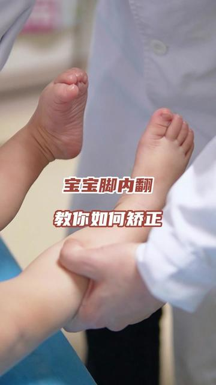

[toc]

# 正文

宝宝脚内翻，教你如何矫正 #脚内翻#母婴育儿#育儿知识#扁平足 #硬核健康科普行动

作者: [儿科张璐医生](https://www.douyin.com/user/MS4wLjABAAAAlto1GVRhXaL5HIi-ykOlByqUMe8xpcgM6lxNXzSZPd4)

发布时间：2024-12-29 17:0:0

收集时间：2025-12-24 16:44:11

统计信息：点赞数（4709），评论数（151），收藏数（2498），分享数（8113） 

原文地址：[宝宝脚内翻，教你如何矫正 脚内翻母婴育儿育儿知识扁平足 硬核健康科普行动](https://www.douyin.com/video/7452246598765088015) 

