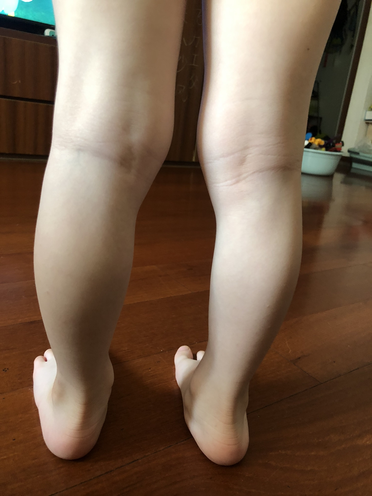

[toc]

# 正文

小朋友平足有这种情况的，训练学起来！ #扁平足 #儿童 #足踝

作者: [白露骨科攻略](https://www.douyin.com/user/MS4wLjABAAAA3VOdiDvl4uxX6ekJEHBYv5ajE023bq3YNxACEg4mGTc)

发布时间：2020-8-14 20:0:0

收集时间：2025-12-24 20:3:42

统计信息：点赞数（1200），评论数（56），收藏数（172），分享数（345） 

原文地址：[小朋友平足有这种情况的，训练学起来！ 扁平足 儿童 足踝](https://www.douyin.com/video/6860767772931132685) 

# 评论

1. <a href="https://www.douyin.com/user/MS4wLjABAAAA_SbRReuHORPFtRlP-eHnSUNEX3cVGFO1TcZnuu5RcTM">why</a> (<small title="">2020-8-25 20:58:17</small>): 我儿子也是扁平足，医生推荐足弓垫，穿了半年了吧，感觉效果挺好的。
   - <a href="https://www.douyin.com/user/MS4wLjABAAAAFd1XvwKGIrEbi3NNBvOz_TWqgK-SSN8s4CpEMDq5sFg">小幸运💗🌺</a> (<small title="">2020-9-17 22:50:45</small>): 请问哪里买的足弓垫？
2. <a href="https://www.douyin.com/user/MS4wLjABAAAA8AT2QSTJMzaHFdR8375dgPj-NrQWYTfjA2vWlKJ00ck">双子⇔DD</a> (<small title="">2021-4-24 6:42:55</small>): 扁平足去医院看什么科啊
   - <a href="https://www.douyin.com/user/MS4wLjABAAAAn4o36HBttnjzcFS01_IBalnrEr8geHdidsVSDkZUNZg">用户1617990945728</a> (<small title="">2021-5-29 11:47:1</small>): 我挂了各种骨科都让他长长，问题我们腿型已经开始变形了
3. <a href="https://www.douyin.com/user/MS4wLjABAAAACvVx8uYvHDtPn2DSsfeVoMXMysZ8RfSON96UswNwe8g">emmmmmmmmmmmm</a> (<small title="">2023-6-2 14:29:4</small>): 三岁，请问这是扁平足吗［感谢］ 
4. <a href="https://www.douyin.com/user/MS4wLjABAAAA7EjpnhO3idyYT9r3RZ544Ltzx_fTAoCrSxQ12dLxRHk">簪子</a> (<small title="">2020-8-20 11:25:58</small>): 建议也是给孩子平常使用穿有足弓鞋垫，加上医生建议训练这样孩子效果会更好 因为我自家宝贝除了做训练还有穿足弓鞋垫
   - <a href="https://www.douyin.com/user/MS4wLjABAAAAHQAgc9ZlEtrfHkD_tichwbQoZi39Z9a9n_CdzNWYT7w">胖胖和宝贝</a> (<small title="">2022-2-25 3:9:15</small>): 你好你家平足有改善吗
   - <a href="https://www.douyin.com/user/MS4wLjABAAAAazLi-41Hv8jtWT2HwfKx0XWUb3aYXqqigOT_uo8lPnc">王子</a> (<small title="">2021-7-7 15:8:51</small>): 你家孩子多大［比心］
   - <a href="https://www.douyin.com/user/MS4wLjABAAAA7EjpnhO3idyYT9r3RZ544Ltzx_fTAoCrSxQ12dLxRHk">簪子</a> (<small title="">2020-9-22 20:36:55</small>): 根据医生的建议来做足弓训练哦
   - <a href="https://www.douyin.com/user/MS4wLjABAAAAwfuRbAVs2B4CAgc3jl2JwgumTUR8mJY_-Xi9nrIqOKo">真的很哇塞！</a> (<small title="">2020-9-22 20:9:55</small>): 你家是怎么练的，求分享［比心］
5. <a href="https://www.douyin.com/user/MS4wLjABAAAAODuoYVBXq6ZVmwuEfOu1qsbOArfYY-9f1MBO5K69kkg">૮ 薄.  ̫ .凉 ა</a> (<small title="">2020-8-16 1:24:15</small>): 让她平坐床上这样试扁平足可以吗
   - <a href="https://www.douyin.com/user/MS4wLjABAAAA4cXtIw-ytbF_YwyxC9kgZlARvX1F3nisqxeXcpjOVeGsmwCkZzfihX65LlbQ5O68">🌹y1392010</a> (<small title="">2020-8-22 13:42:48</small>): 什么是平足求解答？
   - <a href="https://www.douyin.com/user/MS4wLjABAAAAODuoYVBXq6ZVmwuEfOu1qsbOArfYY-9f1MBO5K69kkg">૮ 薄.  ̫ .凉 ა</a> (<small title="">2020-8-22 19:8:55</small>): 没有足弓，走路脚跟外翻，最简单的方式就是把脚弄湿踩地上。看看脚印是什么样子，百度收下扁平足的脚印。看着图片可以测
6. <a href="https://www.douyin.com/user/MS4wLjABAAAAKjZatjtGWc_XVoIdfa1ZJB3pziDWywsNDfOcL1GzMkxUKDxw25F4sSnSp1GH9SwE">大眼睛</a> (<small title="">2020-8-15 15:57:35</small>): 10岁了，可以用这种方法纠正吗？
7. <a href="https://www.douyin.com/user/MS4wLjABAAAAGJg_ByMZfP0W0K77z2Yo9LZnvl_fAS4ayKhNdZBz9wA">个子有点高</a> (<small title="">2020-8-16 10:5:8</small>): 我二十了，因为平足征兵被淘汰了，能纠正么？求解答，谢谢
8. <a href="https://www.douyin.com/user/MS4wLjABAAAA8oC7JUiZPdf_6e0zgxlrgDt0nrXhM8YzvbUhZ2Br-DUVkJlRmZTUduNUKkC6h7k0">津海哥</a> (<small title="">2020-8-14 22:56:2</small>): 好方法［比心］［比心］［比心］
9. <a href="https://www.douyin.com/user/MS4wLjABAAAAuxizc4VDyrFbGynrnfKXS0DbrPYQDgrgyJNWk9y7HJA">幸福像花儿一样盛开</a> (<small title="">2020-8-14 21:58:16</small>): 踮起脚尖走路怎么办
10. <a href="https://www.douyin.com/user/MS4wLjABAAAAc24k2nsNW1YqWkItpiSeQFIV8Fwmhu_ZeR5jU3JCPh0">wingdy</a> (<small title="">2020-9-21 10:47:22</small>): 请问孩子7岁了，可以怎么治疗呢？
11. <a href="https://www.douyin.com/user/MS4wLjABAAAA5frRvOxaCrYZFeMgzMAJdyZPzHmgaqPIhR64KNJXtMA">wenghongxiang</a> (<small title="">2020-8-16 18:35:9</small>): 白大夫，现在左脚还行，右脚内踝足跟处疼，足弓也有点疼，希望你能指点一下
12. <a href="https://www.douyin.com/user/MS4wLjABAAAAo2C6AXyyBcah_iZUqIXVJRXLhyYALA8ykIwEd_6RzGM">家里有🐶</a> (<small title="">2021-5-28 18:46:3</small>): 需要练多长时间呢
13. <a href="https://www.douyin.com/user/MS4wLjABAAAAmLMpJPfem0XgiMUlqkLcevlF9ASj1OwGdf3-lQFvoPc">39</a> (<small title="">2020-8-15 21:32:54</small>): 25岁了练了还能改变吗
14. <a href="https://www.douyin.com/user/MS4wLjABAAAAeqGDL5RMGJYb63WZtciCpeRxKlHdqFbjULPRBDdAZOo">艺 🌈</a> (<small title="">2020-8-14 20:30:39</small>): 请问，孩子总是踮脚走路是怎么回事？怎么调整？
15. <a href="https://www.douyin.com/user/MS4wLjABAAAAAFVMDTvGdQ5pTpePJZqLNcXUjGpMvygs7ev3nzSodfA">诸事皆顺财神爷的宠儿</a> (<small title="">2020-8-27 23:10:13</small>): 那还伴有足外翻呢，需要处理吗
16. <a href="https://www.douyin.com/user/MS4wLjABAAAAKvXWe-KBm2xfv-u6n8LKHjgR0dCM_eXYNco_kJAj9zY">鲟鳗</a> (<small title="">2020-8-14 20:12:43</small>): 原来上次带儿子去看，是因为年纪过来8岁
17. <a href="https://www.douyin.com/user/MS4wLjABAAAAzo27RSHXTZ51yDOo-aJrbLncwnXnjLlu6-OAt-aV4Ko">米娅</a> (<small title="">2020-11-6 0:58:18</small>): 我家姑娘轻微后足外翻，做踮脚练习可OK？
18. <a href="https://www.douyin.com/user/MS4wLjABAAAAVH4EhZ4BcSyiI-HKHlsfSIOD5ZSHdrPnFRKiw1hGwa0">美味脆皮烧鸡</a> (<small title="">2020-8-14 23:14:15</small>): 10岁了可以练吗？
19. <a href="https://www.douyin.com/user/MS4wLjABAAAA3K1oZF9aPHYIwHaAA8fV-4VBx4yJvrKAqhnQzAIJVp8">小66</a> (<small title="">2020-8-19 17:3:46</small>): 什么叫平足
20. <a href="https://www.douyin.com/user/MS4wLjABAAAA2b2_Sczi89vXMlLGY7BwCV00wDENW4Pe-SEZu7joQK4">C～^_^</a> (<small title="">2020-8-14 20:9:55</small>): 9了还能不能锻炼［流泪］
21. <a href="https://www.douyin.com/user/MS4wLjABAAAADx71zYyMGzIrmqD9jTcLBcPhZVB0Pl0JNs64Q7b32Qs">王子Tino</a> (<small title="">2020-8-14 21:55:15</small>): 一样一样的脚型 发愁死了
22. <a href="https://www.douyin.com/user/MS4wLjABAAAAkiGmzcSXJVmsVzW3BhZt3Dvgs-VcDapfk2cUBDOaxnk">葱姐</a> (<small title="">2020-8-15 2:25:28</small>): 平足可以打篮球吗？
23. <a href="https://www.douyin.com/user/MS4wLjABAAAAACwOxh0x9zq9gaYlyOZMWjjySpLwvc5On-mZnPa_k_Y">我家有条傻🐶叫布丁</a> (<small title="">2020-8-16 9:21:42</small>): 我小孩12岁，才发现平足很老火，怎么训练
24. <a href="https://www.douyin.com/user/MS4wLjABAAAA3ifjTPiKQpR7_9FZLcPxh2R-7Y_PSYfpbhNvKFjoSzc">焕</a> (<small title="">2020-8-15 22:21:20</small>): 60岁了从小平足还能改善吗？
25. <a href="https://www.douyin.com/user/MS4wLjABAAAA25PO83ViZn0S4OsObgAdLbIghVgFo14c2lYvJ3FGnH0">明年今日</a> (<small title="">2020-8-15 2:31:5</small>): 崴脚两个月脚踝处变厚了也不是水肿 感觉里面厚度增加 也不疼了 请问是什么个情况呀
26. <a href="https://www.douyin.com/user/MS4wLjABAAAAD3EVWHR6aqajVpSdoIBzDIzYLcVzjNY9GpMU7D8n2mA">玉之伍德</a> (<small title="">2020-8-18 15:50:41</small>): 我家孩子快9岁了，也是这样，该怎训练？谢谢！！
27. <a href="https://www.douyin.com/user/MS4wLjABAAAAvPhgQq_QjEsJAy1pqbb-Sgt1YjKFJUGlZ-8iJNeQf7A">平行</a> (<small title="">2020-8-16 20:39:44</small>): 白医生好，我脚裸韧带拉伤三月了，医生说让下地走，说有点脚裸变形，我现在走路稍微有些疼，不能太用力，我该怎么办，怎么恢复
28. <a href="https://www.douyin.com/user/MS4wLjABAAAA3HzAkYM-_RyUuR-dDRV0XJkrwHjH-kIwv5gZsEREy4w">。温 . 暖 。</a> (<small title="">2020-8-14 20:24:58</small>): 足外翻怎么办？
29. <a href="https://www.douyin.com/user/MS4wLjABAAAAYPNBeoZ3lLrkE_zZ6BR5l3t3wR96sYO-hQ3LqtGULok">宋好运</a> (<small title="">2020-8-26 18:31:35</small>): 我儿子一岁半 后跟外翻我正说要去看医生 害怕。
    - <a href="https://www.douyin.com/user/MS4wLjABAAAARsFqf-PMhWQRMTzc2UQ57Fkhpn9gVW_VvmPczlqg6Fw">猩猩点灯</a> (<small title="">2020-10-7 1:7:42</small>): 才18个月刚会走路不久，扁平足很正常的，3周岁后才应该在意
30. <a href="https://www.douyin.com/user/MS4wLjABAAAAM4m8qbsKQdgQPF0sIGM8kx3a-7TgNQyUTknm4ItMujQ">放不下的是记忆</a> (<small title="">2020-8-14 22:13:37</small>): 你好小孩有点内八怎么调节
31. <a href="https://www.douyin.com/user/MS4wLjABAAAArYr2WQELpLy9wsJSzY0e-oBaPjvja4MhgamIpzGNL1wvG8UZ7P8wC43NXqCNo-4R">香菜，</a> (<small title="">2022-5-13 5:14:22</small>): ［赞］
32. <a href="https://www.douyin.com/user/MS4wLjABAAAAg90usRDoYBn3JxhPIvRfublsLDAkmaSYrwqIS66NfpXk9gEKgmpmBgVL6cQYXfQI">林中仙</a> (<small title="">2022-3-17 20:39:55</small>): ［赞］［赞］
33. <a href="https://www.douyin.com/user/MS4wLjABAAAAZ09H6KOD6v-Mua5B4Xe6Pm58GBN_exm50K0PNwT5sTE">梧桐雨～</a> (<small title="">2021-11-23 23:4:17</small>): @橙橙橙呀！🍊
34. <a href="https://www.douyin.com/user/MS4wLjABAAAApIU__cjqDvw_AhJQC2suXu70sY8zDRmZXYxJAlVcquI">水中鱼</a> (<small title="">2020-9-6 21:27:41</small>): 孩子8岁平足，需要治疗吗
35. <a href="https://www.douyin.com/user/MS4wLjABAAAA5frRvOxaCrYZFeMgzMAJdyZPzHmgaqPIhR64KNJXtMA">wenghongxiang</a> (<small title="">2020-8-16 19:59:53</small>): 白大夫，右脚柔性平足，足踝内侧后跟处疼痛，足弓处也有点疼，53岁了
36. <a href="https://www.douyin.com/user/MS4wLjABAAAAGt-HWiHrw5Te7DzQ2L06EDbXDcCN-qkVXqh4JO8yOuCO-CecxLLpr0J8a2jS0ra3">南边的花开了</a> (<small title="">2020-8-15 0:16:46</small>): 我孩子读幼儿园时，因为平足，挂了儿童医院骨科，拍了片，然后女医生说穿矫正鞋，给了我厂家册子，然后就结束了，什么也没有交待。我到现在也没有想明白，儿童医院怎么会有“水份”的医生，那可是我心中的大医院。
    - <a href="https://www.douyin.com/user/MS4wLjABAAAA5221ZaPi0fItayFk-ohDoepLdb1DOOylAW9_ereuNxk">星晴.</a> (<small title="">2021-3-31 0:21:18</small>): 有效果没
    - <a href="https://www.douyin.com/user/MS4wLjABAAAACRZzt94Uohwf1apvBQ9c9reGPcwqiKYJjLg0jdqn6HM">燕子</a> (<small title="">2020-8-30 5:18:25</small>): 一模一样的，儿童医院看完就是让定制鞋子，一双大概1800左右，然后就说观察。哈哈
    - <a href="https://www.douyin.com/user/MS4wLjABAAAAMMpTkDNUwWtpbdMpszM8MZYpNUF7-gM_o3yegGYE68A">Mᰔei&amp;Mᰔei</a> (<small title="">2020-8-15 6:57:58</small>): 我也是这样，鞋子还贼贵一千多一对，穿一两个月就不合适［晕］［晕］
37. <a href="https://www.douyin.com/user/MS4wLjABAAAA5frRvOxaCrYZFeMgzMAJdyZPzHmgaqPIhR64KNJXtMA">wenghongxiang</a> (<small title="">2020-8-16 18:30:3</small>): 白大夫，我去年4月5日左脚崴脚，没有骨折骨裂，当时没有处理好，造成3个月后，右脚踝关节也开始疼，一直到现在，双侧脚内踝后跟处疼痛，右脚有点柔性平足，劲后肌腱炎，右脚疼的更厉害，现在53岁，正是绝经期，
38. <a href="https://www.douyin.com/user/MS4wLjABAAAAnW0P3jG_xcL0OA64QavPVCiQwfKD_6Jbxnww8OqtqJ8">布洛芬</a> (<small title="">2020-9-29 11:42:6</small>): @风行者
39. <a href="https://www.douyin.com/user/MS4wLjABAAAAIeiJ9mLimLWxXoz79VaZTsgVRTQv_SJwtc5Lw1FBPZA">Mr.陈</a> (<small title="">2020-9-15 22:36:38</small>): @海燕呐~
40. <a href="https://www.douyin.com/user/MS4wLjABAAAAPVejM8V0fosl0h8FkRsnpiVU_axUUm60m6hPAnF3bjM">CHOW.</a> (<small title="">2020-9-8 0:11:50</small>): @橙仔
41. <a href="https://www.douyin.com/user/MS4wLjABAAAABWA006P2TBvSpAJdKVWSJ_31njEhgM7QqcvrfbOXMMnXAMNmxMKZCaT55D9FldPA">晚佳</a> (<small title="">2020-8-14 21:36:24</small>): 您好！我儿子有点内八，15岁，需要治疗吗？
42. <a href="https://www.douyin.com/user/MS4wLjABAAAACu0RSnU1mEgGkJcHfppu14Lj50UyLrDOWSFtr7_GGAM">🍭陈-cici🍭</a> (<small title="">2020-8-30 0:12:44</small>): 白医生，请问两岁半男宝宝，膝超伸需要治疗吗？
43. <a href="https://www.douyin.com/user/MS4wLjABAAAA1aD18Mae7fwqNqP-QHvI69OPWOd8nyNR6lj1dIvLRJU">海洋饼干～</a> (<small title="">2021-3-2 9:56:13</small>): 您好大夫，2岁半跟骨外翻怎么治疗？［玫瑰］
44. <a href="https://www.douyin.com/user/MS4wLjABAAAAxjeo9QEoHdgiEqfMF_bettYRuWe0rujJyxQ_sf8g5ew">TT.</a> (<small title="">2022-4-27 15:12:11</small>): @🌈 爱你是最好的时光#

=[评论](./attachments/comments.json)

