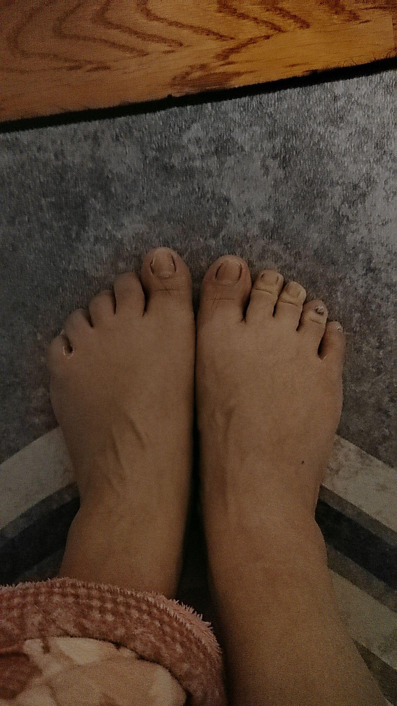
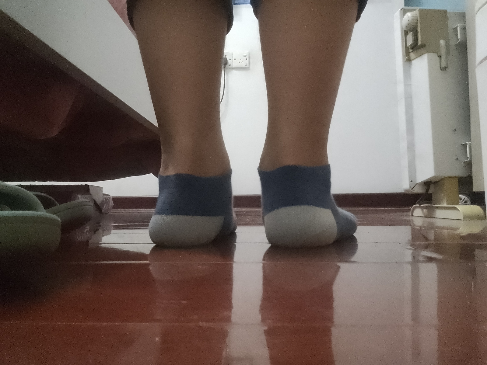

[toc]

# 正文

扁平足不可怕，可怕的是结构性扁平足。#体育生扁平足 #体育生 #扁平足 @抖音小助手 @DOU+小助手

%

作者: [田径匠人张初一](https://www.douyin.com/user/MS4wLjABAAAAK-VuOpDygtMFEZyvrq9F0KmfI7WwWX_H88yDQBZXhN1tn_SMaeS9utjLypywuZap)

发布时间：2021-11-24 12:53:11

收集时间：2025-12-24 20:32:19

统计信息：点赞数（77424），评论数（1651），收藏数（2068），分享数（2496） 

原文地址：[扁平足不可怕，可怕的是结构性扁平足。体育生扁平足 体育生 扁平足 @抖音小助手 @DOU+小助...](https://www.douyin.com/video/7033995023611972904) 

# 评论

1. <a href="https://www.douyin.com/user/MS4wLjABAAAATBIWriU38W2MW4Eb6yaPoverg_UIApTV9K17IXqZgZo">乐.</a> (<small title="">2021-11-24 19:30:35</small>): 那我高弓足是不是很牛逼？［看］［看］
   - <a href="https://www.douyin.com/user/MS4wLjABAAAAAatPCqbzAVpD3uHfSI14SzZX1zL5Rrk_IyXoQQujydo">JVKEI</a> (<small title="">2021-11-28 11:49:39</small>): 古代裹脚就是那样［看］［看］
   - <a href="https://www.douyin.com/user/MS4wLjABAAAAo8vOsrP0S05g1zRxxQ5fEhH0OzXmVLupnGthKXTb_8E">།།།</a> (<small title="">2021-12-3 0:2:54</small>): 我也是，但是高足弓容易前掌筋膜炎，我就有［黑脸］
   - <a href="https://www.douyin.com/user/MS4wLjABAAAATBIWriU38W2MW4Eb6yaPoverg_UIApTV9K17IXqZgZo">乐.</a> (<small title="">2021-11-28 13:15:40</small>): 完全不一样的
   - <a href="https://www.douyin.com/user/MS4wLjABAAAAl2HhKd4bA0k7IR2AcSe8L1vQrwWeFchqTxQ6Byk5nFM">万卿门窗</a> (<small title="">2022-1-21 0:41:39</small>): 一蹬腿就能上天［看］你说牛不牛逼［呲牙］
   - <a href="https://www.douyin.com/user/MS4wLjABAAAAqrKRPN6nLTWKOoaAdXQbQsoLG9fOXSJYIV4PtMXhD0a8msmt8CiVQoXSbN8UROjf">haha</a> (<small title="">2021-11-30 6:58:47</small>): 我是足弓大，但是还算不上高足弓哈哈［看］
   - <a href="https://www.douyin.com/user/MS4wLjABAAAABzeDUjJJO9KCk4TXwrimvmIlLVCilIImMNbsCPjGz6Q">凌・渡</a> (<small title="">2021-12-4 1:3:31</small>): 放心，我这边快一年了［看］
   - <a href="https://www.douyin.com/user/MS4wLjABAAAAjY_NOOR2r-gLqOWva6_IvEAwvxS_HAp4buDRa7D4NHg">三文鱼暹罗yu</a> (<small title="">2021-11-28 17:10:22</small>): ［泪奔］
   - <a href="https://www.douyin.com/user/MS4wLjABAAAAbpYTUkaB7L6cIxHzdN3iWnlrq8_HXefla8EBgLVl1jc">斜🐑</a> (<small title="">2022-2-10 17:34:52</small>): 容易断［看］
   - <a href="https://www.douyin.com/user/MS4wLjABAAAA1zMgHtWdDaCQHzeX1fw94iELeOO2MXTAZl7fk5SeCZy5R7RRyubNokLlFXts0CIF">东起</a> (<small title="">2022-1-20 22:3:39</small>): 别说了，我就是 大拇指后面那块骨头会很大［赞］
   - <a href="https://www.douyin.com/user/MS4wLjABAAAATBIWriU38W2MW4Eb6yaPoverg_UIApTV9K17IXqZgZo">乐.</a> (<small title="">2022-1-20 14:27:39</small>): 笑死马蹄足和这个有啥关系？
   - <a href="https://www.douyin.com/user/MS4wLjABAAAAWVQdFnS0fefu71LMkVGJEUSbb0Tak5aEGgNyG9mBTps">Calm</a> (<small title="">2021-11-26 23:1:4</small>): 虚空遁地兽
   - <a href="https://www.douyin.com/user/MS4wLjABAAAAvnX6UWF6meO2baGPhaTwHS0AA9IvaLEP3fqS6qHpum4">用户9060152524523</a> (<small title="">2021-11-28 1:8:1</small>): 高足弓也不行［看］
   - <a href="https://www.douyin.com/user/MS4wLjABAAAAVZpTVPHSzoCC39Gj7b7RAMyurdQKxmuskqLce_xLPhtF_1BHIIUTrFKD5ZuTogdf">cola</a> (<small title="">2021-11-28 20:11:52</small>): 我也高足弓 跑几步累死［看］
   - <a href="https://www.douyin.com/user/MS4wLjABAAAA3BGFcVlhsWwFhyExM0drbB-qxF7ugL5xpQBuOO12OZa4_suT6aFjh3fGUZc4w-X-">星星🌷.</a> (<small title="">2021-11-28 0:26:59</small>): 一样，但是我跑得巨慢［看］
   - <a href="https://www.douyin.com/user/MS4wLjABAAAACXOpX8ZzlO2IKHV69WadYcOoZnjp3SGW6AteCl04yNU">衡</a> (<small title="">2022-2-4 0:51:37</small>): 黄晓明［机智］
   - <a href="https://www.douyin.com/user/MS4wLjABAAAAd1IjJNUPfSS8vJnqEuqOGYHNZMeSA_knGcP5n04oaDc">考试总能考第一</a> (<small title="">2022-1-28 20:47:17</small>): 我没有［捂脸］
   - <a href="https://www.douyin.com/user/MS4wLjABAAAAEEFpbngjpNX4VFEWqAp15CNGEGrLd8elUgTrr-hvNPk">Hey</a> (<small title="">2021-11-28 20:49:7</small>): 但你要训练，脚弓越拱，承受的力就更大
   - <a href="https://www.douyin.com/user/MS4wLjABAAAA21TpKAeEA45_o4XzrSuLX0-Y_qaqSrXfeaPAZswrR5I">6464</a> (<small title="">2024-12-11 18:29:12</small>): 是跳的很好，但是没有正常足宫跑的快
   - <a href="https://www.douyin.com/user/MS4wLjABAAAA425U81vjod3HhopCupfJJ0ZB4aUeTxGwdY2LLiMUFVc">qerw</a> (<small title="">2022-1-20 13:31:1</small>): 马蹄足
   - <a href="https://www.douyin.com/user/MS4wLjABAAAA_xrUqCVnu3XzC86upIu8FxfpN9PjYD-RBssIdQPZnoY">金钩</a> (<small title="">2025-2-23 17:22:54</small>): 过高也不行
   - <a href="https://www.douyin.com/user/MS4wLjABAAAAvhY_sNsBMW-7eIFRbP4qfsCjyAzCgvH1ogBHWgFBrrU">扬爷</a> (<small title="">2025-2-23 15:26:1</small>): 足弓太高也不适合运动
2. <a href="https://www.douyin.com/user/MS4wLjABAAAAtCtq3oAY8QX492vi4q2--d5FNjE2QoGdcRmMnjzanaQ">有失真味</a> (<small title="">2021-11-26 20:59:4</small>): 扁平足还会导致走路摇头晃脑
   - <a href="https://www.douyin.com/user/MS4wLjABAAAAtCtq3oAY8QX492vi4q2--d5FNjE2QoGdcRmMnjzanaQ">有失真味</a> (<small title="">2021-11-28 17:8:41</small>): 那没那种气质
   - <a href="https://www.douyin.com/user/MS4wLjABAAAASPyrBV17qBGZWsZe1OWZMmbaekRSS2Vy9hwRh8-PylA">Avec le vent</a> (<small title="">2024-8-24 15:40:19</small>): @Liberté 什么歪门邪道 我就是扁平足 照样能跑的快
   - <a href="https://www.douyin.com/user/MS4wLjABAAAASWfp0CsXbJcsAStVpzlUyB4SNa3dGelKctQbmV2k4a4">该干嘛干嘛去❤️💙</a> (<small title="">2022-3-10 19:0:21</small>): 夸张了吧，我就不会，我爸也不会
   - <a href="https://www.douyin.com/user/MS4wLjABAAAAiy49OHZXNyi3NA0Y_7Qsdgk0-6qWo6HoA7TW6WBOttM">ok</a> (<small title="">2022-1-30 16:6:30</small>): @忆 丁子琦给我说我跑步摇头晃脑的
   - <a href="https://www.douyin.com/user/MS4wLjABAAAAtVoDgOCLd3qTyT3hLrfAY1ZYWBQyGWMIdQzli5bfv6Y">爱吃萝卜的瓜</a> (<small title="">2021-11-28 21:45:11</small>): 礼貌许昕：你吗
   - <a href="https://www.douyin.com/user/MS4wLjABAAAAtCtq3oAY8QX492vi4q2--d5FNjE2QoGdcRmMnjzanaQ">有失真味</a> (<small title="">2024-8-25 10:31:10</small>): 比别人更累
   - <a href="https://www.douyin.com/user/MS4wLjABAAAA0pBbBHrPC2-846fuw8Ppa6ksiCWmwkLzDe6tcBO7zDM">^11</a> (<small title="">2022-1-22 17:34:21</small>): 不是我吗，可我不是扁平足［看］
   - <a href="https://www.douyin.com/user/MS4wLjABAAAAHhCzVw4ua-ya6n5jbxZ_2Y2FAs0nVH4-zMfIq1_f1hb9HtJuQETuIwp2wLQOAjTA">💺宁姨上椅中</a> (<small title="">2022-1-20 21:22:26</small>): @小兑.
   - <a href="https://www.douyin.com/user/MS4wLjABAAAAVSlGPGBLrG2TIgeoHcKtqpXHMnHdmssNc6sflZ6aH8I">景鸢</a> (<small title="">2022-1-20 18:25:2</small>): ？
   - <a href="https://www.douyin.com/user/MS4wLjABAAAAFcGRcjrORZu5H1rwkh7d7RIxrRXP2IDcJbmTQKW4_Mc">日京</a> (<small title="">2022-1-20 13:28:40</small>): @碎碎念 这不是阿吉马吗［看］
   - <a href="https://www.douyin.com/user/MS4wLjABAAAAfAa0YhVdK7E5oi9v9VH5mbkHL9jQR2rOt1oO99m5G78">Liberté.</a> (<small title="">2024-8-24 16:4:21</small>): 我不是扁平足［呲牙］［呲牙］
   - <a href="https://www.douyin.com/user/MS4wLjABAAAAp5zlbvyudZwfmPduWVjT5_dGDhCgShtczEQl7quJEPQ">玉</a> (<small title="">2024-8-7 18:55:44</small>): 我不会，走路还贼有气质
   - <a href="https://www.douyin.com/user/MS4wLjABAAAAi4BaNxBuCRvtbM65jd5bIyNLNIEdBZnJsuwPFWaaMj8">_额</a> (<small title="">2022-1-20 13:15:8</small>): @\_SleepZz ［流泪］
   - <a href="https://www.douyin.com/user/MS4wLjABAAAAZLJh9k9hbCGYthXU7WUGLAxCdiBy5iUCPNOG8M6VaQY">零距离</a> (<small title="">2022-1-20 13:3:20</small>): ？
   - <a href="https://www.douyin.com/user/MS4wLjABAAAAmD93PWbLhCSPb5n_YB8uR2RseaskKSSOSRCEdGbZJb4">不挂科🇨🇳</a> (<small title="">2021-12-13 12:57:52</small>): @墨殇
3. <a href="https://www.douyin.com/user/MS4wLjABAAAAXWVfZN8_odMwOehj99OAMtCRwnKUGFJd83trEa3UJJk">云淡风轻</a> (<small title="">2025-4-11 22:38:31</small>): 两脚一起抓地，左脚是这样的［流泪］［流泪］ 
4. <a href="https://www.douyin.com/user/MS4wLjABAAAAxwN41mR6owbAXZJbEHPGUDCVb1V20hpPPek6NN_5YlE">南北绿豆</a> (<small title="">2021-11-24 18:32:43</small>): 博尔特是因为长期训练 有下压动作形成的类似扁平足吧
   - <a href="https://www.douyin.com/user/MS4wLjABAAAAKvw5nbwnxwgXm9PaORxKaDyBPt4mazUhdj-7yHVc_mhm9qRdeptIROIV2hNxSacj">Beta. ds</a> (<small title="">2021-11-24 23:20:2</small>): 我觉得应该也是［看］
   - <a href="https://www.douyin.com/user/MS4wLjABAAAAGAI7d-895qlWsPclEUEAzYOor3-VYDFrhlRQPm20qxc">川学良</a> (<small title="">2023-12-25 7:27:3</small>): 大部分短跑运动员训练强度都不小，但是，大部分短跑运动员不是扁平足
   - <a href="https://www.douyin.com/user/MS4wLjABAAAA-qDKa61lCiPEF0NAMubuRYdy5DINixHxxPbyUuMEqVY">小乖兔</a> (<small title="">2025-10-5 15:52:7</small>): 很多马拉松运动员也是扁平足，跳水运动员也多
   - <a href="https://www.douyin.com/user/MS4wLjABAAAAAP8ykd3Du-yK7Av3Kac6ZkWApqxQc80TEolpU-JIHpE">古城小巷 少年已去</a> (<small title="">2024-8-17 17:32:18</small>): 对，我看他那脚明明有弧度
   - <a href="https://www.douyin.com/user/MS4wLjABAAAArzslbAAUF7Ep_S0ZlpDUvJz9eV4CuoNWPdltzpuwriXzQdA7pz0ew-5MjQMj2szt">泰骷辣</a> (<small title="">2023-10-24 9:40:13</small>): 对啊，这图也看着不明显的，自媒体不夸大没流量
5. <a href="https://www.douyin.com/user/MS4wLjABAAAAh-kMU15S1Y7qP3XHXe6wHy26aiCCweLbPWGSNcHfaFI">Dandelion wind</a> (<small title="">2021-11-28 11:33:32</small>): 扁平足不可能是体育生，所以体育生不怕扁平足［看］
   - <a href="https://www.douyin.com/user/MS4wLjABAAAAvIqkouf-GSRFmDiPblvTHeHtzj3si6WtXAH8bywc8jQPegV-WQlfweU-Wc9CU8i9">Sky🪐</a> (<small title="">2024-4-30 19:52:18</small>): 确是成不了我国选材运动员，乔丹、博尔特扁平足、詹姆斯罗圈腿、1.6几马拉多纳，此类按国内标准没一点天赋跳不高跑不快，入体育生资格都不够。
   - <a href="https://www.douyin.com/user/MS4wLjABAAAAh3C21B-AMPVBb1sdcGcgopWvwnwv1LM0D3ARFjd5pZ8">義毅</a> (<small title="">2022-2-3 21:25:53</small>): 我笑了 我就是 然后呢
   - <a href="https://www.douyin.com/user/MS4wLjABAAAAp1jU_NJastWzDq7Lwft40vw9biyveqe1D9RO4YBvFjRxvREzp_oOV441GDw-JIWU">XUAN.</a> (<small title="">2024-10-5 20:16:11</small>): 人家有后天练成功能性扁平的［玫瑰］
6. <a href="https://www.douyin.com/user/MS4wLjABAAAA1ED3EgCNmuOuxhWw73SqdaIjihfn-9snVzsPUZObTbo">乄夵</a> (<small title="">2025-8-2 10:5:45</small>): 开玩笑，俺儿扁平足，三岁半，你根本追不上他［灵机一动］，我高弓足，跑步长了走路久了跟断了一样疼
   - <a href="https://www.douyin.com/user/MS4wLjABAAAA_xrUqCVnu3XzC86upIu8FxfpN9PjYD-RBssIdQPZnoY">金钩</a> (<small title="">2025-8-8 2:23:42</small>): 小孩子发力是筋骨，会更持久，不是肌肉发力，小孩子可以蹦跳一天，成年人一个小时累得不行。
7. <a href="https://www.douyin.com/user/MS4wLjABAAAA43EP8ikRY07LxHTY-aq14bTNStT9VlTuyNLq_O16V3A">无情抑郁</a> (<small title="">2021-11-28 0:24:35</small>): 扁平足跑不快？扁平足更适合跑跳吧
   - <a href="https://www.douyin.com/user/MS4wLjABAAAAar8xexDZVAlUWXj46q3NIf05tExh7D0fXZudgJzVgL0">jqk 私信被封90天</a> (<small title="">2021-11-28 9:9:7</small>): 扁平足不适合竞技运动 他们以前都是有足弓的 长期竞技运动练塌了
   - <a href="https://www.douyin.com/user/MS4wLjABAAAAXhRPIX3PnAZLHDLbEiuzIVqKdLxw9QFxxaqEWL7cBiU">kilo☔️</a> (<small title="">2023-9-24 16:48:40</small>): 那也只是你啊，而且扁平足落地很伤脚的，只能说你天生弹跳就很好嘛，我就是扁平足，跑步弹跳都不行［听歌］
   - <a href="https://www.douyin.com/user/MS4wLjABAAAAjLDTUk5x24bCVLrO9nplnqfqRcu1CLYeuay6vWv08No">白豫</a> (<small title="">2021-11-28 8:10:22</small>): 不是跑不快，是更累而且更容易受伤
   - <a href="https://www.douyin.com/user/MS4wLjABAAAAvwY6G1nFoWcOj-z_7Synvbgx6a6x5qUtjsQm96UTwb0">蟹堡亡</a> (<small title="">2023-9-24 15:40:54</small>): 笑死，老子扁平足171随便抓框
   - <a href="https://www.douyin.com/user/MS4wLjABAAAAXhRPIX3PnAZLHDLbEiuzIVqKdLxw9QFxxaqEWL7cBiU">kilo☔️</a> (<small title="">2024-7-28 14:17:38</small>): 我155［宕机］
   - <a href="https://www.douyin.com/user/MS4wLjABAAAA3eGVC_PwllGbOoh17ZbMqiTBxWmm6lWOMY0SyHs9E_Q">LeoMessi</a> (<small title="">2024-7-28 12:55:37</small>): 我171随便抓［尬笑］
8. <a href="https://www.douyin.com/user/MS4wLjABAAAAc0iI89laEh7qT9hBAxo9HpRzQpXLXPgXuPsSvQO4WBc">value_null</a> (<small title="">2021-11-28 21:48:54</small>): 为什么我高足弓也跑不快呢［泣不成声］
   - <a href="https://www.douyin.com/user/MS4wLjABAAAA8n_M0_gML0VB4VqLPE6yJnuPnSL-78FEvW16rf8sKK4">可儿和西柚</a> (<small title="">2023-7-9 16:25:31</small>): 你把扁平足的人放哪里
   - <a href="https://www.douyin.com/user/MS4wLjABAAAAbOIGUWJpf214PFWbFfnrPD4UMEQin360QmC6bs_weRY">无邪</a> (<small title="">2022-1-20 15:33:36</small>): 你没爆发力，当然跑不快
   - <a href="https://www.douyin.com/user/MS4wLjABAAAAAqOq96EO2eF7viWXCuxnpTAcoqeeKSiCfdbADS2UP5U">火龙果</a> (<small title="">2022-2-24 23:53:41</small>): 股四头肌，臀大肌，核心稳定上肢稳定原因很多方方面面都有可能［看］
   - <a href="https://www.douyin.com/user/MS4wLjABAAAAHQy8F3Yy7dNdE072jamRcGMOStNS0QIrFNKVADlmqs0">吃草</a> (<small title="">2022-2-2 1:28:49</small>): 脚板会痛［看］
   - <a href="https://www.douyin.com/user/MS4wLjABAAAArabacjn4DIJyAR8aPXy_Apd0K3mrTvN_6nneP6ygV7k">用户0147667455996</a> (<small title="">2022-1-22 23:30:8</small>): 是个人都是高足弓
   - <a href="https://www.douyin.com/user/MS4wLjABAAAArBmHhSCDC8Hm-GhqCzVyz_b5OXHk7VnSmWNeCc2q9cKGtdDj0hO-kiddkqtgxsrG">MAUGHA毛姆</a> (<small title="">2021-12-3 21:23:37</small>): 就好像给你博尔特的身高你能跑过他似的［暗中观察］
   - <a href="https://www.douyin.com/user/MS4wLjABAAAAAnogVgKBde3HSvhhCxyj3AdL-VABYetKG55_s_eFqBg">等一份日落</a> (<small title="">2021-11-28 21:59:44</small>): 可能是脚踝的问题
9. <a href="https://www.douyin.com/user/MS4wLjABAAAAWgQLVtDjxXsuNrs1bcsv-1uhmIoPJGMpPZLvUXxtNW4">魏先生的布朗熊</a> (<small title="">2021-11-28 19:13:28</small>): 我不是扁平足但我跑的特别慢［尬笑］［尬笑］
   - <a href="https://www.douyin.com/user/MS4wLjABAAAAXhRPIX3PnAZLHDLbEiuzIVqKdLxw9QFxxaqEWL7cBiU">kilo☔️</a> (<small title="">2022-1-25 20:16:59</small>): 那就是天生体能问题，多练［看］
   - <a href="https://www.douyin.com/user/MS4wLjABAAAAWgQLVtDjxXsuNrs1bcsv-1uhmIoPJGMpPZLvUXxtNW4">魏先生的布朗熊</a> (<small title="">2024-6-8 23:51:16</small>): 不是懒，真的跑不过别人［流泪］
   - <a href="https://www.douyin.com/user/MS4wLjABAAAApz_hygmIEWdM-blcf8kz6QhRNM9PxxboCwUBvx08CXk">7</a> (<small title="">2022-7-11 8:12:42</small>): 我扁平足但我跑挺快［看］
   - <a href="https://www.douyin.com/user/MS4wLjABAAAAWgQLVtDjxXsuNrs1bcsv-1uhmIoPJGMpPZLvUXxtNW4">魏先生的布朗熊</a> (<small title="">2024-6-9 1:48:19</small>): 我刚刚看到［泪奔］
   - <a href="https://www.douyin.com/user/MS4wLjABAAAA9aSDO-dPZcadLaBlr0l5GPdK-z0RVWoYOm0IRWiIdXw">战你太美</a> (<small title="">2024-6-9 0:12:32</small>): 时间好久啊［泪奔］
   - <a href="https://www.douyin.com/user/MS4wLjABAAAAGvVR_dg72zYnRmXgrcLBe0mg937IQHv5s-0d-rEDxHg">用户3909254570672</a> (<small title="">2024-6-8 17:1:6</small>): ［泪奔］
   - <a href="https://www.douyin.com/user/MS4wLjABAAAAXhRPIX3PnAZLHDLbEiuzIVqKdLxw9QFxxaqEWL7cBiU">kilo☔️</a> (<small title="">2022-1-27 19:22:41</small>): 他又没说是短跑，是短跑的话当我没说［看］
   - <a href="https://www.douyin.com/user/MS4wLjABAAAAUAwSzG6XGx7TDn3hRLZo3-tYXIH5GMnrGei0DLGsf-rYi8s4-d5u8opNwntCDwsd">简单的一天🐅</a> (<small title="">2022-1-27 1:46:18</small>): ［看］特么都短跑，体能已经不是最主要的了
   - <a href="https://www.douyin.com/user/MS4wLjABAAAAcFUMhdzSY0n9S9dynKMCmLJ_1sriqMqxN1OJNFxM08bgnghbQG4jp4orurtAlG6_">嘉茶圆舞曲</a> (<small title="">2022-1-20 13:17:56</small>): +1［看］
10. <a href="https://www.douyin.com/user/MS4wLjABAAAAW_FW11NKmgcmY6WNpQxcXYB67DMQynZboslHXxVL74A">福州小佳男士发型设计</a> (<small title="">2021-11-24 18:37:9</small>): 我脊柱有问题［流泪］
    - <a href="https://www.douyin.com/user/MS4wLjABAAAAUlO_sYHW6hYTj-r72IqQbmQMY4nezp5hxnJMbYtBQ1s">zkj</a> (<small title="">2021-11-28 8:34:56</small>): 博尔特也有脊椎侧弯
    - <a href="https://www.douyin.com/user/MS4wLjABAAAArKZbxoBudw_SXPNQmcav5YKy-OZPLzWLCDqkanBgW_4">你才像西瓜🍉</a> (<small title="">2021-11-28 18:36:48</small>): @DzJ. 知道了 我是博尔特［看］
    - <a href="https://www.douyin.com/user/MS4wLjABAAAAW_FW11NKmgcmY6WNpQxcXYB67DMQynZboslHXxVL74A">福州小佳男士发型设计</a> (<small title="">2021-11-25 18:41:48</small>): 我脊柱侧弯［感谢］
    - <a href="https://www.douyin.com/user/MS4wLjABAAAAqCLoUhNDiwRe5n452AKQ2S6acQD83zW97VGqDMFQ7vI">Eason</a> (<small title="">2021-11-24 23:57:50</small>): 我脊柱有一块突出来，压迫髋关节，跑步一只脚没事，另一只脚跑的累死［尬笑］
    - <a href="https://www.douyin.com/user/MS4wLjABAAAAktrPxJRolQ_K013-uw8CqZrx2ENBd4ZOZX9bhVnFHd4">Dusk</a> (<small title="">2021-11-24 21:43:12</small>): 博尔特也有，相信自己［看］
    - <a href="https://www.douyin.com/user/MS4wLjABAAAAW_FW11NKmgcmY6WNpQxcXYB67DMQynZboslHXxVL74A">福州小佳男士发型设计</a> (<small title="">2021-11-30 18:26:26</small>): 哈哈哈［看］
    - <a href="https://www.douyin.com/user/MS4wLjABAAAAUfSjjuZ_U9EGXBr9F8OIEdFbx31kEm8ShYunO8b0s2U">阿走.</a> (<small title="">2021-11-25 21:39:57</small>): 博尔特也是［看］
    - <a href="https://www.douyin.com/user/MS4wLjABAAAA0tnWy41So3MPwSneiHTIvN4IbABA2NETYvfM8_5IGykLe5obwikQIO-3WaPXzXo3">玥🍼</a> (<small title="">2021-11-28 23:44:46</small>): 哈哈哈，我就是博尔特，扁平足又脊柱侧弯
    - <a href="https://www.douyin.com/user/MS4wLjABAAAAW_FW11NKmgcmY6WNpQxcXYB67DMQynZboslHXxVL74A">福州小佳男士发型设计</a> (<small title="">2025-4-23 11:26:7</small>): 幸好我是先天性脊柱侧弯 现在也不算特别严重 发育也差不多停止了 所以我就没做手术
    - <a href="https://www.douyin.com/user/MS4wLjABAAAAuk_vR_LrmWLWQzIEraDrNL_8p2ls8TxV_y8Fv5IBC_o">7</a> (<small title="">2025-4-18 18:44:29</small>): 现在怎么样了
    - <a href="https://www.douyin.com/user/MS4wLjABAAAAoO8FjBAbhnvw8t4F3rp_Ki7tkkvgQfVzJvWWhFn5IdrQjgwBjgaHZj4s_FSgJw2m">非晚🇨🇳</a> (<small title="">2024-3-30 21:26:29</small>): 我是重度的
    - <a href="https://www.douyin.com/user/MS4wLjABAAAAIfDsPf1xKHxEJ8krByoKN8qgo17XY4ElEAlwxpv28kBxO9xi7h5_8In2yuBAYrCD">Tianin_syioo^</a> (<small title="">2022-2-26 17:49:47</small>): 我也不知道啊 但是吧它其实也没有影响你走路什么吧 所以说如果改不了了 那就不要过多的思考这件事 得学会释怀啊
    - <a href="https://www.douyin.com/user/MS4wLjABAAAAIfDsPf1xKHxEJ8krByoKN8qgo17XY4ElEAlwxpv28kBxO9xi7h5_8In2yuBAYrCD">Tianin_syioo^</a> (<small title="">2022-2-5 17:18:38</small>): 看医生指导 多复查 一般是没啥事的 仰卧起坐不能做
    - <a href="https://www.douyin.com/user/MS4wLjABAAAAFOSKPMD-3_36jHeztWbDt4YxK6bijacgZIKERyQc9nQxI7IlpmLqx6lfVtrnDqNI">抖音该溜子</a> (<small title="">2022-2-5 15:46:29</small>): 兄弟，我也脊柱侧弯，不能多运动，会越来越严重
    - <a href="https://www.douyin.com/user/MS4wLjABAAAA02FX2V9CSXJMavA2Cii-2H78MjekQg5RkmF13KjXL9GZv-O0eEHHEWUZYPwq4HDC">bi</a> (<small title="">2022-1-20 23:7:32</small>): 我是高弓足［捂脸］
    - <a href="https://www.douyin.com/user/MS4wLjABAAAAPwyDfym_438bX5u0tY22UOeLOLO0oTYFtkX_uCX42JpbN3H6tdarYb64Uq5rZ3LB">🏍️飄嫡</a> (<small title="">2021-12-11 22:55:28</small>): ［泪奔］
    - <a href="https://www.douyin.com/user/MS4wLjABAAAAMAb9DGE_Wg0xVKecahaAiN5q5Mno_oema4QHdv9rEKg">魔法龍帕夫</a> (<small title="">2021-12-3 12:34:5</small>): 那你就是下一个博尔特
    - <a href="https://www.douyin.com/user/MS4wLjABAAAAW_FW11NKmgcmY6WNpQxcXYB67DMQynZboslHXxVL74A">福州小佳男士发型设计</a> (<small title="">2021-11-29 21:24:47</small>): 一样［看］
    - <a href="https://www.douyin.com/user/MS4wLjABAAAAW_FW11NKmgcmY6WNpQxcXYB67DMQynZboslHXxVL74A">福州小佳男士发型设计</a> (<small title="">2021-11-29 21:24:38</small>): 没事小问题［看］
    - <a href="https://www.douyin.com/user/MS4wLjABAAAAcJI7GYkJagcE88vNTnWltpfO79Y40biAdvKTKvSCWjs">freedom &amp; democracy</a> (<small title="">2021-11-28 23:18:49</small>): 没事听说过麦迪吧，他就是脊柱侧弯［看］
    - <a href="https://www.douyin.com/user/MS4wLjABAAAAYiH_XqPps9WEA9o1S8WgaHFjgWOOkM1xDbHZYlxbfocak49kyLytXfDnWVETQfLN">yifei_cc</a> (<small title="">2021-11-28 20:53:38</small>): @🐋 @Answer @酥🧸 @L💅🏻 @💨 ［看］［看］
11. <a href="https://www.douyin.com/user/MS4wLjABAAAAHgP__16n5WdoJWtrl4TOBFEfLcDTLMMTRA3erxc945ZQc9sRmAtxstbSDyeREWfz">活死人</a> (<small title="">2021-11-28 21:50:26</small>): 扁平足要多踩踩鹅卵石
    - <a href="https://www.douyin.com/user/MS4wLjABAAAA0FoqOnud100awsR_hIXmGY4_ffmjK9u_CFoGBSmJ6H0P2IIp2cGvFvQ0jz9s-R5b">用户3415842584136</a> (<small title="">2022-1-20 22:0:44</small>): 听谁说的
12. <a href="https://www.douyin.com/user/MS4wLjABAAAADMeV9zr8fLjh2PnAu6dTM5nyMMTr16En1taQFVCHZsfCpo4DKgVyIp57Fysgso8S">吕串串吕</a> (<small title="">2024-2-22 21:40:41</small>): 扁平足当兵 反正我是佩服自己的［酷拽］
    - <a href="https://www.douyin.com/user/MS4wLjABAAAApHwE1k5LIgYmJsS5Jsj7YgSxmm5eGBgGwvoXhTAggFc">两颗南瓜</a> (<small title="">2024-6-5 20:1:38</small>): 扁平足武警路过
    - <a href="https://www.douyin.com/user/MS4wLjABAAAADMeV9zr8fLjh2PnAu6dTM5nyMMTr16En1taQFVCHZsfCpo4DKgVyIp57Fysgso8S">吕串串吕</a> (<small title="">2024-4-7 19:20:40</small>): 因为扁平足进去 你所有关于脚的负担和疼痛都是别人十倍以上 很容易受伤 崴脚
    - <a href="https://www.douyin.com/user/MS4wLjABAAAAG3E-JY2xevEJvCmoyN1aOSoSndHfwgFv81mx1nMFFWM">尼克·王尔德</a> (<small title="">2024-10-2 21:53:54</small>): 第一次练五公里给我疼的，还有400米障碍我最怕了
    - <a href="https://www.douyin.com/user/MS4wLjABAAAADMeV9zr8fLjh2PnAu6dTM5nyMMTr16En1taQFVCHZsfCpo4DKgVyIp57Fysgso8S">吕串串吕</a> (<small title="">2025-10-5 16:2:44</small>): 哇哦 好厉害哦
    - <a href="https://www.douyin.com/user/MS4wLjABAAAA-qDKa61lCiPEF0NAMubuRYdy5DINixHxxPbyUuMEqVY">小乖兔</a> (<small title="">2025-10-5 15:54:21</small>): 啥问题都没有，我徒手5公里18分多，武装21分，四百米障碍一分四十几，五百米障碍3分四十几
    - <a href="https://www.douyin.com/user/MS4wLjABAAAAcLQvCPqflsorhPs6rNtaDtC2PxAN4h_nghHXb2FZSQBV4k-KWLTKMeN6qTDvretP">不渝.</a> (<small title="">2025-7-7 6:39:9</small>): 可以当
    - <a href="https://www.douyin.com/user/MS4wLjABAAAAsOLmIyD7oUJTbyqrimLX9gnYc0kahePuS4ZI5GhygbZccYhRvaLN4Wpz1ZxQ4QBX">董浩林2016</a> (<small title="">2025-6-18 7:4:9</small>): 我的认知里平足就是不能当兵。
    - <a href="https://www.douyin.com/user/MS4wLjABAAAADMeV9zr8fLjh2PnAu6dTM5nyMMTr16En1taQFVCHZsfCpo4DKgVyIp57Fysgso8S">吕串串吕</a> (<small title="">2025-6-18 0:0:44</small>): 机会是靠自己争取的 光靠你看抖音发问号❓
    - <a href="https://www.douyin.com/user/MS4wLjABAAAAsOLmIyD7oUJTbyqrimLX9gnYc0kahePuS4ZI5GhygbZccYhRvaLN4Wpz1ZxQ4QBX">董浩林2016</a> (<small title="">2025-6-17 19:10:40</small>): 平足就淘汰了，你哪来的机会当兵？
    - <a href="https://www.douyin.com/user/MS4wLjABAAAADMeV9zr8fLjh2PnAu6dTM5nyMMTr16En1taQFVCHZsfCpo4DKgVyIp57Fysgso8S">吕串串吕</a> (<small title="">2025-6-14 17:34:0</small>): 很痛的［捂脸］
    - <a href="https://www.douyin.com/user/MS4wLjABAAAAQ1TLcSFWktOKryGCGRub9odWpyh7j5gy80bOwutdf-c">冰美式不加冰</a> (<small title="">2025-6-12 16:52:50</small>): 我因为这刷下来了
    - <a href="https://www.douyin.com/user/MS4wLjABAAAAQ1TLcSFWktOKryGCGRub9odWpyh7j5gy80bOwutdf-c">冰美式不加冰</a> (<small title="">2025-6-12 16:52:41</small>): 我因为这刷下来的
    - <a href="https://www.douyin.com/user/MS4wLjABAAAApHwE1k5LIgYmJsS5Jsj7YgSxmm5eGBgGwvoXhTAggFc">两颗南瓜</a> (<small title="">2024-12-12 18:57:40</small>): 对啊
    - <a href="https://www.douyin.com/user/MS4wLjABAAAAkA33sZ0j19tmFjyGRWwoOjhqYJNMxz8fBYyns5Ja3qI">临旧雪</a> (<small title="">2024-12-12 18:19:59</small>): 先天的吗
    - <a href="https://www.douyin.com/user/MS4wLjABAAAA-jN9BOhRqdK53TRZcjCQ-6k3ZD7DmAJCaT2JB7nvTgE">+硕</a> (<small title="">2024-4-7 12:55:48</small>): 哥咋进的啊
    - <a href="https://www.douyin.com/user/MS4wLjABAAAADMeV9zr8fLjh2PnAu6dTM5nyMMTr16En1taQFVCHZsfCpo4DKgVyIp57Fysgso8S">吕串串吕</a> (<small title="">2024-10-2 21:31:59</small>): 习惯了［泣不成声］
    - <a href="https://www.douyin.com/user/MS4wLjABAAAAG3E-JY2xevEJvCmoyN1aOSoSndHfwgFv81mx1nMFFWM">尼克·王尔德</a> (<small title="">2024-10-2 21:27:12</small>): 深有体会［流泪］
    - <a href="https://www.douyin.com/user/MS4wLjABAAAA-jN9BOhRqdK53TRZcjCQ-6k3ZD7DmAJCaT2JB7nvTgE">+硕</a> (<small title="">2024-4-7 20:59:46</small>): ［抱拳］［抱拳］
    - <a href="https://www.douyin.com/user/MS4wLjABAAAADMeV9zr8fLjh2PnAu6dTM5nyMMTr16En1taQFVCHZsfCpo4DKgVyIp57Fysgso8S">吕串串吕</a> (<small title="">2024-4-7 20:41:41</small>): 小事
    - <a href="https://www.douyin.com/user/MS4wLjABAAAA-jN9BOhRqdK53TRZcjCQ-6k3ZD7DmAJCaT2JB7nvTgE">+硕</a> (<small title="">2024-4-7 20:28:45</small>): 好，了解［坏笑］谢谢哥
    - <a href="https://www.douyin.com/user/MS4wLjABAAAA-jN9BOhRqdK53TRZcjCQ-6k3ZD7DmAJCaT2JB7nvTgE">+硕</a> (<small title="">2024-4-7 20:11:44</small>): 唉，这么恐怖［石化］
13. <a href="https://www.douyin.com/user/MS4wLjABAAAAhaLeZx5ffXnICoJy-LBAGhuKIj8DAJvHdkB0t6Mwfzo">lus</a> (<small title="">2024-10-5 19:33:11</small>): @\_\_ @1ever- 我就是功能性［捂脸］［捂脸］［我想静静］
    - <a href="https://www.douyin.com/user/MS4wLjABAAAAxoCQXFSjo86qO28Splx39QEJC0tABVzuyArDEcQHQrWirbs-HjalsrTj246Ejjn2">1ever-</a> (<small title="">2024-10-5 22:10:58</small>): 那你也不是博尔特［图片表情］
    - <a href="https://www.douyin.com/user/MS4wLjABAAAAhaLeZx5ffXnICoJy-LBAGhuKIj8DAJvHdkB0t6Mwfzo">lus</a> (<small title="">2024-10-5 23:20:27</small>): 小波尔图
14. <a href="https://www.douyin.com/user/MS4wLjABAAAAe8AIsUAsR4rMie-msS9UtG9P28I6pXWyeDlI9HE5vOIgHI159_BF5-qP_963zoNP">ʰᵉˡˡᵒ𝙠𝙞𝙩𝙩𝙮.</a> (<small title="">2021-11-24 20:36:44</small>): 我就是功能性名扁平足唉！
    - <a href="https://www.douyin.com/user/MS4wLjABAAAAc5CmudnLizqe3f9_YbWMF4BkDOOA1KIhhHF6jWe2kVo">抖音用户</a> (<small title="">2022-2-26 16:13:1</small>): 我不知道，但是我脚静止的时候是平的，走路或者跑步的时候足弓就出来了
    - <a href="https://www.douyin.com/user/MS4wLjABAAAAc5CmudnLizqe3f9_YbWMF4BkDOOA1KIhhHF6jWe2kVo">抖音用户</a> (<small title="">2021-11-24 22:53:58</small>): 我也是
15. <a href="https://www.douyin.com/user/MS4wLjABAAAAikbXM8Ounk7_ztYqSAnmuY-fP07bP47KOMdovV3xOkIFA80vd1Kb6-uNf7R1ZtiL">谦虚是个天才</a> (<small title="">2023-10-29 1:28:3</small>): 我就是扁平足为啥我跑步特别快啊。
    - <a href="https://www.douyin.com/user/MS4wLjABAAAAxR2IYo_lU-TG6XqalFX97dmNJP4QM9afKikmp6RBGvbrrvZeQsuaakqqBuIKuIOl">伟伟</a> (<small title="">2024-1-31 16:20:42</small>): 正常，我100米全区第3，长跑不行
16. <a href="https://www.douyin.com/user/MS4wLjABAAAAMMRaarDee39kA44QlIrIhZs3x2nheQkXfxgh6NQM9fHrBhGXlc5UPLSktbTspLJK">羊！蜜！</a> (<small title="">2025-11-29 14:29:49</small>): 如果扁平足的话，那么你就可以去游泳
17. <a href="https://www.douyin.com/user/MS4wLjABAAAArxKQoVD34_dhPyY72tvw9g9gjSHc9cB_ecUM9BtPvn1hq-WIPd1Awejqp3ijzBPF">用户2850340901500</a> (<small title="">2022-1-20 13:38:2</small>): 我小时候还以为我是有毛病，特意，给按平了［微笑］
    - <a href="https://www.douyin.com/user/MS4wLjABAAAA2wr-p0kKHx57zHNMViLXgjP5hMbzszD-JJ59xxUIk4U">我在深圳写Bug</a> (<small title="">2023-5-15 1:38:56</small>): 我也是，也特意按过，因为踢球正脚背不平［呲牙］
    - <a href="https://www.douyin.com/user/MS4wLjABAAAA35H3dtNYdeQgx_ndmPICEMdmp2W9WMF-gFNas8Nfs4Q">Trum.</a> (<small title="">2022-1-20 23:41:18</small>): 我giao你是怎么压的［泪奔］
    - <a href="https://www.douyin.com/user/MS4wLjABAAAAtBWm7fMZ-Lqat3wP7IKAkXXWVKXS8RyPAU9qg6vHlYFUkn9cW5v2n3PW2H071B-q">山是山，水是水</a> (<small title="">2022-3-17 23:8:36</small>): 你更是人才
    - <a href="https://www.douyin.com/user/MS4wLjABAAAAtBWm7fMZ-Lqat3wP7IKAkXXWVKXS8RyPAU9qg6vHlYFUkn9cW5v2n3PW2H071B-q">山是山，水是水</a> (<small title="">2022-3-17 23:8:29</small>): 你是人才
18. <a href="https://www.douyin.com/user/MS4wLjABAAAAG5AO0LqPoicQGWp8Dp1D61eSgPWUoYCvwFg8cOGp59o">2.0</a> (<small title="">2022-1-20 23:38:6</small>): 我感觉没有什么感觉，因为只有到达那种高度才会有那种感觉，对于体育生没有什么影响，除非单招，这只是我的个人感觉，因为我也是个体育生
19. <a href="https://www.douyin.com/user/MS4wLjABAAAAwZM2kWqWUkChm7Pc44qZemE27Pr4RWwhxye1DXcnEcI">自愈我</a> (<small title="">2021-11-28 11:15:45</small>): 我是外八怎么办，有影响吗［泣不成声］
    - <a href="https://www.douyin.com/user/MS4wLjABAAAATExnEnZ7Bd20arz0vzQ84gAQumNGH09K9c-ov4E8Jwi6F3h4ly3ccdm6XhmMFhCy">还没有输</a> (<small title="">2021-11-28 13:15:59</small>): 没有［看］
20. <a href="https://www.douyin.com/user/MS4wLjABAAAA6qPaKmiFpdeIxQJB2ikYrYgJ9prxX_ufIKmhbDCbNhA">星仔</a> (<small title="">2021-12-11 21:26:20</small>): 我也是扁平足啊 50米七秒
    - <a href="https://www.douyin.com/user/MS4wLjABAAAAA9ddgVL9dxnJHSV9s7W3AwSYqF9AYS2TKqrPqhmBMnjWl3HnvX5zYvjIEqSI20hU">c💦</a> (<small title="">2024-8-22 15:56:30</small>): 就是因为扁平所以七秒，我也扁平，我也跑七秒，七秒就是个垃圾成绩［捂脸］［OK］
    - <a href="https://www.douyin.com/user/MS4wLjABAAAAblw7EwpQz7ZnedVEWxRRM2S7tB1kfOcJZtoS0cE3Yoor_4BuyOkvlc9YTz6Me1qc">⁷</a> (<small title="">2022-8-22 0:24:14</small>): 7秒是个人都行好吧［捂脸］
    - <a href="https://www.douyin.com/user/MS4wLjABAAAAUAwSzG6XGx7TDn3hRLZo3-tYXIH5GMnrGei0DLGsf-rYi8s4-d5u8opNwntCDwsd">简单的一天🐅</a> (<small title="">2022-1-27 1:46:52</small>): ［看］七秒［捂脸］
    - <a href="https://www.douyin.com/user/MS4wLjABAAAAjRqvjiURXhcKgP-sO_9ZlW2Xa2zZQu27KuNDZQeBD1M">神渡我</a> (<small title="">2024-9-2 19:48:9</small>): 扁平足50米电记6.3怎么说？
    - <a href="https://www.douyin.com/user/MS4wLjABAAAAn29_EyA8UYUuvqWr4xSzg5fpQ944WJS2luC315epyDA">断线纸鸢</a> (<small title="">2024-6-6 18:45:26</small>): 我扁平足6.5［看］
    - <a href="https://www.douyin.com/user/MS4wLjABAAAAblw7EwpQz7ZnedVEWxRRM2S7tB1kfOcJZtoS0cE3Yoor_4BuyOkvlc9YTz6Me1qc">⁷</a> (<small title="">2022-12-12 12:8:23</small>): 有脚就行
    - <a href="https://www.douyin.com/user/MS4wLjABAAAA7UU_Mf2D8jdyuaHiYP8sJ-6tgb1eMXHt1fP0TjqeT0JIg7NIBzc73A22aRtYPX_G">妈妈说名字很长就有傻子跟着念</a> (<small title="">2022-12-12 10:24:46</small>): 抖音是个人都行
    - <a href="https://www.douyin.com/user/MS4wLjABAAAAM7voS9B__QT3WlhEuPSRI02TMl_FL0sgzYaYxpcsvXs">Begk1ng</a> (<small title="">2022-2-7 1:35:30</small>): 七秒正常吧
21. <a href="https://www.douyin.com/user/MS4wLjABAAAAf28FrpDYTEZCcqTeHPalNDbHNo6CMpp-SENC4ZKFkPc">KiP.</a> (<small title="">2023-9-9 0:6:25</small>): 功能性扁平足脚踝会下限协力［流泪］，别人弯道脚往外压我内陷［尬笑］
    - <a href="https://www.douyin.com/user/MS4wLjABAAAAIvnDRU6q16kWbROcbky9PNEMoCD4yPIZlrsxY2hOchA">阳光正气大男孩</a> (<small title="">2023-11-16 12:9:32</small>): 你知道怎么主动形成吗
22. <a href="https://www.douyin.com/user/MS4wLjABAAAAZnXdnD3Lr-fTVFEDOMnlIH4c1E43MYBaYC0YwpqjUk4">望明月</a> (<small title="">2024-6-16 0:8:52</small>): ［流泪］怎么办 
    - <a href="https://www.douyin.com/user/MS4wLjABAAAAlhOKA0VJ-PlhqVZmmWcMEet1MrXflVDkAZwhGRirZ1Y-EIw1M3HbI3nH-1AtHwBE">大白(●––●)</a> (<small title="">2024-7-10 23:20:44</small>): 有点内翻［捂脸］
23. <a href="https://www.douyin.com/user/MS4wLjABAAAAx-xm3ti5XO0Z1sBoNVAIa8R_k4bNJkafO5KBj6dbKPI">沉着冷静自信</a> (<small title="">2021-12-4 9:26:46</small>): 立马看了看自己的jio［看］
24. <a href="https://www.douyin.com/user/MS4wLjABAAAAkvJRt1FEz11MPhvZdOX7-LlthFEWCai13PO9Enh4SEw">柳下系舟</a> (<small title="">2023-12-28 12:59:49</small>): 
25. <a href="https://www.douyin.com/user/MS4wLjABAAAACQTo6r7KFq_t_qi98XSDnbayg9egZR12bAg7UyVFwlw">帆</a> (<small title="">2022-1-21 10:6:59</small>): 我朋友扁平足，5公里18分多［捂脸］［捂脸］［捂脸］
26. <a href="https://www.douyin.com/user/MS4wLjABAAAAExQdRIuXmdj40SaVzHpG4DCHUbL3HAtaikWgYEptoOinRvGAfv8oqnQALaU8fKee">用户7925084702155</a> (<small title="">2023-7-2 21:56:48</small>): 兄弟们功能性扁平足适合练体育吗［泣不成声］［泣不成声］
    - <a href="https://www.douyin.com/user/MS4wLjABAAAAIvnDRU6q16kWbROcbky9PNEMoCD4yPIZlrsxY2hOchA">阳光正气大男孩</a> (<small title="">2023-11-6 19:46:56</small>): 我练了一年了，不练了，每次练完浑身疼，坚持不下去了唉，小时候二郎腿翘多了后悔啊…
27. <a href="https://www.douyin.com/user/MS4wLjABAAAAP27Sv25kvxIyLVBKlCfmOj8jIBrrXdwToRx99GJpgsrh46W7WkMYET07CcQcNMlT">红枫SSH</a> (<small title="">2022-1-25 21:38:48</small>): 我就是扁平足，从小就是，我去当兵了，我冲刺都是第一跑五公里也是第一，一点也不难受，跑步都是用脚尖跑
    - <a href="https://www.douyin.com/user/MS4wLjABAAAAcLQvCPqflsorhPs6rNtaDtC2PxAN4h_nghHXb2FZSQBV4k-KWLTKMeN6qTDvretP">不渝.</a> (<small title="">2025-7-7 6:41:0</small>): “可以”
    - <a href="https://www.douyin.com/user/MS4wLjABAAAAT1YZ4-TbV5PeP20rl3kTVYt3aWc8fI0zWAxB30k1Q5tVJy989vcNWk1yBWPiUS9W">内向小学生.</a> (<small title="">2025-5-27 22:36:18</small>): 扁平足能去当兵？
    - <a href="https://www.douyin.com/user/MS4wLjABAAAAP27Sv25kvxIyLVBKlCfmOj8jIBrrXdwToRx99GJpgsrh46W7WkMYET07CcQcNMlT">红枫SSH</a> (<small title="">2024-3-26 9:1:11</small>): 扁平足变异了，大脚趾部分的骨头变粗了，走路脚面着地一点都不难受
    - <a href="https://www.douyin.com/user/MS4wLjABAAAAfcUPnLpV7TcV8v3qVKf7a2PvdeoXcGBnPybtsJenV3w">山口小姐</a> (<small title="">2024-3-26 8:57:44</small>): 平时正常走路是不是也是脚尖先着地？
    - <a href="https://www.douyin.com/user/MS4wLjABAAAAP27Sv25kvxIyLVBKlCfmOj8jIBrrXdwToRx99GJpgsrh46W7WkMYET07CcQcNMlT">红枫SSH</a> (<small title="">2022-2-7 7:3:25</small>): 收，但也收那个［比心］
    - <a href="https://www.douyin.com/user/MS4wLjABAAAAM7voS9B__QT3WlhEuPSRI02TMl_FL0sgzYaYxpcsvXs">Begk1ng</a> (<small title="">2022-2-7 1:36:27</small>): 部队不是不收扁平足吗？
28. <a href="https://www.douyin.com/user/MS4wLjABAAAA77i9Hx19hQH9wTNEJ5pvcg0VbAomMUkPQlymgRd23F8">用户0409820727018</a> (<small title="">2022-1-20 13:32:28</small>): 扁平足跟跑的快不快没关系 但是长跑会比较累一些 短跑毫无关系
    - <a href="https://www.douyin.com/user/MS4wLjABAAAA8vsSxqpYayI8XYImXRWq90ctbLGGFkjOY8jwidutTz4">爱吃臭豆腐</a> (<small title="">2022-1-25 14:57:31</small>): 为什么我高足弓1000米还是不及格［流泪］
29. <a href="https://www.douyin.com/user/MS4wLjABAAAAK-_-mu9UXzhj2l30JJkSD2kO9Axx-B6EVnOsu55bfmvh6wI-SU5Uz11vkHz_Zwq5">走上爵路🍟</a> (<small title="">2021-11-28 0:2:31</small>): 现在好多球鞋都适合扁平足，我不适合
    - <a href="https://www.douyin.com/user/MS4wLjABAAAAK-_-mu9UXzhj2l30JJkSD2kO9Axx-B6EVnOsu55bfmvh6wI-SU5Uz11vkHz_Zwq5">走上爵路🍟</a> (<small title="">2021-12-12 0:14:50</small>): 阿迪
    - <a href="https://www.douyin.com/user/MS4wLjABAAAAeAiUxj2Sm9s6jVMZ3d7C8GNj8DLdSN8EqoDjSokr0No">命名</a> (<small title="">2021-11-28 21:55:48</small>): 哪些
30. <a href="https://www.douyin.com/user/MS4wLjABAAAAx4FuPfn7yGitrk-xOifnjhuxvLKfSpYHsfHC9bA2b8VR_7DQTWk2-Sr7xDT9l1e3">清涟</a> (<small title="">2021-11-28 7:49:34</small>): 难怪我200才32［泣不成声］
    - <a href="https://www.douyin.com/user/MS4wLjABAAAATExnEnZ7Bd20arz0vzQ84gAQumNGH09K9c-ov4E8Jwi6F3h4ly3ccdm6XhmMFhCy">还没有输</a> (<small title="">2021-11-28 13:17:20</small>): 不一定挺多因素的
31. <a href="https://www.douyin.com/user/MS4wLjABAAAAjKc2mifyPCOFw9VUJvrb1G-BKc9wRDIMXQ_qxK7_Elc">江辞</a> (<small title="">2021-11-28 0:3:39</small>): 高足弓怎么办
32. <a href="https://www.douyin.com/user/MS4wLjABAAAAHwNeOhazIyz43fB58iYuypFSiphxOQzF_Z-1Xx4AcmA0qpt0klnMA6xNBDHJ3r_2">飞扬的小灿花</a> (<small title="">2025-3-20 18:15:30</small>): 怪不得我使用了最大力气跑步［抠鼻］［抠鼻］他们还是说我跑的慢。
33. <a href="https://www.douyin.com/user/MS4wLjABAAAAO85OxosI3iHQFfYyd1OPJtVzRQkRXRY8K7fbautczHq_96uJtE61tAsLCPWLYRdQ">^是琦不是琪^🍥</a> (<small title="">2025-3-2 17:23:8</small>): 但是呢，扁平足呢他们游泳很快
34. <a href="https://www.douyin.com/user/MS4wLjABAAAAVNmcXV3GsKd2uavM23pgcw1s2RMi-dcHFhqvcvZVApY">郑宗炒货</a> (<small title="">2025-2-11 13:24:33</small>): 数学
35. <a href="https://www.douyin.com/user/MS4wLjABAAAAmPlWABuadAWReid1EyyV4C8mNFQEA7tqu30v8tFaEoU">墨染青衣</a> (<small title="">2025-1-20 0:11:8</small>): 是不能长跑不是跑不快
36. <a href="https://www.douyin.com/user/MS4wLjABAAAAHXJzfz8yweXR0wIXg4BWrd7bffbeJN9ZfLJTSS2xlubrom_TB7JoFU9c2C0mpym7">思怡</a> (<small title="">2024-12-14 17:41:44</small>): 我也是［发呆］
37. <a href="https://www.douyin.com/user/MS4wLjABAAAAJFMjIAToPwbnedBEoqdK8kzi6-GVdFFOVlJ08kAYMhsQ3RgCQILzSMI5Ktf-cYum">用户85326939</a> (<small title="">2024-12-10 19:52:35</small>): 我好像也是功能性扁平足
38. <a href="https://www.douyin.com/user/MS4wLjABAAAAs2bLJ-cEi3lMyGY74VAAU207VskofH5juraUxMlMsQA">𝙔𝙪𝙇𝙞𝙣𝟳</a> (<small title="">2024-12-6 14:5:57</small>): 我就是公能性［捂脸］［捂脸］
39. <a href="https://www.douyin.com/user/MS4wLjABAAAAb1ltYP35wxGNjfAkkWmB2IF_gw6mCDJQy95z4F9xv3uSn_nd8qEyMg90OlngXEi3">用户5569065968697</a> (<small title="">2024-11-5 21:36:7</small>): 后天的？
40. <a href="https://www.douyin.com/user/MS4wLjABAAAA_nXjM14V_HRWqLJYaUvotN6XUZc1p13hdphVPHpHHrDBDDEH-CLdzzY88YPrtMPg">狒狒吃鸡</a> (<small title="">2024-10-17 19:52:55</small>): 跟健长45
41. <a href="https://www.douyin.com/user/MS4wLjABAAAAG6sNspOHoJjy-iljucPzDOJQzH6OLeQ9RNyL55F2iKo">Kendy</a> (<small title="">2024-8-19 10:31:59</small>): 博尔特是长期训导致的扁平足，不是天生的
42. <a href="https://www.douyin.com/user/MS4wLjABAAAAgwXrG-8F6kxAmuErvQF67mMZBI5rACHqjPI_m_ONTVg">一抹追忆</a> (<small title="">2024-7-31 22:50:51</small>): 短跑影响不大，长跑就明显了
43. <a href="https://www.douyin.com/user/MS4wLjABAAAA3xYOy1vbnjOdaZn7q8WPsDygbHbDxxzHv95m5uTdSfQ">瑞雪盖悲秋</a> (<small title="">2024-7-24 2:59:40</small>): @
44. <a href="https://www.douyin.com/user/MS4wLjABAAAAG5MT0AqwOaj3KqwVklcKpp3PtygTSv728bFXDydojH4">命运戏弄大馋猪</a> (<small title="">2024-6-15 12:32:28</small>): @泡菜肉 ［微笑］
45. <a href="https://www.douyin.com/user/MS4wLjABAAAAvU-YobPponNCqvekOFz9XBgW4qpg6sNv7xkyZB42uIgqs8ZChHf45KS2FZ_M7ZdD">孙啸川</a> (<small title="">2024-5-27 19:58:2</small>): @
46. <a href="https://www.douyin.com/user/MS4wLjABAAAAq1LJfZH4M28l8IBQzYwUxDi4i6OSHTd2oO0L_ExYZV0">公牛ིྀ</a> (<small title="">2024-5-21 22:16:32</small>): @小佑 我有扁平足
47. <a href="https://www.douyin.com/user/MS4wLjABAAAAwvChTsAFccWqUvfTSRJJ2Bvvinnd_THKqun9QQ-KZ1zHfFL4eA9par2Cs8-HDNFj">MZ</a> (<small title="">2024-5-19 3:12:49</small>): 跟腱40几厘米一声都不说的［看］
48. <a href="https://www.douyin.com/user/MS4wLjABAAAAZG9BF_tMoVVr1tcAdHINVCnJ3LkGi2x7vRmx-M861ZWUTFWimkHsH-WuMJiJAsm3">木辛</a> (<small title="">2024-5-18 23:28:29</small>): 那游泳呢
49. <a href="https://www.douyin.com/user/MS4wLjABAAAAxTF_cKdJp24_P4Q7ifNlhpR7iUDi3d8JnM40VUdVRJo">坚强妹儿</a> (<small title="">2024-5-17 22:14:44</small>): 我是扁平足
50. <a href="https://www.douyin.com/user/MS4wLjABAAAA4z4TjelzglciHGvMBix-nd1Ugn5rr53ClpXHq9o99kG30JmvuqT_x9yaRqVdmf_v">怎豪</a> (<small title="">2022-2-17 1:9:21</small>): 我就是功能性扁平足［看］
51. <a href="https://www.douyin.com/user/MS4wLjABAAAAwgP8LFY3s-laWlxW5okM52PNZXnaho7x1jMCdhuCHdInAHf-__Uvc8ewBPNmImPz">兜尻</a> (<small title="">2022-1-21 21:51:56</small>): 我是扁平足，现在还穿足弓垫，支持下［流泪］［流泪］［流泪］［流泪］［流泪］
52. <a href="https://www.douyin.com/user/MS4wLjABAAAA8r1yU0gU7bFs8OCqNLov_JYQUW4lFnpcmvz0bW6g-UI">蓝伞</a> (<small title="">2022-1-20 13:49:36</small>): 我扁平足，不是体育生，一百米14秒
53. <a href="https://www.douyin.com/user/MS4wLjABAAAAp6liCNpWJ7Xc05iix6nmj7IM9WNK_1K-4FExbwLoH8VU9tqTuUuh26BoE04IQqJt">用户3775463872024</a> (<small title="">2021-11-24 18:51:21</small>): 皮肤加成
54. <a href="https://www.douyin.com/user/MS4wLjABAAAAi1R0o7ctCpbOG2v-suTMTd09n9kt4Aopy70KpZ9_k6E">𝓦𝓮𝓒𝓱𝓪𝓽ℯ⃝慧</a> (<small title="">2024-6-2 12:4:31</small>): 我的也是扁平足，一年级的时候跑步第一名
55. <a href="https://www.douyin.com/user/MS4wLjABAAAAUXaLf2fbpYWTY4mZU8VkocdMTkRb64ZNsnbtsbznPnnIdye_eYs1qOhjmgmerM0L">._.</a> (<small title="">2023-1-17 20:11:29</small>): 偏平足短跑真的很猛的［流泪］
56. <a href="https://www.douyin.com/user/MS4wLjABAAAAD7_CGNfZlcIMWzsh4XokpqAnYzYOo9mvykMvClYIr-o">微言欺</a> (<small title="">2021-12-5 13:29:20</small>): 建议你去了解一下张真源
57. <a href="https://www.douyin.com/user/MS4wLjABAAAALLz-248pC69BwI_N8S4TE2FhtOqZ1bACZezgJVa5D0sx3idTjDrEw-jRd0DtLw20">信几苦</a> (<small title="">2022-2-6 19:52:5</small>): 一只扁平，一只正常［看］［看］［看］
58. <a href="https://www.douyin.com/user/MS4wLjABAAAAuJFB27kxV3zpTZYnkdtQ-kI_OzMlaRm8R7LSb7A7cnE">星星✨</a> (<small title="">2024-4-29 22:53:41</small>): 以前不是扁平足的，我跑1500米拿过第一名，扭伤了就变了，然后扁平足塔了，脚都变长了［流泪］
59. <a href="https://www.douyin.com/user/MS4wLjABAAAAY2b07IPkT4NfVrJV0kvNWaSvKYQxML5ZVFgqmSAyT5M">180守门员</a> (<small title="">2021-11-29 0:16:44</small>): 我也可以把扁平足动成足弓但是挺疼的
60. <a href="https://www.douyin.com/user/MS4wLjABAAAA_Pgq5MENW8s0mbTrV8vNwWfteyEq-MS7jLYP5_Hg2KU">陈崇彬</a> (<small title="">2025-6-27 19:38:20</small>): 我不是
61. <a href="https://www.douyin.com/user/MS4wLjABAAAACY4qY09UNjS4NyYwfhX5v5gPRBCTZo6eu8lbxtYDYoY">会走对抗路的中华鲟</a> (<small title="">2021-11-26 18:13:20</small>): 我们教练说光脚可以治疗扁平足
62. <a href="https://www.douyin.com/user/MS4wLjABAAAA_KALNGSX9mqDIKCammmzvNjJSCmFoppIb8xV91oLGTw">Poole_13</a> (<small title="">2022-1-21 11:35:52</small>): 我是功能性扁平足［看］
63. <a href="https://www.douyin.com/user/MS4wLjABAAAAqQqMgtD9p3ieb83TFLR4_mgnJtnXE3_iuG1lqj8u6sg">大大大水杯</a> (<small title="">2021-11-28 23:15:17</small>): 很多马拉松运动员和跑步的，都是训练强度太大才导致的扁平足，一般人天生的就别想着高强度训练比如练体育
64. <a href="https://www.douyin.com/user/MS4wLjABAAAAbO-MJWV91i5L3FNwxAMFMglJCMbSqQe8EFx7Gm0wCAwFJfMYsiQzNb0EsCyvfvYm">影子后面的自己</a> (<small title="">2022-1-25 15:7:6</small>): 我真的为你们感到扁平足而自卑，我不是好开心［看］
65. <a href="https://www.douyin.com/user/MS4wLjABAAAA07QvSF6vE6Tr11-Ws2VtTYreytoz2p_eYq5eisNwB_rNYQZRiUy_sL98dyVZfhgU">快乐有氧</a> (<small title="">2022-1-22 21:39:10</small>): 我是正常足弓，扁平足和正常足弓的人的脚印是不同的
66. <a href="https://www.douyin.com/user/MS4wLjABAAAA0plkeBNGpHMXa15hIR7b9mIu9sNQPEgMMejJTPWOgQAgmqZ1qA5WGIk7ZF9LxRkA">Anme</a> (<small title="">2022-1-24 20:42:34</small>): 我记得朴智星貌似也是扁平足
67. <a href="https://www.douyin.com/user/MS4wLjABAAAAASzuBLl6RgoxisxpEtWzhDYN-xEWxU-dVfjUll5OwrPflDHli9twmY1MSmztUEMb">……</a> (<small title="">2022-1-25 13:37:39</small>): 我不是扁平足怎么办？
68. <a href="https://www.douyin.com/user/MS4wLjABAAAAXINhCJMu1UjLrXusIw1soYGloVzlDj2-rJIiLSLzFNS1W3LjDzjyoXNgMO9pY9v1">北沙雅迪</a> (<small title="">2025-4-3 15:51:13</small>): 我家孩子体育生母外翻真的心疼孩子［流泪］
69. <a href="https://www.douyin.com/user/MS4wLjABAAAA2PXVuZjU0nJS9QoI9QLvI0-CG-Qw1FZIfoRZRKqUn5_paxc136Pe65IdbQo-6EcG">云栖菍.</a> (<small title="">2021-11-27 16:19:29</small>): 我是扁平足，我练武术
70. <a href="https://www.douyin.com/user/MS4wLjABAAAAP27Sv25kvxIyLVBKlCfmOj8jIBrrXdwToRx99GJpgsrh46W7WkMYET07CcQcNMlT">红枫SSH</a> (<small title="">2022-1-25 21:37:48</small>): 小的时候扁平足，主要受力部分骨骼就会变粗，就不影响，年龄大了，扁平足，就很受影响
71. <a href="https://www.douyin.com/user/MS4wLjABAAAAgEz0b9b-47YyDD5yyoiBZl6913fDJpPyLJJKXPc2sJI">感情淡放点盐</a> (<small title="">2022-10-11 20:48:27</small>): 慢跑还是可以的
72. <a href="https://www.douyin.com/user/MS4wLjABAAAAe-hdMDKumDpgLr7pZZVCj-0mcI-WJu8VK3LR_PrTrhM">风长欢</a> (<small title="">2021-11-28 22:54:35</small>): 我好想就是这种功能性的，跑步的时候四个脚趾头会自动形成拱桥状［衰］
73. <a href="https://www.douyin.com/user/MS4wLjABAAAAtTrnNOortYdpXQbEsVnW_Ze3b5QXIKmzWoCX3gcoymo">太原好市民</a> (<small title="">2022-7-10 23:16:27</small>): 我扁平足短跑贼快
74. <a href="https://www.douyin.com/user/MS4wLjABAAAAqs46AlfD6LPJrPIMD2KGXZJmwNws5DUDt03p5aumdT5OxPXtY5l6Lj1stZ2jPkIS">@浮云@</a> (<small title="">2022-1-20 14:38:29</small>): 主要在于力量，力量够了没问题！
75. <a href="https://www.douyin.com/user/MS4wLjABAAAAiZCwSuoyvX7qLmg5-ByZR4NcECClVOPMf-kdgqcsX3g">Luvsic</a> (<small title="">2022-12-6 11:46:30</small>): 我也是扁平足和视频里一样能自己弓起来但是跑步的时候总感觉足弓没有用力
76. <a href="https://www.douyin.com/user/MS4wLjABAAAAXR140rzJYEzn8xAx380R0Bl8W1m0nJN4mV3a9QfR5hPFrBn3jIjFpsWWnu28EutV">用户5747484195747</a> (<small title="">2021-11-27 23:22:17</small>): 我不是扁平足我为什么跑不快
77. <a href="https://www.douyin.com/user/MS4wLjABAAAASN94BpG-hF_LGujIgzkjOMZFTKDNfEsp9j3GxhYsoSkJ00LcYMrYHm3F0feyAfc9">萧石腹</a> (<small title="">2022-1-22 0:23:28</small>): 吓得我摸了摸我的脚［暗中观察］
78. <a href="https://www.douyin.com/user/MS4wLjABAAAAv3_dHeoVFbTX7nzQjAGkMImWJ62H590oO3xbkTBj0oM">用户7573494429558</a> (<small title="">2021-11-28 0:46:56</small>): 我左脚扁平，右脚有足弓
79. <a href="https://www.douyin.com/user/MS4wLjABAAAARBNhuJgoKX5P0XsLx-TUdwXTndMZbSPYExZMabJ9pfw">阳</a> (<small title="">2023-9-2 15:26:31</small>): 我也扁平足但是一百米12.80但跑长跑就跑不了多少圈
80. <a href="https://www.douyin.com/user/MS4wLjABAAAAelxVdIgGHXKfPKcgl_mHON6bg8irTm_ZS1_WWcZXPzghT4zC0E9JmEaHN85GylMD">用户6180819613598</a> (<small title="">2021-11-24 17:49:4</small>): 我就是这样的
81. <a href="https://www.douyin.com/user/MS4wLjABAAAAQ6at9y0pts6gPrE_UBPAdEYtqnd4HXH89g6xdeimKH0Ed2OEyvb0StVzZHWCP2Xd">GTR</a> (<small title="">2024-5-14 21:2:38</small>): @РО ［流泪］
82. <a href="https://www.douyin.com/user/MS4wLjABAAAAOJABonXusobRA3oANngpJkXN8UQWxQPohxZIy2TWjrQ">吃了个大瓜</a> (<small title="">2024-4-29 2:44:32</small>): ［灵机一动］［灵机一动］［灵机一动］
83. <a href="https://www.douyin.com/user/MS4wLjABAAAAj_hOkYrOfBSz_uoLxpGOeVuGIEORuyM35b5oEWSmPfyE_yl0BeZ8eaQzeW0ya621">无忧、</a> (<small title="">2024-4-23 12:28:34</small>): @小刘老师^\_^ 玉米兰［流泪］
84. <a href="https://www.douyin.com/user/MS4wLjABAAAArGkz9Ik7ZqqrqfbyuCadgUkfAR581G_1cgY8-gQ91pU">巴巴博一</a> (<small title="">2024-4-16 13:29:22</small>): 可是我扁平足当时体育中考的短跑也拿20分诶［宕机］
85. <a href="https://www.douyin.com/user/MS4wLjABAAAAgsFdKzZBMv2OeSPbp4D6yFtSBCQzlUR2_R3iIykZGgfgIMpJlp96H2FSgyrsCwus">贝利亚</a> (<small title="">2024-4-1 20:40:13</small>): ［666］［666］［666］
86. <a href="https://www.douyin.com/user/MS4wLjABAAAAB7FUilqWT4oabrdkytIKIGmZVPXKtzHax1Bb5SZP8A8">我最讨厌香菜了</a> (<small title="">2024-3-29 20:14:37</small>): @🌴T-his81dON9 ［捂脸］［捂脸］怪不得那天李林昊说他是博尔特
87. <a href="https://www.douyin.com/user/MS4wLjABAAAACkNKENyWqYTYqOwT4NwQzM4oH3X5aaAvM4psavilQ7rjib1vf6E3y4uyImGsE1HA">𝙌𝙇𝘼𝙎𝙃.</a> (<small title="">2024-3-13 20:31:12</small>): @𝙃𝙚𝙮 @用户7762441053537 @雷鸣万叶 @graceee
88. <a href="https://www.douyin.com/user/MS4wLjABAAAAGAI7d-895qlWsPclEUEAzYOor3-VYDFrhlRQPm20qxc">川学良</a> (<small title="">2023-12-25 7:27:39</small>): 大部分短跑运动员训练强度都很大，但是，大部分短跑运动员不是扁平足。博尔特的扁平足不是训练造成的。
89. <a href="https://www.douyin.com/user/MS4wLjABAAAAchD4QrDsK-jZrkItBFTnTTb4yOl7imRjm3iCt4ljbs8">一生快乐</a> (<small title="">2023-12-24 9:26:26</small>): 我也是点评，据说怪不得我50m跑跑个10秒2
90. <a href="https://www.douyin.com/user/MS4wLjABAAAA5_9q-ejDiyq7iTH9gglbr2jlyrUjjWloXJr6jMpyBb8">冬天(白菜妆毛娘</a> (<small title="">2023-12-23 9:46:28</small>): ?4@［绝］［绝］［绝］［图片表情］
91. <a href="https://www.douyin.com/user/MS4wLjABAAAAusb1ReFYB-hH-DR8kk0gYmY763TCHBIi4IF6dt6vnEE">看海祈愿し</a> (<small title="">2023-11-17 23:50:48</small>): @跑不动的王子 对啊博尔特就是扁平足
92. <a href="https://www.douyin.com/user/MS4wLjABAAAAqJHzyQUTKfSp9azt3VXzDcZ3EwbHFgohQSYq6Mn0Lvj0fgcEjeFT0dJn2o8ZkEtH">饺蛋.普尔🏀🏀🏀</a> (<small title="">2023-11-4 8:6:36</small>): 我也是这种，但是足弓需要自己供起来，感觉跑步的时候顾不上这么多，很难专门分心供起来
93. <a href="https://www.douyin.com/user/MS4wLjABAAAAD618ExkaWbDKSs6uM3TpxWWlxQIwNIE9BKe3L40MwE8">超级无敌酷炫拽炸爽6岁帅哥不喜欢冷暴力</a> (<small title="">2023-10-31 21:55:32</small>): @GaoYuuuuu “很难”
94. <a href="https://www.douyin.com/user/MS4wLjABAAAAkDcnFl5oCB7FvWOpaq3gcpo5X_jAApbi1Heb7jHGTfCt0BCZ-gyXFILVuFxsl-Yh">林稀</a> (<small title="">2023-10-30 19:25:39</small>): @\_小梨涡^ 我就是扁平足
95. <a href="https://www.douyin.com/user/MS4wLjABAAAApQAW8xISAylZBtmqbznRmBgU5gTeTErMesII0D9-lhc6UEh3MIt6cTgtoAllU7qI">下午茶吃什么</a> (<small title="">2023-10-30 14:19:37</small>): @Wyyy @？ @豆腐 @蓝明风 @我似随👋 @忧郁小土豆 @航仔！
96. <a href="https://www.douyin.com/user/MS4wLjABAAAA5zKdD3v4oRM5CKlSRN0OjRjpH9gBLM4VnPEdFURPzMk">采茶戏</a> (<small title="">2023-10-21 11:48:54</small>): 正在跑步的时候，怎么主动行程啊？
97. <a href="https://www.douyin.com/user/MS4wLjABAAAAckSxgMXzL28wbF4aZT1259Fgwb92Ysa155Y7DfJMraRtFEUhC5dAxS4XAAAj2j6k">鹅饿晕了吧🧡</a> (<small title="">2023-10-14 23:35:11</small>): @山茶予雾 我是［泣不成声］［泣不成声］［泣不成声］
98. <a href="https://www.douyin.com/user/MS4wLjABAAAASkqXoJ6Hx9sbPvbleAAcS3xhnKk5PmtzLIu7GsBknOzDmFmJsmMNlozgKXCJjqsa">米奇</a> (<small title="">2023-9-22 19:31:34</small>): @dyh今天想我了嘛 怪不得屎哥跑那么慢
99. <a href="https://www.douyin.com/user/MS4wLjABAAAARHoefmwTN8mW6y92WySTpi6jSJ4lWPr_aPCoFZuXhidOLGK5S2kNmNnb-faYBr24">玉汝于成</a> (<small title="">2023-8-21 0:21:52</small>): @藤 原 拓 海 我就是功能性
100. <a href="https://www.douyin.com/user/MS4wLjABAAAAsL_xs96vLv_kOCICHND112M8lLUzz_EuxKLnFo1fhf4">观海台</a> (<small title="">2021-11-28 11:13:17</small>): 我练了半年进不了11秒
101. <a href="https://www.douyin.com/user/MS4wLjABAAAAlCKaV4Eb5xetpWz0Yi2itdv_MZEq8AAn0YbprvMdS_vMeNeoVxFM0XdFnoHk3F4K">小李同学.</a> (<small title="">2024-1-19 20:46:46</small>): 我是扁平足 50米6.8秒
102. <a href="https://www.douyin.com/user/MS4wLjABAAAA0cGQHnRizYOZPxRayhzvqLzze4KRSS7wX4dA8cDMw8A">九</a> (<small title="">2024-10-3 19:46:28</small>): 潘展乐不也是体育生吗［看］
103. <a href="https://www.douyin.com/user/MS4wLjABAAAAkzDMXhO22sl541CHkPtjVNX39tMyP_LuMVPYlfUiprCEhisgYuHkwG0ULWOUY3iT">用户0095106901349</a> (<small title="">2024-4-9 20:45:1</small>): 还好我是正常足弓
104. <a href="https://www.douyin.com/user/MS4wLjABAAAAs1spbZvXGG6GfH4VIG_aARg4CSxKZfPjNrZ_pe7Qe9o">疑心怪</a> (<small title="">2024-3-19 17:56:45</small>): 谁定义扁平足 跑不快［尬笑］ 一个博尔特就足以证明 只有扁平足顶峰［微笑］
105. <a href="https://www.douyin.com/user/MS4wLjABAAAAWfRhWNelMp4nZIoyXToG8QKBVt9FqXnq0qxkqeyKWD4">用户9950019609466</a> (<small title="">2022-1-24 15:49:7</small>): 我见过一个短跑运动员那足弓老高了，不服不行。
106. <a href="https://www.douyin.com/user/MS4wLjABAAAAAW5_pYLP9qXGAXwPXyItMB1OuT9P9_a-x9eMrfYR4ZUiIMkbprkwXiHkiq6k_s7o">伊呐</a> (<small title="">2024-5-26 20:37:37</small>): 高足弓会导致肌肉疲劳酸痛
107. <a href="https://www.douyin.com/user/MS4wLjABAAAARGj8NPM435FMRNh7T1ph4WT3AXgDR3SJwFEZ4avItbQ">不开朗的网友</a> (<small title="">2021-11-24 21:14:45</small>): 我这个就有点那什么
108. <a href="https://www.douyin.com/user/MS4wLjABAAAAVkUKESdpZdsc4ZUGYNPCGPzJBJiiNH9uDmXXPbKmyfI">Edelweiß</a> (<small title="">2022-2-8 2:53:44</small>): 我结构性扁平足站久了或者走路多了真的很疼［流泪］［流泪］还有足底筋膜炎和跟腱炎
109. <a href="https://www.douyin.com/user/MS4wLjABAAAAqEQzCxP31CRvU-ceoo2pA6jMQZkcQb3DCeZaATUaFO9U4va2PVpJ4Z_mKOW812Ei">用户9717091219215</a> (<small title="">2022-1-25 1:32:15</small>): 苏神也是扁平足
110. <a href="https://www.douyin.com/user/MS4wLjABAAAAHY0pn270UKKOiWZ2IClx_uzGYzWWXHUZUweF0egwzuQ">大美女🌟</a> (<small title="">2021-11-24 20:25:26</small>): 我不是扁平足但，跑起来的时候就变成了扁平足
111. <a href="https://www.douyin.com/user/MS4wLjABAAAAx_q0raKsYjtf_UCGmRjpZ0GCr_lTM5Vc471NnqFNFK4">用户7895932602014</a> (<small title="">2022-1-22 3:48:58</small>): 游泳上看，足弓问题就不大了。从物理上来说，扁平足更有利。脚有更大面积推水。鸭子们都是扁平足
112. <a href="https://www.douyin.com/user/MS4wLjABAAAAOfZnDJYB85FtzJHaESVCT0EMQwhFpV1J57bbhANrDLs">不要在意我</a> (<small title="">2022-2-15 9:11:6</small>): 扁平足从几岁开始和同龄人有差距（跑步）
113. <a href="https://www.douyin.com/user/MS4wLjABAAAA8O1E0kvxDk-74SxLKeF1HObzHXQC2PTbI1vmZwcs7_I">yuan🌊</a> (<small title="">2022-2-16 11:44:38</small>): 这些都还好，只要没有后天疾病，这算得了什么啊［泣不成声］［泣不成声］［泣不成声］
114. <a href="https://www.douyin.com/user/MS4wLjABAAAAd1IjJNUPfSS8vJnqEuqOGYHNZMeSA_knGcP5n04oaDc">考试总能考第一</a> (<small title="">2022-1-28 20:48:0</small>): 高足弓咋办
115. <a href="https://www.douyin.com/user/MS4wLjABAAAAaSO11_mlUOnkalSbxlRnUV7AUDNACM5mHBl3yyfa83Q">乐子</a> (<small title="">2021-11-27 11:16:6</small>): 我不是扁平足
116. <a href="https://www.douyin.com/user/MS4wLjABAAAAYcnNaCX5vxYxAXuhJYrgZ_VG_Mk7TNIA0owYMmuS9Uk">是一个神仙哟</a> (<small title="">2021-11-28 18:50:42</small>): 这么说，我好像也是功能性扁平足了，从小跑得就快［捂脸］
117. <a href="https://www.douyin.com/user/MS4wLjABAAAAhZXD2Xk4OeHnvHEGJRyu_p59NJuNp36HsvFBrXAnllY">冈崎朋也</a> (<small title="">2022-1-25 12:57:49</small>): 我是高弓足［白眼］
118. <a href="https://www.douyin.com/user/MS4wLjABAAAAceQmhGdPApihajcZHO6dCd8f2C5pzek0j57pbvv19Pwj75X3-0tDhXkZ5sjuprg7">459249</a> (<small title="">2022-2-15 12:53:38</small>): 我有一个问题，扁平足不是形容昆虫的吗？［发呆］
119. <a href="https://www.douyin.com/user/MS4wLjABAAAAhTOTbrGgIKgR23E_Fwm0HmOTRgTfbF6NncIzeb9sc2ArWLhO8ngfENMkg4lTjQPS">宇宙超级无敌暴龙大王</a> (<small title="">2025-4-23 12:37:35</small>): 功能性的怎么恢复呢［流泪］［流泪］一年了
120. <a href="https://www.douyin.com/user/MS4wLjABAAAAP27Sv25kvxIyLVBKlCfmOj8jIBrrXdwToRx99GJpgsrh46W7WkMYET07CcQcNMlT">红枫SSH</a> (<small title="">2022-1-25 21:40:0</small>): 我就是天天爬树爬墙，从上面往下跳下来，把脚弄得，足弓塌陷
121. <a href="https://www.douyin.com/user/MS4wLjABAAAAQNOHHwef3pvLajkxEMBK-5064iMJU2f1JWCU-NWAcYQ">余悸ㅤ</a> (<small title="">2022-1-26 16:38:0</small>): 我不是扁平足也跑不快［流泪］
122. <a href="https://www.douyin.com/user/MS4wLjABAAAAtcvtfZ4eXJqluf3_z71Zy1IJagZgAjGjBL0URtW9u4M">燚垚</a> (<small title="">2021-11-25 17:56:6</small>): 我好像是第一个，但右脚因为前年脚踝那里骨裂了，好像扁了许多［泪奔］［捂脸］
123. <a href="https://www.douyin.com/user/MS4wLjABAAAA9E5NNFu_D6ospEHKNNvJzDKOfAbsmVCfPWE_UD2MLCw">炮鱼</a> (<small title="">2022-1-24 18:36:43</small>): 我一只扁平一只足弓［看］［看］［看］
124. <a href="https://www.douyin.com/user/MS4wLjABAAAAOvCm5wn3ppKTgg6H51jgaQIAg4_FK3kIar1CONglUWU">五加一</a> (<small title="">2021-12-4 12:18:22</small>): 那我右脚崴了两次，第二次还比较严重，站立的时候足弓基本上是压下去的，但是脚内侧还是有一点弧度没有挨地，算不算扁平足啊
125. <a href="https://www.douyin.com/user/MS4wLjABAAAAoBFtbFqCOe1vWCpKFxqY4D93Oy5sql8de3VYqyitAmYfUajsovbMJ1LnNsKVTFhw">潞.</a> (<small title="">2022-1-20 12:47:14</small>): 博尔特是训练一直穿钉鞋然后一直穿就变成扁平足了
126. <a href="https://www.douyin.com/user/MS4wLjABAAAAfnxi9j76CMkj7bGGet4vd-yOYtaRfByQ4wP6Emzoeuz8gdKv5AMQ-enIa_1m0dI9">.A.</a> (<small title="">2021-12-4 20:36:47</small>): 我不是扁平足
127. <a href="https://www.douyin.com/user/MS4wLjABAAAAIxjLdbKwNZmHyq8y4v01ubH9I6br6X7mGwMV_tPehq3mkD29lL9cd56jyt-juVmO">给我取个名字</a> (<small title="">2022-2-3 18:49:24</small>): 我也是扁平足，但我跑的很快，参加学校比赛
128. <a href="https://www.douyin.com/user/MS4wLjABAAAA5K4TEIMyCl66c1DLAvaVT7535AlYzso3uFr3Onmk-r8">小臭风</a> (<small title="">2021-11-27 23:36:3</small>): 我感觉我的足弓好高？？
129. <a href="https://www.douyin.com/user/MS4wLjABAAAA_taJfZE1uB9zC-tt_eY41bm0_Wmrkmri0eaJc3vVC3c">大大怪将军</a> (<small title="">2022-1-24 18:46:31</small>): 那要是一个扁平是一个是足弓［泣不成声］
130. <a href="https://www.douyin.com/user/MS4wLjABAAAAHo9Rr70_nUXvNNI1xr_veW2twq6VsemftMUCuo0xbcyiDblwLxmlNqRpWdvXsEAP">呆头呆脑干饭王</a> (<small title="">2021-11-28 10:48:33</small>): 我不是，但跑的真的很慢
131. <a href="https://www.douyin.com/user/MS4wLjABAAAAiCG7hAmlf39CekN41QGc2pKUEGQQ2oZ2pwFnFJ3SI10">了了</a> (<small title="">2021-11-26 22:20:8</small>): 我不是扁平足为啥我跑不快［泣不成声］
132. <a href="https://www.douyin.com/user/MS4wLjABAAAA1plj5Tu6Dc9PdbJWKuOUxzSH5mVpzC-N8umUteBzVm8">煩</a> (<small title="">2021-11-28 22:36:9</small>): 我已经做了手术叫跟骨拉长，小编忘了说［看］
133. <a href="https://www.douyin.com/user/MS4wLjABAAAAM1Yig9q5zVEYJ26_0uBVqYrsfp4s62LJTOaSJV_BODQ">97.</a> (<small title="">2021-11-28 11:14:18</small>): 为啥我高工足
134. <a href="https://www.douyin.com/user/MS4wLjABAAAAaGdXHJEpAbI9eUckqriNTEDtsHwHPj8iQZHvKw1twTOncYLpZ6EIZl0791DTCjDe">6</a> (<small title="">2023-8-7 21:40:53</small>): 我就是扁平足，但我们是朋友里跑的最快的一个。
135. <a href="https://www.douyin.com/user/MS4wLjABAAAAHbL9ELqowqT4jQpqIplRJIm1zkJLxzqrV1fnwBkLcxA">三国演熠</a> (<small title="">2023-5-12 22:0:15</small>): @Riona @MTEyO @G.' 我废物了
136. <a href="https://www.douyin.com/user/MS4wLjABAAAAxFsFT1LsmwkKtF_2M7Yisr1uzQcrQRsNMKRBblj4kE8">只想睡个好觉</a> (<small title="">2023-4-2 12:2:16</small>): @香菜拌饭（私信被封版 我跑不快［快哭了］
137. <a href="https://www.douyin.com/user/MS4wLjABAAAAQVa4zMQnoaNTl1wpmVNAZAPdFrXJ-GjTOu8L5n-X7C6xjyplhdv4qa-Yjxg6un9r">全员鄂人</a> (<small title="">2023-2-21 15:6:4</small>): 怎么自动形成
138. <a href="https://www.douyin.com/user/MS4wLjABAAAAEzZu6gK65IF5dpvR8vl9M-TCgxCpip26RS68rvMwXOU">小橙子🍊</a> (<small title="">2023-1-9 11:55:1</small>): ［比心］［比心］［比心］
139. <a href="https://www.douyin.com/user/MS4wLjABAAAA6exZ-VpaLcj5tNxu_ezZO3hflIE3U5gtFEhsWRU9vYM">长记性</a> (<small title="">2022-12-21 20:50:49</small>): @佳佳有本难念的经 原来我是功能性的［色］
140. <a href="https://www.douyin.com/user/MS4wLjABAAAA6jAJo-tSWA_Hf1ZQedtq61C09oau5CzcxGF8nG6nvO4">用户9206786732909</a> (<small title="">2022-12-10 17:41:52</small>): @2I0 我
141. <a href="https://www.douyin.com/user/MS4wLjABAAAAB3QlrpjovDTELMLnEk2-XXMkr4eQGc_zofhEvBKfPQw">银杏叶</a> (<small title="">2022-11-21 12:1:29</small>): @Krr🫥 一样［流泪］
142. <a href="https://www.douyin.com/user/MS4wLjABAAAAu36XaAA4Zr51yEMU_FLpO-zDA43TKSqpuA8O9LDR1CXhgpzbI6QsgcnEGK0VHiRg">BIEREDERUI</a> (<small title="">2022-11-13 21:46:18</small>): @Cook🥤 我的也是功能性［看］
143. <a href="https://www.douyin.com/user/MS4wLjABAAAATeb15D_2hMIu94sxsPkFh6tQp3ArOf4zgprqvk9bKZU">余生随心🌼</a> (<small title="">2022-10-29 14:18:12</small>): 我扁平足加副舟骨短跑没练11.5
144. <a href="https://www.douyin.com/user/MS4wLjABAAAAnLaJfVc-IrTa8rfPdv9l9yHw_Bu25RoNqjHOyEdGoX4">AAA战警阿良</a> (<small title="">2022-10-25 18:15:38</small>): @追随宇哥的脚步 怎么跟我一样
145. <a href="https://www.douyin.com/user/MS4wLjABAAAAR5DwY-RuIHRNllLRqrQGJyqlrabjSKsKhI7pD7Zi-NDaGvFFG_BJuEVcwJ3FczY3">lmbj</a> (<small title="">2022-10-11 12:57:26</small>): @0.2％ 这样的
146. <a href="https://www.douyin.com/user/MS4wLjABAAAAXtXVqfRw7HTuC4081DxS0OObmDGvRk_rSFRmuFtsKg4">长颈𝑳𝒐𝒐𝒐</a> (<small title="">2022-9-28 0:24:32</small>): @栖旧 @杨源昊 @马子爱睡觉 @辰宇鹏 @小旭要学田径🇨🇳 @余故翔. 嘴嘴是功能性扁平足
147. <a href="https://www.douyin.com/user/MS4wLjABAAAAvd8n447866iJtzq34TMD39BO5cbZYXdBNHh6TpyueUg">忍者蛙</a> (<small title="">2022-9-25 1:16:56</small>): @偷你裤衩🩲 教练说扁平足要比普通人努力几十倍［流泪］
148. <a href="https://www.douyin.com/user/MS4wLjABAAAAdzNp7KtiFiwealtkqUmJXJOaxyNMZiv95nqg03L8kFA">N</a> (<small title="">2022-9-20 21:0:9</small>): 博尔特好像是扁平足加拇外翻，反正听说他的脚畸形挺严重的。
149. <a href="https://www.douyin.com/user/MS4wLjABAAAA9ia12RDzFcOIxfXBEtQsqjMO2z0Kx9rQB85ZZC_8uanz5c_WIfOwFoKAbDjgMzUf">Yyy</a> (<small title="">2022-9-10 11:26:44</small>): @8.24 @sg @速耐一组倒🤯
150. <a href="https://www.douyin.com/user/MS4wLjABAAAA2yWIk3UM6zwgN836vmZImhD9qHbBpqZtnAakMB7EdNQ">Tsunoda</a> (<small title="">2022-7-6 10:13:34</small>): 波尔特那是压下去的，他不算是扁平足
151. <a href="https://www.douyin.com/user/MS4wLjABAAAAx0E81eisoDWggVi_469yyGE6zhjwwVt_F0X9q8r4ptgPgFlVFb2mW7kZdZb8JNfs">用户9256670701829</a> (<small title="">2023-8-17 0:28:12</small>): 扁平足可以跑长跑吗［流泪］
152. <a href="https://www.douyin.com/user/MS4wLjABAAAAiZCwSuoyvX7qLmg5-ByZR4NcECClVOPMf-kdgqcsX3g">Luvsic</a> (<small title="">2022-7-12 8:43:38</small>): 我能主动恢复但是足弓不大［难过］
153. <a href="https://www.douyin.com/user/MS4wLjABAAAADzEfzYXtvx3nkpRWGb5oNMmS6m_lXDK7yGztZ4FL4us">小耳朵琪琪（海娜77版</a> (<small title="">2022-7-17 16:27:36</small>): 我就是功能性扁平足，放松时候脚很奇怪，但是用力以后跑的还挺快的［流泪］
154. <a href="https://www.douyin.com/user/MS4wLjABAAAADFba6dpQ3NGtVgE3FvRG3rlSD4dsQAaj7ULA_QnCYrOt4q2YmiFqUMGAztZd2dH1">1M.</a> (<small title="">2022-4-4 5:59:5</small>): 我跟博尔特一样
155. <a href="https://www.douyin.com/user/MS4wLjABAAAA6PJFGAf5YLBkQ78BjO10PcaX3tYV83kdOcTqbR5ByZzsXEvuMivsXIgsnODAzQx1">Andy</a> (<small title="">2022-9-18 23:57:36</small>): 我说为什么我总跑不快［泣不成声］
156. <a href="https://www.douyin.com/user/MS4wLjABAAAAfOxS-I4k6m1F18SwSYC-YRVA8CZeiy_AXpgZoBy02ozKH7n1c6Z5jBw0qaVeOSdn">咚咚_</a> (<small title="">2022-1-18 21:48:28</small>): 我站着是扁平足 然后绷直脚背感觉还是有点足弓的 那我这个是什么扁平足
157. <a href="https://www.douyin.com/user/MS4wLjABAAAAJXr_9JhJBElkgCX8TfSZah3_5hAd5vpSmmQSECQGQSzz9dC03KpzEKWWVyU9smRD">用户7479289920885</a> (<small title="">2022-1-20 19:31:25</small>): 谁说扁平足跑不快？
158. <a href="https://www.douyin.com/user/MS4wLjABAAAAms-BwYdO7_Yklp91_HB_w6rSxjwYaz9FtVie8GcKZEg">DouY</a> (<small title="">2021-11-28 1:46:38</small>): 我也是功能性扁平足［呲牙］［呲牙］
159. <a href="https://www.douyin.com/user/MS4wLjABAAAAzvUkCpzKroeJqBon5HbLIIMNC2Bu7eiQMkwmQvQbsf4">用户4714338434165</a> (<small title="">2021-11-28 14:34:44</small>): 我是扁平的，但是我能控制我的脚。随时可以弯随时可以扁
160. <a href="https://www.douyin.com/user/MS4wLjABAAAA5Ei0enMgi9Rua2KjCKTmN5PsNZALxoREwHh6H5d_eW7A269AGS8NPGdpWlPurpNx">用户2790173350674</a> (<small title="">2021-12-3 18:5:26</small>): 我既是扁平足，又是不是扁平足
161. <a href="https://www.douyin.com/user/MS4wLjABAAAAxwrv7dMM-lP2PTbEVEiHe_uEJpr1LiiISLnJiPYH4hM">盛夏</a> (<small title="">2021-11-25 9:1:31</small>): 没救了［流泪］［流泪］
162. <a href="https://www.douyin.com/user/MS4wLjABAAAAxTO3nU1bp4GhQqktkqdRotmXyPlkuF_688ozGq06HhY">Orange</a> (<small title="">2021-11-28 23:26:29</small>): 我华夏足［看］
163. <a href="https://www.douyin.com/user/MS4wLjABAAAAmxyRJJvby2zDsTHlkxSoK-FVc8V4gjc4J3cOmH1b3ZQ">Tudor</a> (<small title="">2021-11-28 18:57:36</small>): 所以怎么区分结构和功能
164. <a href="https://www.douyin.com/user/MS4wLjABAAAA3GVcTXIMXRtCDHssaZ-wqP-E5U_b64pRguGM_udOH34">😀</a> (<small title="">2022-1-26 23:59:19</small>): 我有轻微扁平足，但我的脚背可以拱起来，应该就是视频说的样子，但我这么练感觉脚好累，还不如不拱
165. <a href="https://www.douyin.com/user/MS4wLjABAAAAxYDCC88kf3gYevv21HMHXv_txMcmkfUDQC21RWW5P5c">ldy</a> (<small title="">2021-12-3 16:26:25</small>): 我是扁平足但是我跑的挺快的［看］
166. <a href="https://www.douyin.com/user/MS4wLjABAAAAiWR_X2GwA17AzbhbzjWKpyYvk1O_aFojrKSxoSE6RYr-pYWBiu1n0pSFSfDpETKH">橘子</a> (<small title="">2021-11-25 20:40:39</small>): 博尔特好像不是扁平足吧 好像后面跑成那样的
167. <a href="https://www.douyin.com/user/MS4wLjABAAAABfCXIBTBZ2Zi_Hp3KGkHid3W8Kt-F9xQg8iKgC1gixA">酸芝士汉堡🐇</a> (<small title="">2022-2-14 23:5:26</small>): 不是扁平就是有点挑鞋
168. <a href="https://www.douyin.com/user/MS4wLjABAAAAI9RaYoM445HPCyLPCKgeFkppv2h1HACseaDh2pfXSos">稻屋</a> (<small title="">2021-12-9 13:58:22</small>): 我1000米倒数是有原因的［看］
169. <a href="https://www.douyin.com/user/MS4wLjABAAAAflttFQJrO4UJsJIi8P0i8TAZVH3iGcfPoROGAZ2UOBF7bmqAeuQRqnz03gCmE7D1">北笙</a> (<small title="">2021-12-7 17:31:20</small>): 左脚弓足右脚扁平足什么意思［泣不成声］
170. <a href="https://www.douyin.com/user/MS4wLjABAAAA9KfO22osvQp27voIUQp4tXYyRQmz5miZMAjtOGe8pLI">Q”</a> (<small title="">2022-1-15 0:45:52</small>): 你是哪种
171. <a href="https://www.douyin.com/user/MS4wLjABAAAAjorcn9tirwybQmrj1vLStk-8gVGWXBe0NnXcXR5ltWA">赤</a> (<small title="">2022-2-4 11:57:56</small>): 意思是后天的扁平没事了
172. <a href="https://www.douyin.com/user/MS4wLjABAAAAEdYA5983mrjr83Alo2HsbW4zXQ0xpKyecGTH0NMZCb0">用户6313866462028</a> (<small title="">2021-11-28 19:55:44</small>): 开玩笑，我也是扁平足，
173. <a href="https://www.douyin.com/user/MS4wLjABAAAAllQKJ4Vzp1GsaQX0FM9hlxOW94hDcYXyIzZ4TCOeAS0">NooneButYou</a> (<small title="">2022-2-4 19:56:14</small>): “成神之路没有那么容易”
174. <a href="https://www.douyin.com/user/MS4wLjABAAAAmZd4DKK7MDMuxA-75IZBVZ9KPwnSAJWBWrYWv-55vd8">22℃</a> (<small title="">2022-2-6 14:10:58</small>): 我也是扁平足
175. <a href="https://www.douyin.com/user/MS4wLjABAAAADudiWLCohd4htMAkzTl1_QcGiGA5bsoq79e8-BoUnDU">L同学</a> (<small title="">2022-2-1 19:39:32</small>): 我是扁平足
176. <a href="https://www.douyin.com/user/MS4wLjABAAAAGA3tmkflT1YXxk42in6NIQz37RV0DBBbCEKddLJuvHTuwm1SVHntSKgIJJ9h3H_0">疾风手里剑  鱼你同行</a> (<small title="">2021-12-5 17:8:27</small>): 我的脚就不是扁平足
177. <a href="https://www.douyin.com/user/MS4wLjABAAAAGd9ma3simSkQ5KF6t_N5gDgOCZf1_6RqkZAUsmAuVTrBEROO572C4j3Lrd_DynbB">米奇堡不奇</a> (<small title="">2022-2-7 0:32:50</small>): 我还以为大家都是扁平足［暗中观察］
178. <a href="https://www.douyin.com/user/MS4wLjABAAAAcap94aEFXssBtOTr2pwBGDulnt5rRKeu8Qwv_LF3_iHcUCXEOdlgc0zZOm0xyV-t">牙缩</a> (<small title="">2021-12-10 20:49:31</small>): 为什么我不是扁平足，还是跑得很慢［泣不成声］［泣不成声］［泣不成声］
179. <a href="https://www.douyin.com/user/MS4wLjABAAAAIJBMXADDGYrI5FyFo7f9Rc8VrwbFlJdBWBbSEgq0U0o">正心归源</a> (<small title="">2021-12-3 15:28:14</small>): 高足弓天赋高 但是我跟腱受不了大强度
180. <a href="https://www.douyin.com/user/MS4wLjABAAAAfnxi9j76CMkj7bGGet4vd-yOYtaRfByQ4wP6Emzoeuz8gdKv5AMQ-enIa_1m0dI9">.A.</a> (<small title="">2021-12-4 20:36:32</small>): 不不是扁平足
181. <a href="https://www.douyin.com/user/MS4wLjABAAAAKyjcrAi71emY8kB1n7X7TZi1pe5_ruKUabP0dI4YnxE">講</a> (<small title="">2021-12-4 16:56:13</small>): 运动的时候变成足弓不会抽筋吗［泪奔］
182. <a href="https://www.douyin.com/user/MS4wLjABAAAAwuJxak4Od4XuzZtvq6FK-NFkBWOqjZDDW9_qttH6B86PSvaUFdo6FXKcuRSXb4tU">长梦</a> (<small title="">2022-1-21 12:9:7</small>): 我两只脚都是但是一只好像是先天性另一只好像就是你说的
183. <a href="https://www.douyin.com/user/MS4wLjABAAAAkBxv_UUIKd0c6mbNhav6CTxdt6FdpDUEw7WYU4UC804">一天三顿辣堡🍔</a> (<small title="">2022-9-9 21:17:26</small>): @小欻欻… ［泪奔］
184. <a href="https://www.douyin.com/user/MS4wLjABAAAAVX-OsKlAyOvl1JeXjfCUxjSweHoX2DFktDbZfYWkjNPhj5GcZ70hJkMp2tY0GZvL">@不吃辣条</a> (<small title="">2022-9-9 18:36:40</small>): @ZYH. @小孟不会打球 @琼 @ZZ @伯 @杨栋. @姜wen qiang🏃 @XGD @银 钗 🏅 @再见路星河 ［捂脸］
185. <a href="https://www.douyin.com/user/MS4wLjABAAAAVX-OsKlAyOvl1JeXjfCUxjSweHoX2DFktDbZfYWkjNPhj5GcZ70hJkMp2tY0GZvL">@不吃辣条</a> (<small title="">2022-9-9 18:35:39</small>): @庆生 @恸 @墨初吖~ @张脑丸 @凝望Z🐟 @纯情宇 @宿命 @我和路明非一样是废物 @碎觉
186. <a href="https://www.douyin.com/user/MS4wLjABAAAAwoxWpV9Jdwkj-UALOUcOhsOhq6OTsXEdWcMjTc0JqzEtYrK9luD_bJpGNk8iG3q-">漫威熊</a> (<small title="">2022-9-8 22:58:24</small>): @Iverson @🥷🏻 @小叶努力达二级 ［流泪］［流泪］
187. <a href="https://www.douyin.com/user/MS4wLjABAAAAOmKXr1iRuLsB9lyIbvOmCQDpKHLx3_X5LKnOhvBNV_E">люблю</a> (<small title="">2022-9-7 16:43:44</small>): @91. 你就属于这样
188. <a href="https://www.douyin.com/user/MS4wLjABAAAASUYkRDzpHWUhAfmkCyASABWvSfFseEzrdc7syEKHvbQ">腕嘉</a> (<small title="">2022-9-4 23:11:44</small>): @不让吃鱼丸 我就是这种
189. <a href="https://www.douyin.com/user/MS4wLjABAAAA1wEI-bqLHJzcnxMkHx0Kk2Fq2lzAbl1nlbuYVesnmL8enxu0qAaEgVRYl1Jdme1v">ZQ.ZL</a> (<small title="">2022-8-26 14:32:38</small>): 我有救了［流泪］@^o^ @^\_^ @碳化 @飞猪🐷 @Ye. @江南第二深情
190. <a href="https://www.douyin.com/user/MS4wLjABAAAA8qWW-dHUV47NPF82tASEr_ygv_j6L_UEP1BDLdK9zP4">Slow Ried</a> (<small title="">2022-7-14 14:10:28</small>): @浅夏. 懂了吗
191. <a href="https://www.douyin.com/user/MS4wLjABAAAAdrQ_GEgX33uYUAAOFmrWDZRZGfPbLkeOu7ekatHlnak">砺</a> (<small title="">2022-7-5 0:3:17</small>): @文刀嘉火日立 @24. @卡文迪松🚴 @嘿嘿 ༽ @🐰🐰🐰🐰
192. <a href="https://www.douyin.com/user/MS4wLjABAAAA9eA56BhaKUlQluFJkAVjeAzVgbZbF0tj1Q5HaP_QZfc">姜喜宝儿💰🌊</a> (<small title="">2022-5-3 23:12:28</small>): @安心。 完了完了，开始推这些了［泪奔］
193. <a href="https://www.douyin.com/user/MS4wLjABAAAAylaKtUEteYdUvOTMsjiy0YnkM5--WGzxPdx446K5JP4">小萌的鸿</a> (<small title="">2022-4-30 10:22:44</small>): @路痴K 我也是功能性
194. <a href="https://www.douyin.com/user/MS4wLjABAAAAdIUDfQpb07f1fQDJyF-2rxA9Hmjah0kq6iBD2JGlEkY">霓</a> (<small title="">2022-4-7 23:47:35</small>): @ᵕ᷄ι ̠ᵕ᷅ 我扁平足［流泪］
195. <a href="https://www.douyin.com/user/MS4wLjABAAAA8QIfDSjv7EtWL_s8Lgw-lslMlKOWoYHAkW5eivjEE-A">TT🎸</a> (<small title="">2022-3-30 13:1:24</small>): @慢慢变好 @IK🤯 @是胡不是祸 @Jie✨
196. <a href="https://www.douyin.com/user/MS4wLjABAAAAZGNNvxhwX9t3Rk7Vut2sQnzLFytVZbAnG_sQE8_fRJ4">小7⃣️-</a> (<small title="">2022-3-22 10:58:9</small>): @橙 @Bryson 我也是［流泪］
197. <a href="https://www.douyin.com/user/MS4wLjABAAAAF6dDHBd7xHZQB75CK-KINbcSw9PeYoyCqc-zBvAeBas">L.1</a> (<small title="">2022-3-17 15:23:48</small>): @川 我就是扁平足
198. <a href="https://www.douyin.com/user/MS4wLjABAAAAnO7ATvfG2OFLCe5H3vXdKcAOxFKo6EPz3YftNI6ySMs">用户66365818210</a> (<small title="">2022-3-5 21:56:20</small>): @三块牛排占用者 ［流泪］［流泪］［流泪］
199. <a href="https://www.douyin.com/user/MS4wLjABAAAAlQaXmTdpjQ440Cz5siYDjf2QBUov6M0XSmuiwGTBEGjv8nnkKdjQtLeyhhN2Hhfv">陈会兴</a> (<small title="">2022-2-21 20:28:45</small>): @山上羊 ＾
200. <a href="https://www.douyin.com/user/MS4wLjABAAAA6x276ZOKZS0Yftzk_JDDCS7hlsZlUzeZKU2jFXuWaPwuaIMZnvzltB7gpawwW2d5">不喜欢没网的篮筐</a> (<small title="">2022-1-24 11:27:40</small>): 我也是扁平足，但是我的速度在全校排第三
201. <a href="https://www.douyin.com/user/MS4wLjABAAAASav5nyif4in55HGEc_EnrirbVT0rjJGNHAlDQ-GZD7QlNaS7eJRs0bykqnEaZCDb">愀</a> (<small title="">2022-1-24 18:56:10</small>): 我有一个问题，就是我有的时候不不想成为那个足弓，但是突然就成了怎么办？而且一旦成了，就给我来一件深色。
202. <a href="https://www.douyin.com/user/MS4wLjABAAAA6EoXFiQYhkXuAOL6vDjt_t_xzod6IFpecirgDKmJ0IU">最后</a> (<small title="">2022-1-24 20:28:31</small>): 我也是扁平足，暑假作手术
203. <a href="https://www.douyin.com/user/MS4wLjABAAAAEWcAVldLP6MMp7wjrlB3QP-SUvaXgOdjb_f9XfgEOOU">小吴落泪零碎</a> (<small title="">2022-2-21 21:37:42</small>): 多快才算跑得快，我百米十二偏平足［泣不成声］［泣不成声］崩溃了
204. <a href="https://www.douyin.com/user/MS4wLjABAAAATmwJogn9jS7k8T1lEmGoIQIlHOR2jelhfpfWhoFq6qE">知知</a> (<small title="">2022-2-15 14:21:49</small>): 杜兰特也是
205. <a href="https://www.douyin.com/user/MS4wLjABAAAAT4ALBsaTVxSUOLA92yUhfh-RfdNg2i6d7G97XWNHSls">怪我没有能力</a> (<small title="">2022-2-15 11:18:13</small>): 我也是
206. <a href="https://www.douyin.com/user/MS4wLjABAAAAPE_r7SClt8nFkA2vUnl8L7OW63mS0eC_nLpKFtwL_zU">银河系</a> (<small title="">2022-1-21 2:5:31</small>): 我也是扁平足
207. <a href="https://www.douyin.com/user/MS4wLjABAAAAzN8-WxV76LbwxU2CbFh3cSfrB4m7IijnirsHBtBzVy4">穆老师</a> (<small title="">2022-2-18 15:36:7</small>): 是跑不远，不是跑不快吧
208. <a href="https://www.douyin.com/user/MS4wLjABAAAAyMPW95gXtbb8VGkGKscwsvI_ma1wg6c8iYgFAvgzqYGFcHkDqfhaeZ6M4CgnqAdz">万紫千红小炒肉</a> (<small title="">2022-2-15 17:4:17</small>): 我也是啊哈哈哈，我跑的最慢
209. <a href="https://www.douyin.com/user/MS4wLjABAAAAjazJjHx-qXbcIIue6-jKHBvVFyaKcAFpsWEgTwbDM9osr9Z5s5f-VduaYF3-embY">潇潇Lucky✨</a> (<small title="">2021-12-5 17:14:40</small>): 原来不是我的错
210. <a href="https://www.douyin.com/user/MS4wLjABAAAA9uXKNm9Akp_ilF52l4WzqU43diTOhgXr-LJzvumzW8k">。GOD.</a> (<small title="">2022-1-24 10:18:20</small>): 多穿aj35
211. <a href="https://www.douyin.com/user/MS4wLjABAAAAPE9oLSktXkJ1-jLPVzjjDKD_p3O76iOpYFhAfaw5OV3G6oZUD-PtoIvjO9FrujvD">.表情包.</a> (<small title="">2022-1-20 15:41:48</small>): 我也扁平足但昰我也跑的快
212. <a href="https://www.douyin.com/user/MS4wLjABAAAAw-4sJLSIpbBQ-hobB4GCgmBe4i_Dufhlk5M2WgSRfuY">农村库里</a> (<small title="">2022-1-26 22:29:37</small>): 我也是扁平足，但是我跑步特别快。
213. <a href="https://www.douyin.com/user/MS4wLjABAAAA5gDz4DHUIFH2SYtGQUD9bpVvSOux7ypjFW4826IqFz4">用户8084925535426</a> (<small title="">2021-11-28 0:58:0</small>): 杜兰特
214. <a href="https://www.douyin.com/user/MS4wLjABAAAAnioNhBXrhxnPKtRZnIv5TdPa33cMdJ85w35I87ziTNo">山荒</a> (<small title="">2022-1-25 17:9:31</small>): 我也平
215. <a href="https://www.douyin.com/user/MS4wLjABAAAALIK36KSlSizqmhvoMHtqcPCnNJmg7JmP4sR1EDgTycQ">•子木•</a> (<small title="">2022-1-24 20:52:15</small>): 要不学清朝裹裹脚［看］？
216. <a href="https://www.douyin.com/user/MS4wLjABAAAAdvq4gnHwMAfb0eHpm14kMLgewlDylf8HD-qvM3Sx0QM">用户0349588207677</a> (<small title="">2022-2-7 0:33:33</small>): 我就不理解，为什么有人看扁平足看自己两边？［感谢］
217. <a href="https://www.douyin.com/user/MS4wLjABAAAAssASi3bkBpfRlAy54OvLhmJ8q6JC1EwAUGzAyJcceeouBW1LLB6rmNaL79y5NPiw">消磁的包</a> (<small title="">2021-12-4 23:55:51</small>): 可是我不是扁平足也跑不快诶
218. <a href="https://www.douyin.com/user/MS4wLjABAAAAzYJIGxof9jlpI2tZ37GosCRLNrXYhwmF-35fcWkHKKU">🇯🇵⛏🇨🇳</a> (<small title="">2022-2-7 13:33:13</small>): 我也是偏平足，但我每天坚持锻炼足弓
219. <a href="https://www.douyin.com/user/MS4wLjABAAAAcIfl6YeA-rw2LT2NK6pGMr8no_pace-hFkK32UNdXp4">一起数羊羊</a> (<small title="">2021-12-3 23:58:5</small>): 幸好我的是正常足
220. <a href="https://www.douyin.com/user/MS4wLjABAAAALytd7kdJEJ1KMK_2463re8oRb9cUluQ2JnF7_aK3EEc">不吃怎么长肌肉</a> (<small title="">2022-1-4 18:4:40</small>): 博尔特是训练出来的偏平足
221. <a href="https://www.douyin.com/user/MS4wLjABAAAAWySU_HpQhekKIUxIAagmyENPwvp8GrE378xg5_xuMVC9dja-4FYpR03tN9l7DdJM">Alex_</a> (<small title="">2022-2-8 13:1:6</small>): 扁平足一般腿型不也会有影响吗 为什么博尔特腿那么直
222. <a href="https://www.douyin.com/user/MS4wLjABAAAA0iESOPGGJD5FOCbbjAt5H71arMlpgvc99bMhD1_wcI8">52HZ</a> (<small title="">2021-11-28 22:31:10</small>): 我一脚平一脚弓［捂脸］［捂脸］［捂脸］
223. <a href="https://www.douyin.com/user/MS4wLjABAAAAhv6ersrXThXGfszF76hM0Bjgy9TvVuTLb3T3bxtvvTiUuhecyeyP8Ktz8garG37q">🤯🤯🤯🤯</a> (<small title="">2021-11-27 23:55:0</small>): 人家博尔特是练成扁平足的
224. <a href="https://www.douyin.com/user/MS4wLjABAAAAyP-nyA57qCDKvEEbAswXpvfQcPQvPOQ-qifdZVQOh5cI7HDPKYLxMmeYKFVAigdt">私信对喷好吧，别只会在评论区唯唯诺诺</a> (<small title="">2021-12-9 18:22:56</small>): 刚才看了一下，我是扁平足［流泪］［流泪］［流泪］［流泪］［流泪］
225. <a href="https://www.douyin.com/user/MS4wLjABAAAAJ3GHH67mBIggN93cmbvau4LPwaTNuaT7xaMoebZ06mk">Z . xing～</a> (<small title="">2021-12-2 10:56:3</small>): 跟腱，小腿长
226. <a href="https://www.douyin.com/user/MS4wLjABAAAAj9nQPw_dhbIIkpRDhuG0_EK2fLZJcAQ8SqSB-aJ2e6Y">黔人在渝</a> (<small title="">2021-11-28 17:3:38</small>): 有足弓但是又很穷又是什么原因呢？［看］
227. <a href="https://www.douyin.com/user/MS4wLjABAAAAK_YHuqG5ncDAu0zecCPk8vqYN9x6Tt_w7AVFNpy3H01K9j23BNYk6cXoMzUJn2U9">郁雾</a> (<small title="">2022-2-5 22:46:11</small>): 有足弓但是走路和跑步会塌下去
228. <a href="https://www.douyin.com/user/MS4wLjABAAAAsjyThb7gu9ZS579eX5QxIzjM0Ou8czx3JMFweZyGApU">用户3067203571525</a> (<small title="">2021-11-28 20:42:8</small>): 请问扁平足有合适的训练鞋么？
229. <a href="https://www.douyin.com/user/MS4wLjABAAAAm-Mzhj-_MtRWYnxuE_L8Gjo_8NbzxoeXKy5aMsYZhsjM8VEsZ-VuxxZSPuv2YzzX">૮꒰ྀི &gt; . &lt; ꒱ྀིა</a> (<small title="">2021-11-28 20:32:59</small>): 我说我为啥跑不快了［泪奔］
230. <a href="https://www.douyin.com/user/MS4wLjABAAAAi4XglH1Mgyl6JkUpW-2C5CfuIRo2EUosd5co4qCu6Ww">Is You</a> (<small title="">2022-1-24 12:17:52</small>): 我左脚可以右脚不行［泣不成声］就很疑惑
231. <a href="https://www.douyin.com/user/MS4wLjABAAAAugCUxmNZm8YVIufMqRJxwIuynenY5D-M5uEptgisbcA">L</a> (<small title="">2022-1-20 19:32:51</small>): 正常的足弓
232. <a href="https://www.douyin.com/user/MS4wLjABAAAAzP9Z8AnU90tZOYHbNjIEBpgsEDe2Rwtb5CdBkstUFrzkY_L3VfSo028DVXs9h1OF">用户0240255483879</a> (<small title="">2022-2-5 21:2:27</small>): xr改的
233. <a href="https://www.douyin.com/user/MS4wLjABAAAADqxM3Bn84xZ6HLNEqBLPvoR9hmdkLxTImQjx2ShwDdg">桃花源9559</a> (<small title="">2022-2-15 1:26:18</small>): 那我的脚肉很多，也是这样的
234. <a href="https://www.douyin.com/user/MS4wLjABAAAA8Vg0QtGrXnKtccAjReot_pYtakUQi5HqYQEyDfzNB9k9LggOQt_jiIsJRmOqvhA7">池鱼school冤</a> (<small title="">2022-2-16 2:46:52</small>): @反杀 是不是
235. <a href="https://www.douyin.com/user/MS4wLjABAAAApI9imATtJCX2a9kuWgbST-wX1p5kwSVvVc7BtUqTwXc">小华</a> (<small title="">2022-2-15 9:45:53</small>): 穿绝影
236. <a href="https://www.douyin.com/user/MS4wLjABAAAA2ed3rym24ikFIlsq3GtDomzWcYD5afuTgMHUsoIuIAo">风笛</a> (<small title="">2022-2-7 21:29:51</small>): 我不是
237. <a href="https://www.douyin.com/user/MS4wLjABAAAA3p0fZ0Sd-EeSJL4a8avjG7NXKs0VBTGq23k9YqsKWrbP5TTFWNwDsnWD9wZIn5vE">一定要早睡</a> (<small title="">2022-2-6 22:29:15</small>): @Luv.🏅
238. <a href="https://www.douyin.com/user/MS4wLjABAAAAitE8tlMbv_Sm-Yx4IkoCu0nQ0gqmvoi1e9VEVLlwA70">难缘初</a> (<small title="">2022-2-6 17:27:23</small>): @cᥫᩣ n
239. <a href="https://www.douyin.com/user/MS4wLjABAAAAh-beKuhOnyLGRoPw6xqgYaz_NTy-eVcCtMUKrIZnZNSCaf6gYrNNl-f_enZfStgR">悦白风清🎐</a> (<small title="">2022-2-5 22:35:56</small>): 你是嘛@迟骋
240. <a href="https://www.douyin.com/user/MS4wLjABAAAARgOni_lIof2emXccE5dM46VdOFS-PLLeWcuIjz3tlvQ">念冬</a> (<small title="">2022-2-5 21:42:4</small>): @天自愈 我c我好像也是这样［发怒］
241. <a href="https://www.douyin.com/user/MS4wLjABAAAA2DM5-bfXj082Mo_fpyrhH6Cojscwqfc6xeyFcKqmm-A">wlam</a> (<small title="">2022-2-5 19:2:47</small>): 朴智星
242. <a href="https://www.douyin.com/user/MS4wLjABAAAAq-L5OHgs89d_No-WKE84KSoEBnm40LZeClOoU4Ea2Pw">bro</a> (<small title="">2022-2-4 0:6:0</small>): @王俞 @🍐需冻
243. <a href="https://www.douyin.com/user/MS4wLjABAAAAjAX9dkXVAnYO2A5QbkwoZCSrArLnBdh0HN1PAz3oxz8">z✨         ╲   　　　༽</a> (<small title="">2022-2-3 19:1:20</small>): @k. 我就是功能性扁平足［捂脸］
244. <a href="https://www.douyin.com/user/MS4wLjABAAAA6aLE-sd68GCV5mGfgJEOH8uljhuGCp3tYnJpNXdHkWE">17</a> (<small title="">2022-2-3 16:26:7</small>): @🧊美式 @$\_lai @雨淋湿了伞/. @041💙
245. <a href="https://www.douyin.com/user/MS4wLjABAAAAtf_1pT5SeZM6OCuYMtKOdxhnSpP3ctJQIAjGYGZVkY1wTfeDBiBhfhW3yXf9qBMY">学生党大王</a> (<small title="">2022-2-2 20:5:41</small>): nb
246. <a href="https://www.douyin.com/user/MS4wLjABAAAAGjNYn9AgC6NmLO96JP5vCE_ecEdw92fHwuE_4FG3dh0">Z🤞</a> (<small title="">2022-2-2 19:12:52</small>): @🏀~
247. <a href="https://www.douyin.com/user/MS4wLjABAAAA1fWuEczGS34OlSo5KBla3H4E-QhKeZmrXXeUtfzz7xg">C_Q_</a> (<small title="">2022-2-1 23:38:2</small>): @汪汪 我也是扁平足［捂脸］［捂脸］
248. <a href="https://www.douyin.com/user/MS4wLjABAAAAMRLcUOtBfWJ5qNovyG7GLT8kO268jRfkXslJuNI2jns">璿</a> (<small title="">2022-1-31 13:9:58</small>): @不滅 扁平足［看］
249. <a href="https://www.douyin.com/user/MS4wLjABAAAADQvPhxlGsUTyzfG28JC1f70zdFbx32Hj-2Jvb0HxWGA">Mr zu</a> (<small title="">2022-1-31 2:30:10</small>): @cwh @what 功能性
250. <a href="https://www.douyin.com/user/MS4wLjABAAAAIfdCt6S0jiKDw38pPYsNHaAG9HdZQIzmND3Sr6b9_UeUv5l6RNpc6GBDQWH6FNM9">￴ ￴ ￴￴ ￴  ￴ ￴ ￴￴</a> (<small title="">2022-2-14 20:47:14</small>): 我就是扁平足。
251. <a href="https://www.douyin.com/user/MS4wLjABAAAA1gUSEFKs6hw3fVhkToxL1Jkr_dvhqPnvpa6eGBvdEvM">小武</a> (<small title="">2021-11-28 17:34:28</small>): 只要脚没踩地上没受力的时候足弓正常，踩地上就塌的话就是功能性扁平足
252. <a href="https://www.douyin.com/user/MS4wLjABAAAAgVx5P55S-zs8VMO497nRgwY8hKPztAvhuw69jHo4PhQ">ID未定</a> (<small title="">2022-1-20 14:4:33</small>): 善有善豹，恶有恶豹，不是不豹，是猴没到［看］
253. <a href="https://www.douyin.com/user/MS4wLjABAAAAiFRG1EKESLH7QovQsj6y9fLktfBKjUXMOmB1kcl4s3A">天命不凡</a> (<small title="">2021-11-27 11:18:28</small>): 很容易抽到
254. <a href="https://www.douyin.com/user/MS4wLjABAAAAPyztWdkdqkJfg_8QNRCvmEKg2tCUKicaJHXSZmM0Zzr6qFLVT4_yaNqRoWYEJ5lS">冈易不做人</a> (<small title="">2022-2-3 11:31:4</small>): 那我也是这样子的
255. <a href="https://www.douyin.com/user/MS4wLjABAAAAlxgBBWaGfSMMujSeHYzSscnSH68zXjCdDpr3E2HxYu0d1QsWTUaS0ZgQK3XkkMKe">（</a> (<small title="">2022-1-30 17:1:23</small>): 我的前脚掌一抬就起来了
256. <a href="https://www.douyin.com/user/MS4wLjABAAAAOrAScBlnXjLrVvQ7iN_ldLBoW3kwWTceJMQ3VVYV938ZK5UPay8SQJ0bp3U5jtV0">半续的歌</a> (<small title="">2022-2-4 17:15:14</small>): 阿杜:你直接报我名呗！
257. <a href="https://www.douyin.com/user/MS4wLjABAAAA_LGhpXDKZdgxYHQD9qJOUhPOn1LZFd3iGKOqAqxFl9k">噬元兽</a> (<small title="">2021-12-4 18:41:37</small>): 博尔特不是训练把足弓踩平了么［呆无辜］
258. <a href="https://www.douyin.com/user/MS4wLjABAAAA9xmQ-mCwuAIHHIT_8SdLVG886_KCnas3aYCmYWs1T_A">红烧牛肉味方便面</a> (<small title="">2022-1-30 11:20:30</small>): 谁说的我也是体育生练游泳的
259. <a href="https://www.douyin.com/user/MS4wLjABAAAA5GQki9Tyc-im5zEHG0f4GZNWv8z1lsFNDTF5aX61vP0">赫赫</a> (<small title="">2021-12-4 12:40:30</small>): 那我的脚就是这无关了［泣不成声］
260. <a href="https://www.douyin.com/user/MS4wLjABAAAAw8RhX_K75-hMld03VZgI6dGi9I7mzd8FQ7Z-EgWbp9VQ4nVUU7cVLZ6VskQ7JtGc">卜</a> (<small title="">2021-11-28 13:21:29</small>): 他牛逼
261. <a href="https://www.douyin.com/user/MS4wLjABAAAA15lFfa-qwVVn6djDIoHokMqKWnI_puklsjuJHdz2BnVZEMyu4gSz__Fh9AeR3JwQ">我想吃零食🍰</a> (<small title="">2021-11-28 7:4:31</small>): 我不是扁平足也跑的不快［看］
262. <a href="https://www.douyin.com/user/MS4wLjABAAAA8vLuMZ5N0WOnS4hZK40_pl6RKRmRsezT5s4rgNz6iqBBNnujj6n_wrdMyAEWFpyY">🌈君の名は</a> (<small title="">2021-12-10 21:45:25</small>): 因为在决对的实力面前，一切都是花里胡哨［看］
263. <a href="https://www.douyin.com/user/MS4wLjABAAAAHjcaXqmaKptAY4Dyckd7Jr5Kvh82p1H9jZhtm-rc1c0">sunflower</a> (<small title="">2021-11-27 17:23:56</small>): 我不是扁平足为什么跑不快
264. <a href="https://www.douyin.com/user/MS4wLjABAAAA4HMgbWkJBgd1-WIeUaV9-nDnLRRX1g8gFMKDVS9fQGQ">凱</a> (<small title="">2022-1-26 17:7:1</small>): 我说呢，我怎么可以调整足弓［害羞］
265. <a href="https://www.douyin.com/user/MS4wLjABAAAA7pR5_ULw8Q3Jsoh7z4NQO6FxrFrKxy3HKdtN3Aa4NJk">@牛.美味无双。游泳</a> (<small title="">2021-12-1 15:39:37</small>): 扁平足适合游泳
266. <a href="https://www.douyin.com/user/MS4wLjABAAAAcn5c-Qe8HePzRI1Bq5qnWz4tq8lBqp9uTHt7MUX9BqfATgCzRszCg28pvG2suQzr">椰洛</a> (<small title="">2021-11-28 10:15:26</small>): 不要拿自身的缺陷当作你不努力的理由
267. <a href="https://www.douyin.com/user/MS4wLjABAAAAHbczlViyz22Nxh3dDsgmlKeKJhANLQGZ7KTd0xi2OKA">♡ 年少如烟♡</a> (<small title="">2021-11-28 10:28:16</small>): 不是跑不快，是不能长跑。
268. <a href="https://www.douyin.com/user/MS4wLjABAAAATYURsSfRcpNybnY2nHDKaqYC5coQ89fPp6dRCTeDCvAHQSV7ZrYb8SYB-eowPUFY">（尺v尺）</a> (<small title="">2021-11-28 13:7:36</small>): 没关系，我记得李小龙也是扁平足
269. <a href="https://www.douyin.com/user/MS4wLjABAAAAJq2mZehATdcqvaUQJDdhS8th8YAtwax1GdGKWw25JwU">用户0624339516924</a> (<small title="">2021-11-27 23:28:52</small>): 好家伙 吓得我赶紧看
270. <a href="https://www.douyin.com/user/MS4wLjABAAAA57fG6DZUUidsr_-Bu_oeGQ_ruxO7kKwAS7OhsXu_vmY">悲伤的鸡腿</a> (<small title="">2021-12-4 0:55:54</small>): 完了完了［泣不成声］
271. <a href="https://www.douyin.com/user/MS4wLjABAAAA1y7lgKxolEQxfLnodhIcSdm5Hn9iuQscJMVpEYZc2BmsqVFrmZy-gnNQAe1to9Eh">菠萝有季节</a> (<small title="">2021-12-1 11:24:39</small>): 我大镰刀脚为什么短跑跑不快［泣不成声］
272. <a href="https://www.douyin.com/user/MS4wLjABAAAA9UBSoDTUO8TT-gwpZ-mu51vbSlmaljRz8DFhtQbLCq7Xu9ohgP8m2Jj78fTjA7ZF">流萤恋</a> (<small title="">2021-12-11 19:1:22</small>): 原来我是功能性扁平足啊
273. <a href="https://www.douyin.com/user/MS4wLjABAAAAqY24Q6xiciZXXuwBPzmMYVUmxGkSs1HFdpuvAhx7LDqV5zUDC5FKhFx3Ul0yML1D">黑暗无敌暴龙兽</a> (<small title="">2022-1-20 19:20:52</small>): 博尔特是因为训练才形成的扁平
274. <a href="https://www.douyin.com/user/MS4wLjABAAAAgMuQiGmBnGPuezZbiH-lg8VN4VTZ7R055-w7tHuWNHsBt4vDbKs-n5uEaqePtjzY">stars.</a> (<small title="">2022-1-20 18:34:48</small>): 博尔特是个bag
275. <a href="https://www.douyin.com/user/MS4wLjABAAAAeULvRzhJH5Mun_Tk0nZN4rk62XeuiBLGz2qFCAArXXg">青</a> (<small title="">2021-11-27 0:18:40</small>): 哎嘿我不是我跑得快［看］［看］
276. <a href="https://www.douyin.com/user/MS4wLjABAAAA8IybX2ulu3-sLWQTZ1vQhgETdqy4bCXiTbj2x_wUUCIqScflshKk4Z1V54XWgUYw">心心碎小狗</a> (<small title="">2021-12-3 23:15:7</small>): 我是［流泪］哭了
277. <a href="https://www.douyin.com/user/MS4wLjABAAAAuYLdAJsJYcm8wlLXkngNsdZLkKDzE9SQFFxOok-69qG52i_sGlZz7qbUKUSVa93o">珑熬</a> (<small title="">2021-12-2 16:52:46</small>): 怪不得我运动会100米第一
278. <a href="https://www.douyin.com/user/MS4wLjABAAAAn3aUSie318mytguWopHEeiAqopdRgEukOG8iwIZ2JVw">一气化三清</a> (<small title="">2022-1-20 12:38:16</small>): 豹呢［看］［看］
279. <a href="https://www.douyin.com/user/MS4wLjABAAAA0HW9LyIcbQ-RPyd02tIGmexl2609tdKVUwZO9JsqX0kCh2reI10fE4z4KIAGMqHi">瓷器</a> (<small title="">2022-1-20 14:2:17</small>): 我是功能性的但为什么跑不快［泪奔］
280. <a href="https://www.douyin.com/user/MS4wLjABAAAA3ofmn4flkQ2LB1fvK3vgO5RrkznLmx3d7EAVoP2peeU">麦糖</a> (<small title="">2021-11-28 19:40:42</small>): 博尔特有灰指甲［看］
281. <a href="https://www.douyin.com/user/MS4wLjABAAAAJ8PYdKyfuoANuscoeo5QxXmaLu8c_Cy_bgcO9afiG7s">邓紫妻</a> (<small title="">2021-11-27 15:50:39</small>): 奥特曼也不是一样，打人踢人一样快活
282. <a href="https://www.douyin.com/user/MS4wLjABAAAA2W_Rg-SAu7JARsWho41qLv1JQ8RnkGtQR9mrTtdzaSc">川崎英介</a> (<small title="">2022-1-20 15:55:30</small>): 没关系我打篮球
283. <a href="https://www.douyin.com/user/MS4wLjABAAAAUejKZdiMZcwLwgZz_EoqeOXniFc93euO_yTZSr0iJA8">七七九</a> (<small title="">2022-1-28 17:53:37</small>): 我不是［尬笑］
284. <a href="https://www.douyin.com/user/MS4wLjABAAAAiBgMdxr7xUmRYdNDjGDpAnuz5xzVap4CEmqy0qA-j3w">North.</a> (<small title="">2022-1-26 15:52:46</small>): @ai ［发怒］
285. <a href="https://www.douyin.com/user/MS4wLjABAAAAg353ZAK5UWfxPkLK59I1S6cRmpF4CjSnwyjlGg8wAavExblhss1IXf3byN_ViVQ1">最爱柠檬茶</a> (<small title="">2022-1-25 14:9:44</small>): @创新强国 @K. @天外來物. 我就是扁平足，但是是功能性［看］［看］
286. <a href="https://www.douyin.com/user/MS4wLjABAAAABqY4O8N0Lo8NRfzB0xwP1FzMVXuuvvSYhlWK4-0ns5c">𝖄𝖃𝖃𝕬</a> (<small title="">2022-1-25 13:26:34</small>): @𝐊𝐲𝐫ie•智🍊
287. <a href="https://www.douyin.com/user/MS4wLjABAAAAIEo1LwYDC99X20z-wpFEeDQF8DFSblHo6ytxY33TXCM">H.</a> (<small title="">2022-1-25 0:38:51</small>): @ZXnan. @G Xx @偷到偷星星的人了 @hccc\_ ［捂脸］@pp
288. <a href="https://www.douyin.com/user/MS4wLjABAAAAaaDqvgoSC9K_IaU_qFUcgJwRi4vM6Kweqt8NZz5pfhBqHL40wsFNMEYYFqAvej47">用户8210431413705</a> (<small title="">2022-1-24 10:48:33</small>): @Huui 你是不是
289. <a href="https://www.douyin.com/user/MS4wLjABAAAAbrmQZkvoKHdTZ26i8cisdRyrh7Td9rL0W4b0f3u1SkJQzmcARanwTag93qGywGww">撒库拉酱</a> (<small title="">2022-1-23 21:4:7</small>): 博尔特作为现今的短跑世界纪录保持者毋庸置疑身体天赋跟成绩一样顶级，短跑拼的就是身体，别他妈拿努力来说事
290. <a href="https://www.douyin.com/user/MS4wLjABAAAAt0SgZEK4xA--NQ8nxPwYIFPUVZ-Vcv1xBq6KzZCIWv1BoKwxBimhQETjJYTvia3P">二吐</a> (<small title="">2022-1-23 20:42:52</small>): ［图片表情］
291. <a href="https://www.douyin.com/user/MS4wLjABAAAA3DYXXUg66mDkroDq-HAmBqXkhUK-ohCnwBb4ibKZIOc">答应我早睡</a> (<small title="">2022-1-22 23:17:32</small>): Aj35懂得都懂
292. <a href="https://www.douyin.com/user/MS4wLjABAAAAfcnZgCym_GjEjGbR_KuRF3xcRDLQdUJUCEwMLD05rtA">聿</a> (<small title="">2022-1-22 22:39:39</small>): @楊曉東 @秋源缺💰 @Xx\_ @HikC. @🦛
293. <a href="https://www.douyin.com/user/MS4wLjABAAAAplzzykIPve7q2f1jXVmziQ53ohsgd1PjA4neFYYM5Qw">煮久丸子</a> (<small title="">2022-1-22 16:8:30</small>): @不要葱花要香菜x md难怪我跑步
294. <a href="https://www.douyin.com/user/MS4wLjABAAAAxgL1bkEZZHtqVc8z1bc9vYPDkyOETSogrRlMxPvYUIA">可爱熊</a> (<small title="">2022-1-22 13:33:35</small>): @ろこ テツヤ 那我是不是呢
295. <a href="https://www.douyin.com/user/MS4wLjABAAAAxgL1bkEZZHtqVc8z1bc9vYPDkyOETSogrRlMxPvYUIA">可爱熊</a> (<small title="">2022-1-22 13:33:9</small>): @ろこ テツヤ ［看］［看］［看］
296. <a href="https://www.douyin.com/user/MS4wLjABAAAA7N6bP6AC_iLqm_KJYbSeQXiPoWKoSPGGGTmGPIUZmpsuStYfy5Y7KcszEyQtf1yu">堯⚡️</a> (<small title="">2022-1-22 12:10:11</small>): @Yastronaut 我扁平足怎么办［绝望的凝视］
297. <a href="https://www.douyin.com/user/MS4wLjABAAAAhln1a0s1TDnIawTHmVCYs1-eGR0tszr38OlNsdTo0ao">BLACK</a> (<small title="">2022-1-21 18:5:7</small>): @黑马王子🤴🏽
298. <a href="https://www.douyin.com/user/MS4wLjABAAAARzW93jMyrNThMgl-JR1tkuz5hDNsaadepebDGVfMaX0RPOaSQguViicwAzGnsE9B">用户8012487199389</a> (<small title="">2022-1-21 13:6:15</small>): @还要酸辣鸡杂˝ᗢ̈˝ 你知道我跑步的时候把脚抬起来
299. <a href="https://www.douyin.com/user/MS4wLjABAAAAYXvMWwymeBb6bWB_oZ9h_SMxQScrErRjdrFDQTjQf48">小白白又黑</a> (<small title="">2022-1-20 19:36:26</small>): 裹足就好啦，祖宗留下来的好东西
300. <a href="https://www.douyin.com/user/MS4wLjABAAAApBnsaajsK9xm89XWtdNF4WsZOSWI99SaZjMpd5hr2jY">超宇宙无敌王者终结者暴龙战士</a> (<small title="">2022-1-21 1:13:34</small>): 博尔特长的高，所以四肢比较长，他在跑步时步子就比较大
301. <a href="https://www.douyin.com/user/MS4wLjABAAAAMzvJ28gw0hFLmls5cyakB3WDfC4al4OVdqeQG2PsiEdCcKT4zt6UuL7CqLXc1U9N">用户9198323301625</a> (<small title="">2022-1-23 3:13:45</small>): 不一定［看］

......

=[评论](./attachments/comments.json)

