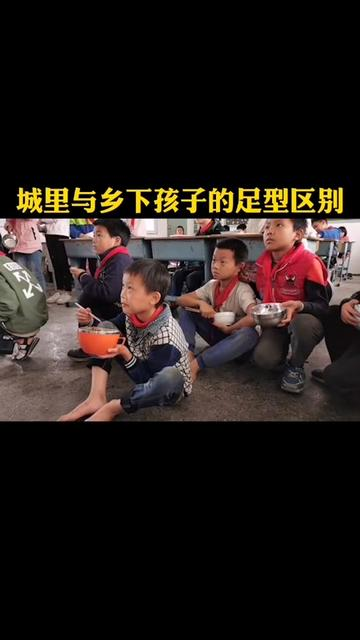

[toc]

# 正文

适当让孩子在沙地，草地或田地里赤脚走路奔跑，有助于足弓的成长！#扁平足 #户外活动 #亲子 #儿童矫形鞋垫

%

作者: [步步衡旗舰店](https://www.douyin.com/user/MS4wLjABAAAARbxvzBAxgWr9teUNIvA9lDmWBNWgv1jWsH4IjmWb76fA5a4ZtY5tylv-2RJwIeih)

发布时间：2021-1-5 10:56:39

收集时间：2025-12-24 16:37:12

统计信息：点赞数（16617），评论数（843），收藏数（223），分享数（302） 

原文地址：[适当让孩子在沙地，草地或田地里赤脚走路奔跑，有助于足弓的成长！扁平足 户外活动 亲子 儿童矫...](https://www.douyin.com/video/6914104371366104331) 

