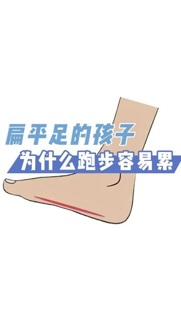

[toc]

# 正文

那些你不知道有关孩子的科普
#为什么 #扁平足 的#孩子 #跑步 容易累#健康 #育儿

%

作者: [康辅之家](https://www.douyin.com/user/MS4wLjABAAAAJ7235qKc2zPYJg07e7od2lz3Dn28r20djc4yxCVvl21Lovh0zJNmrn4dua_6XlY9)

发布时间：2022-6-17 19:10:0

收集时间：2025-12-24 20:29:27

统计信息：点赞数（293），评论数（32），收藏数（88），分享数（241） 

原文地址：[那些你不知道有关孩子的科普 为什么 扁平足 的孩子 跑步 容易累健康 育儿](https://www.douyin.com/video/7110133357136088350) 

# 评论

1. <a href="https://www.douyin.com/user/MS4wLjABAAAADm7ffz7S_3R5xHF-WbDyxQEq0S-dtmz2S-0hUgAtUIA">用户0913252029651</a> (<small title="广东">2023-4-29 15:59:35</small>): 扁平足，百米二级运动员［困］
   - <a href="https://www.douyin.com/user/MS4wLjABAAAAvNkfRNFC708MRdUUroaiR4aC5X2id5_p6f1f5_av9iw">木木溜</a> (<small title="山东">2025-10-8 21:29:25</small>): 真的吗我想跑长跑但是是扁平足可以跑吗
2. <a href="https://www.douyin.com/user/MS4wLjABAAAAKdcNNy_BZcLRZBJhGFbBfIFIIltUL6zVYyXwXlKrA5M">1️⃣</a> (<small title="湖南">2022-8-15 22:22:0</small>): 扁平足跳远3m［流泪］
   - **康辅之家** (<small title="重庆">2022-8-16 16:20:18</small>): ［赞］ 注意运动防护
   - <a href="https://www.douyin.com/user/MS4wLjABAAAAuBZX1iXz79tSNCV9iHJUUUr7vaaS5sPtXSV0ZFi5hZ4">用户6318743374039</a> (<small title="河北">2022-8-26 6:20:43</small>): 来了
   - <a href="https://www.douyin.com/user/MS4wLjABAAAAego0odrqepXCH5ONDH8j7zd0pWE8jv6rJHblLvHhETlUzweZzcEnPRtcwaa4IZg4">sapling</a> (<small title="湖北">2023-11-24 23:46:43</small>): 扁平足50米跑6.27秒
   - <a href="https://www.douyin.com/user/MS4wLjABAAAAKdcNNy_BZcLRZBJhGFbBfIFIIltUL6zVYyXwXlKrA5M">1️⃣</a> (<small title="湖南">2023-11-25 0:59:21</small>): 我是练的5.8［捂脸］
   - <a href="https://www.douyin.com/user/MS4wLjABAAAAsxj1TkZ9SlU36Yw_eKMs3hf4zedhNs9wdZJcoXdpcDE2sS3C-HU88fXn8TFE3mmr">炎培</a> (<small title="江西">2025-6-28 22:34:53</small>): 这不正常吗
3. <a href="https://www.douyin.com/user/MS4wLjABAAAAiZCwSuoyvX7qLmg5-ByZR4NcECClVOPMf-kdgqcsX3g">Luvsic</a> (<small title="新疆">2022-9-18 15:8:9</small>): 为什么我扁平足就不一样跑步根本不累［捂脸］
   - <a href="https://www.douyin.com/user/MS4wLjABAAAAi_16Ns4yJlJUWdlc98BSGSIV3kPnVyFaed0IUfRUJSjMMhmoNRfgXluzLxJKcFVk">🍧</a> (<small title="贵州">2023-4-28 18:42:34</small>): 我也是［看］
   - **康辅之家** (<small title="四川">2023-4-28 19:43:23</small>): 骨性的问题会被肌肉力量和神经控制代偿，青壮的时候神经控制和肌肉力量所以骨性问题表现不明显，但随着肌肉和神经控制的减弱骨性问题就会明显。没有反应不代表没影响，可以测测后跟力线或者膝关节力线。自测一下。
   - <a href="https://www.douyin.com/user/MS4wLjABAAAAiZCwSuoyvX7qLmg5-ByZR4NcECClVOPMf-kdgqcsX3g">Luvsic</a> (<small title="新疆">2023-6-25 23:26:7</small>): 我这是后天性的以前确实有影响但现在好多了
4. <a href="https://www.douyin.com/user/MS4wLjABAAAAvILdUb3CFhd2yBJcg7qj65C8l5Z3Gdv7pfMvWoTBjks">F³</a> (<small title="江西">2022-8-5 13:26:0</small>): 穿足弓垫脚更疼
   - **康辅之家** (<small title="四川">2022-8-5 14:9:21</small>): 要定制不是随便垫的
5. <a href="https://www.douyin.com/user/MS4wLjABAAAANV-Xu6lO7uWpU4cC5wpSfOjaaokGyZWtxZv8vcFF-z5cys-RjfJcLqSJWvwBAEBx">曜！</a> (<small title="河北">2022-8-11 15:37:48</small>): 别提了 本来就扁平足 前几天还把脚踝伤了［流泪］现在蹲都蹲不下去［流泪］［流泪］［流泪］
   - **康辅之家** (<small title="四川">2022-9-19 12:42:22</small>): 平时可以做一些踝关节稳定性训练
6. <a href="https://www.douyin.com/user/MS4wLjABAAAAZWlcwcnVNGEn07MxjsBOgJhSCHMJj4y69dK-2RWPafA">许小可</a> (<small title="浙江">2022-8-10 5:34:11</small>): 别说跑步，站久了也会累，还痛
7. <a href="https://www.douyin.com/user/MS4wLjABAAAAkrDseDCJ1RLHt5PwEM6woq__FFc0FDVEoqhiksdDWBw">唐顼</a> (<small title="山西">2022-8-31 14:18:16</small>): 这是我腿短的原因么［流泪］
8. <a href="https://www.douyin.com/user/MS4wLjABAAAAsc8azLNr0dBiiEX-C-hhfs-tUBbtcx_qQFmufDR8dEw">九键</a> (<small title="河北">2023-5-27 22:1:57</small>): @爱瑠酱 @钢盔小公主 @鹤田林雨 @AY @香菜happy版\_ @迪. ［流泪］
9. <a href="https://www.douyin.com/user/MS4wLjABAAAAkIgVaB7s3JydQHDSLoacMdkP_Snhx6gfJpkWWc9W8vU">CRIMSON</a> (<small title="河北">2022-7-30 16:33:12</small>): @慎平 @困死了😮‍💨 我也是扁平足，我怎么没觉得我运动受影响呢［尬笑］
   - <a href="https://www.douyin.com/user/MS4wLjABAAAAXa--DWy6UN_DefnPeMA6fRZek7dv00g6Qg3R0rsZzOIejcz-ufWmH4M8pPBGjXf7">怎么又下雨</a> (<small title="IP未知">2022-8-10 6:49:38</small>): 一样
   - **康辅之家** (<small title="四川">2022-8-10 11:58:23</small>): 每个个体和不同年龄阶段反应不一样。
10. <a href="https://www.douyin.com/user/MS4wLjABAAAA-8wWZxuE2d-WLeq9C7_pSRzAM3QOZK8E8rZd6-1CVngDa88hcRLIa4sm0ko9uc8I">木马卷</a> (<small title="江西">2022-7-29 12:4:47</small>): @轩(≧∇≦)/品 难怪我就有还超级严重 我也说跑完步走完路怎么脚这么累
    - **康辅之家** (<small title="四川">2022-9-19 12:43:42</small>): 骨性发生变化 肌肉代偿拉伸所以会感觉比较累
11. <a href="https://www.douyin.com/user/MS4wLjABAAAAddvfi5HjeqHIKcpTYiIwzXTnCiu7frOyKw6A3w5b_Fo">极品萌灵根</a> (<small title="江苏">2022-7-20 14:25:48</small>): @GOΛL ［流泪］［流泪］
    - <a href="https://www.douyin.com/user/MS4wLjABAAAAddvfi5HjeqHIKcpTYiIwzXTnCiu7frOyKw6A3w5b_Fo">极品萌灵根</a> (<small title="江苏">2022-7-20 14:26:6</small>): 丫的呜呜呜
    - <a href="https://www.douyin.com/user/MS4wLjABAAAAlx9i4UczztIttEsZI2xpDGUoptiANim1ROpDuFBZWJE">滚了</a> (<small title="上海">2022-7-20 18:4:43</small>): 摸摸
12. <a href="https://www.douyin.com/user/MS4wLjABAAAA_GqWwrqUb7U7aIeBc0htcZbveVvIvXoDc5J21kPPZ1M">咕噜羊</a> (<small title="江西">2022-11-17 1:6:58</small>): @凉生
13. <a href="https://www.douyin.com/user/MS4wLjABAAAAE9pSPiL-nwf5v9Zh7e3x5pQQSi_QgNztJUm8iEaUGXEdYr6RJ99Jz1Pn5Shyu-ZJ">热</a> (<small title="江苏">2023-4-9 20:38:12</small>): @无名无姓
14. <a href="https://www.douyin.com/user/MS4wLjABAAAAYItS7kDkzn9SD3ENuxJbFKSo7HOUmiZQnpWocU8wy5v5hGZ3jRfMSDC22NaQMn6l">实心面团子</a> (<small title="四川">2022-10-2 22:39:29</small>): @陈大事不拘小节
15. <a href="https://www.douyin.com/user/MS4wLjABAAAA7eKQ2ZC_Ww3yt-_wRDaogefjmVIzvTgOwFgij25dnO0">ANAN</a> (<small title="山东">2022-7-17 10:28:44</small>): @柠檬茶
16. <a href="https://www.douyin.com/user/MS4wLjABAAAAwwFyMR5MTS5tw4KgVsWHVoy_ttpR5Ws2p-L-YI_6r2o">用户4166482495269</a> (<small title="广东">2022-9-3 2:22:39</small>): @077 ［舔屏］

=[评论](./attachments/comments.json)

